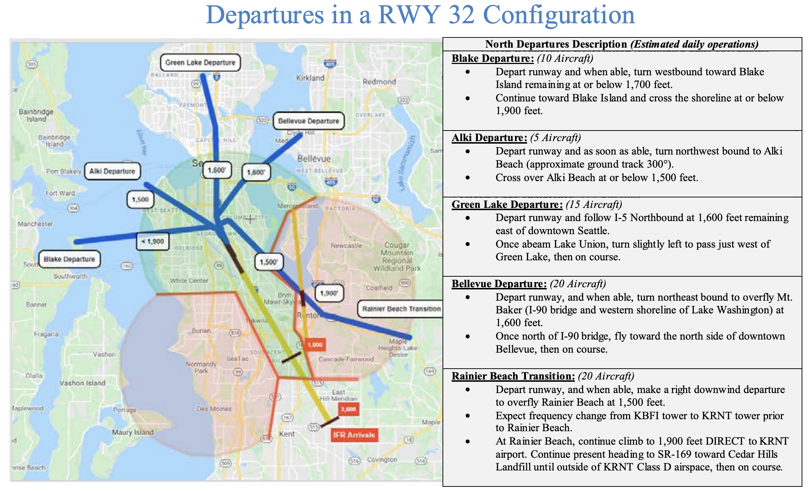

# Towered Airport

---

- [Airport Markings, Signs and Lights](airport-elements.md)
- [Communication](communication.md)

---

## Weather Observation

- ATIS (Automatic Terminal Information Service)
generated hourly by human recording
- AWOS (Automated Weather Observation Sytem)
latested
- ASOS (Automated Surface Observing System)
(by NOAA)

---

## Airport Information

- Runway illustrations
- Name
- ID
- Tower frequency
- Weather frequency
- Elevation
- Lighting
- Runway length
- Unicom

<!--
Towered-airport: blue
-->
---

## Chart Supplement

 

---

## Notice to Airmen (NOTAMs)

- Distant (D) NOTAMs: airport, navigation, services
- Flight Data Center (FDC) NOTAMs: IFR procedures, TFRs

---

## VFR Procedure / Noise Abatement

<!--
https://cdn.kingcounty.gov/-/media/king-county/depts/executive-services/airport/pilot-information/bfi-vfr-routes-final-20210515.pdf
-->