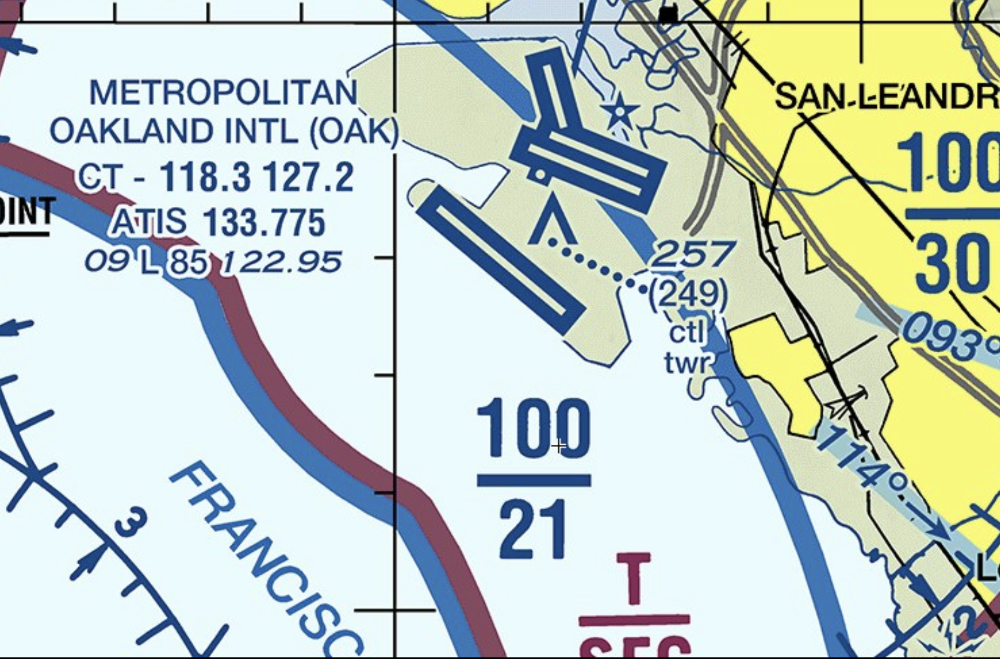

# Towered Airport

---

## Runway Markings

<!--
- Runway Number (L/C/R, >3 parallel runways)
- Threshold
- Centerline (200ft)
- Touchdown zone
- Displaced threshold
- Stopway
-->

---

## Taxiway Markings

<left>

(hold-short-line)

</left>
<right>

</right>

<!--
- Centerline
- Hold short line
-->

---

## Ramp Markings

<!--
- Ramp boundary
- Vehicle lane
-->

---

## Signs

 

---

## Weather Observation

- ATIS
- AWOS
- ASOS

(picture)

---

## Communication

- Tower
- Ground
- Clearance Delivery
(IFR)

---

## Communication

- Phonetic alphabet
- Clearance
  - When entering movement area
  - When entering runway
  - When landing

<non-key>

- “Hold Short”
- “Line up and wait”
- “Land and hold short”

</non-key>

---

## Lost-Communication Procedure

 

---

## Lighting

- Runway
  - Centerline
  - Edge
- Taxiway
  - Centerline
  - Edge
- Runway End Identifier Light (REIL)

---

## Instrument Approach Lights

---

## Precision Approach Path Indicator (PAPI)

---

(video)

<!--
KBFI: 2x. Runway edge lights, PAPI (precision approach path indicator), approach lights, rotating beacon, taxiway lights
-->

---

## Airport Information - On Chart

<left>

- Runway illustrations
- Name
- ID
- Tower frequency
- Weather frequency
- Elevation
- Lighting
- Runway length
- Unicom

</left>
<right>

</right>

<!--
Towered-airport: blue
-->
---

## Airport Information - In Supplyment

(Supplyment)

---

## Notice to Airmen (NOTAMs)

(examples)