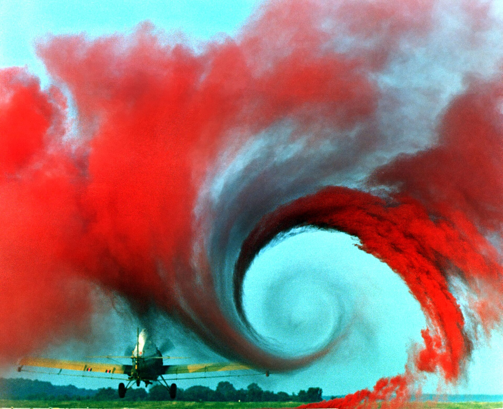
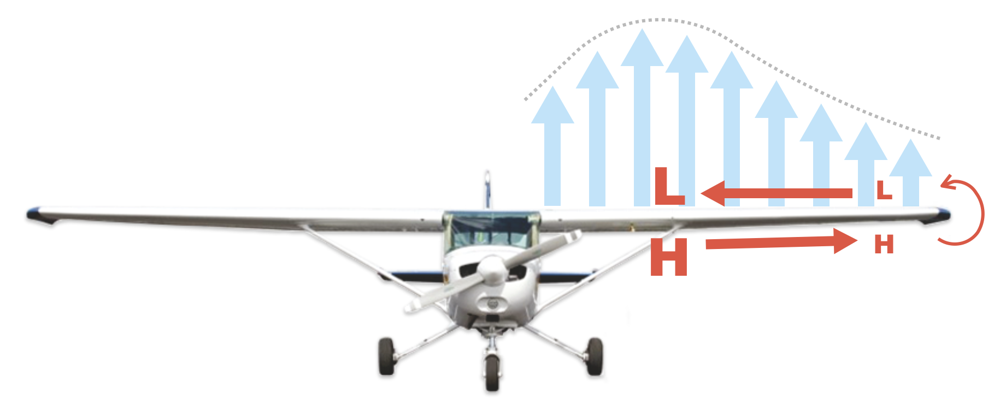
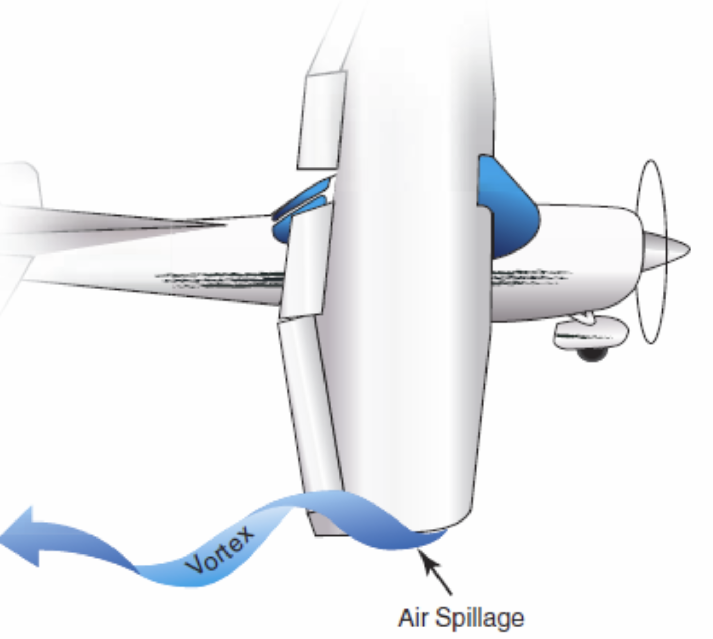
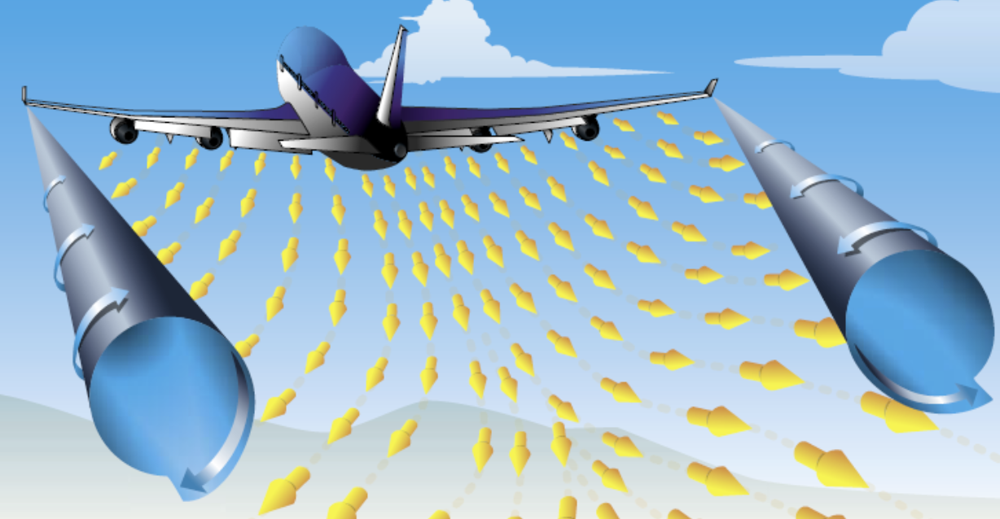
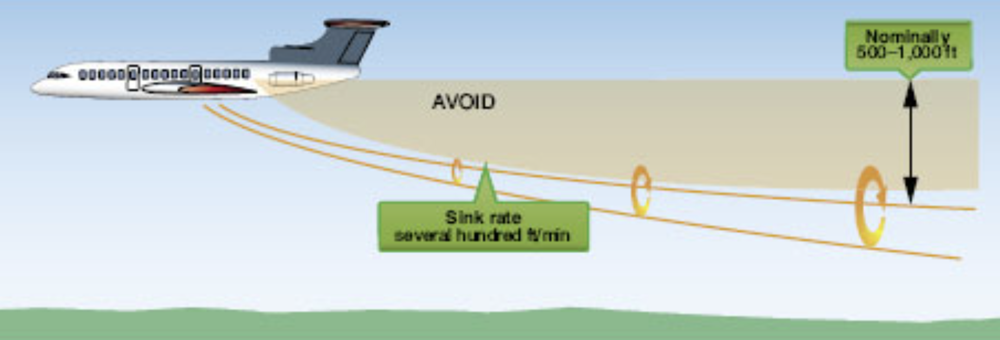
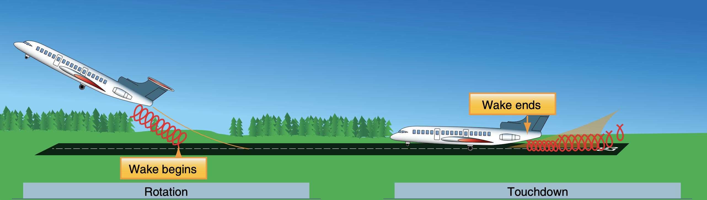
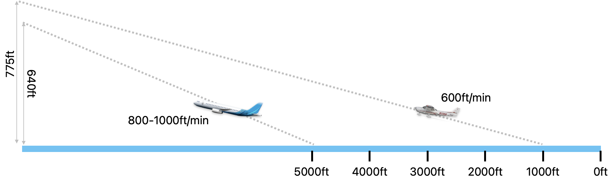
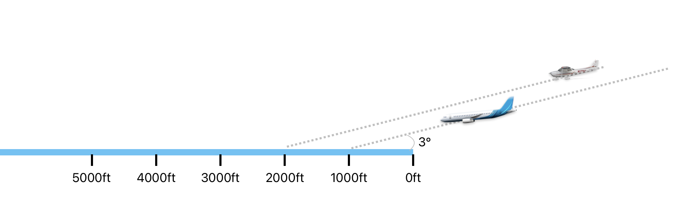

# Wake Turbulence

---

---

## Vortex

By-product of Lift

     

---

<left>

## Vortex

Correlate to lift:
- Weight
- Angle of Attack

</left>
<right>

</right>

---

## Wake Turbulence

- Wingtip Vortex: more stable, last up to 3min
- Jetwash: extreme turbulent, short duration

     

---

## Wake Turbulence

- Sink Rate: ~500fpm
- Sink Amount: ~1000ft
- Spread out on ground

 

 

<!--
Avoidance in the air:
- Stay above
- Stay 1000ft below
-->
---

## Wake Turbulence

Only when lift is generated.

---

## Wake Turbulence Avoidance

- Takeoff: lift off before jet's rotate point 
- Climb: off center; turn early

<!--
Complications:
- Wind
- Parallel runway
-->

---

## Wake Turbulence Avoidance

- Approach: stay above jet's approach path
- Landing: touch down after jet's touch down point

---

