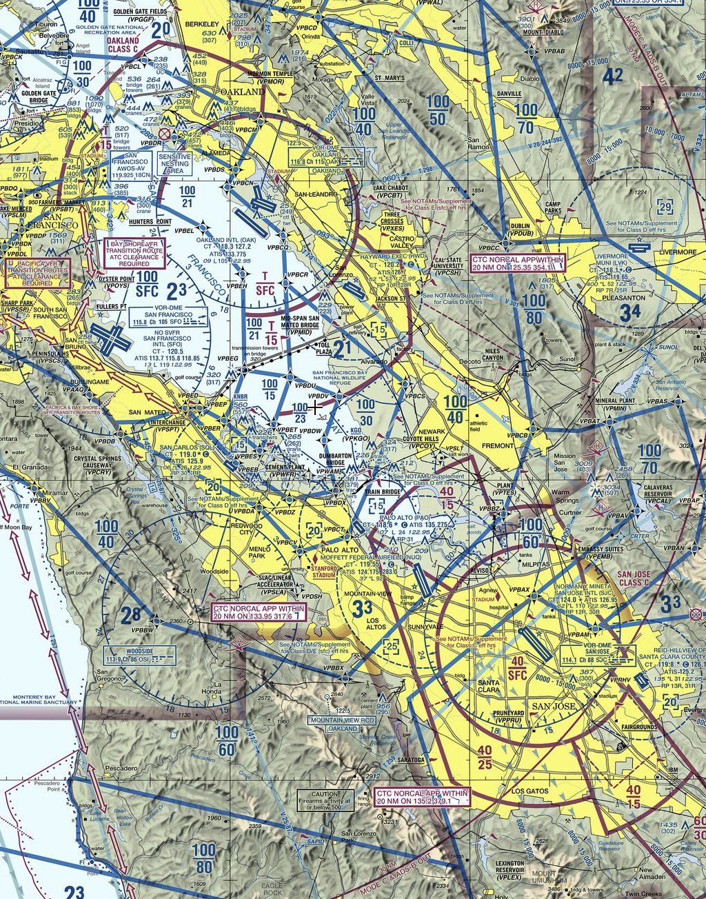

# Airspace

---

## Objectives

For all the airspaces you will fly through / around, know the boundary, rules, and reasons behind.

---

## Prep

- Read "Pilot's Handbook of Aeronautical Knowledge":
  - [Chapter 15: Airspace][1]

[1]: https://www.faa.gov/regulationspolicies/handbooksmanuals/aviation/phak/chapter-15-airspace

<!--
Instructor prep:
  - map
-->

---

---

- [Controlled Airspace](controlled-airspace.md)
- [Uncontrolled Airspace](uncontrolled-airspace.md)
- [Special Use Airspace](special-use-airspace.md)
- [Temporary Flight Restrictions](tfr.md)