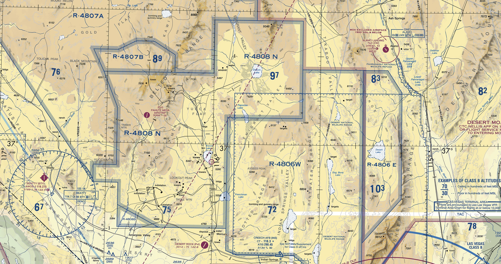
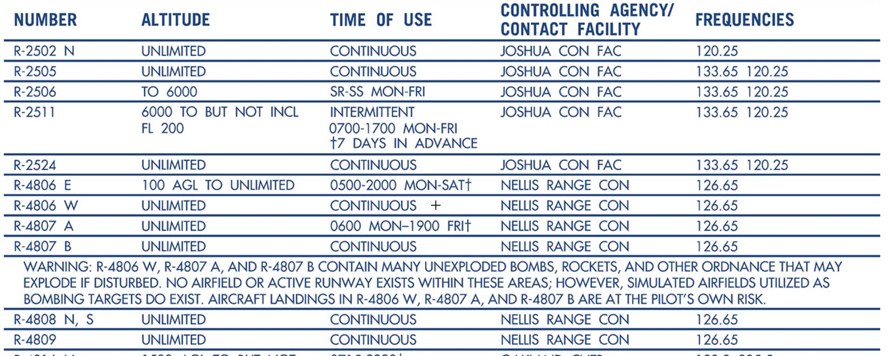

# Special Use Airspace

---

## Prohibited Area

For national security

### <red>NEVER FLY INTO</red>

---

## Restricted Area

Protect aircraft from invisible hazards (artillery firing, missile)

### <red>NEVER FLY INTO WHEN ACTIVE</red>

  

<!--
Area 51: https://skyvector.com/?ll=37.08645588965002,-115.69676616205291&chart=17&zoom=3&fpl=undefined
-->

---

## National Security Area (NSA)

Compromise between normal airspace and restricted/prohibited area.

can be temporarily converted into restricted airspace.

### <red>BETTER NOT FLY INTO</red>

---

## Military Operation Area (MOA)

Separate military training from IFR traffic

### <red>CAUTION WHEN ACTIVE</red>

---

## Alert Area

For intensive activities
- flight training
- glider towing
- parachute jumping

### <red>USE CAUTION</red>

---

## Warning Area / Air Defense Identification Zone (ADIZ)

- 12nm outward from coast
- Participate

      

---

## Wildlife Refuge

To protect wildlife habitants.

### <red>NO FLIGHT BELOW 1000/2000 AGL</red>

