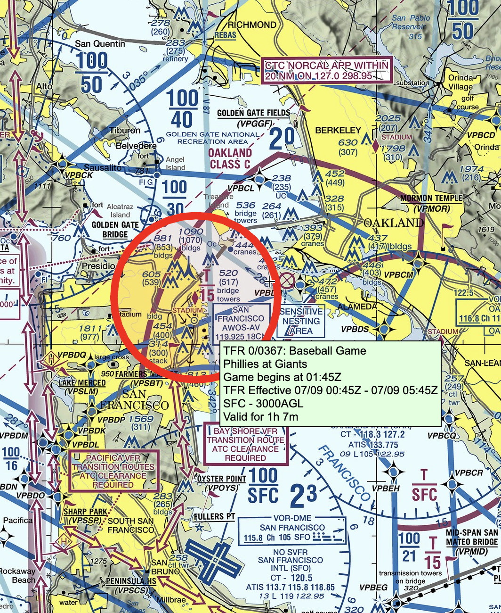
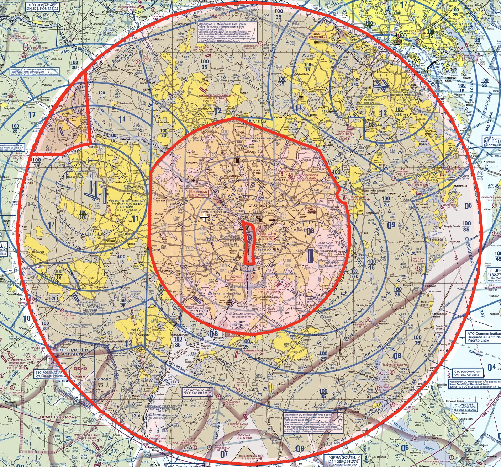

# Temporary Flight Restriction (TFR)

---

## Temporary Flight Restriction (TFR)

To protect people on the ground.
- Presidential
- Air show
- Stadiums
- Disaster/hazard
- Space flight

### <red>NEVER FLY INTO</red>

---

---

## Interception

<!--
https://www.faa.gov/sites/faa.gov/files/2022-01/Intercept-Procedures.pdf
-->

---

## TFRs at Washington D.C.

**Special Flight Restriction Area (SFRA)**

- 30nm 
- VFR within 60nm of DCA requires [“Special Awareness Training”][1]

**Flight-Restricted Zone (FRZ)**

- 15nm around KDCA

[1]: https://www.faasafety.gov/gslac/ALC/courseLanding.aspx?cID=405

