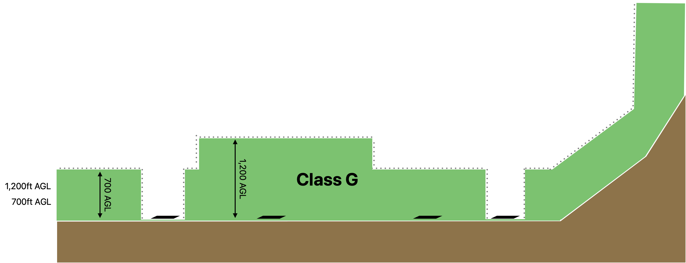
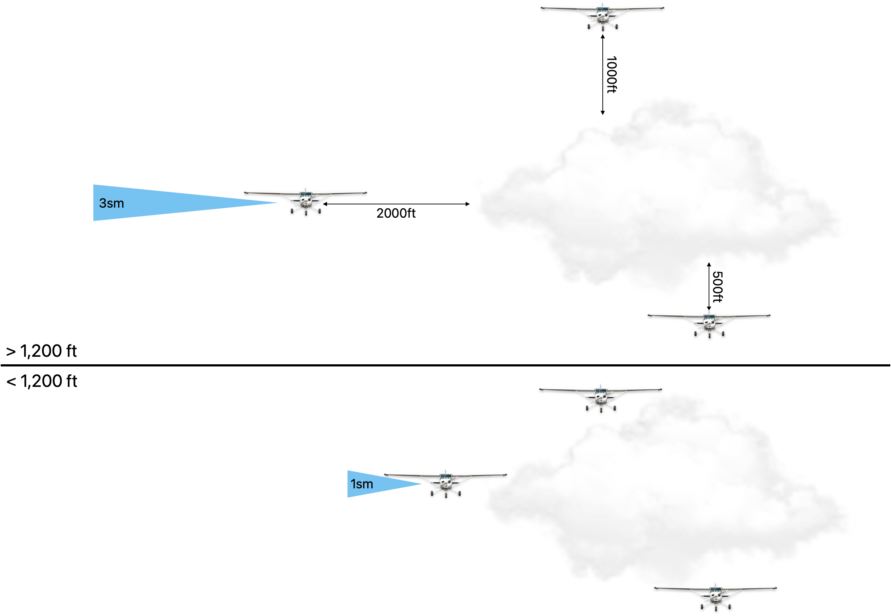
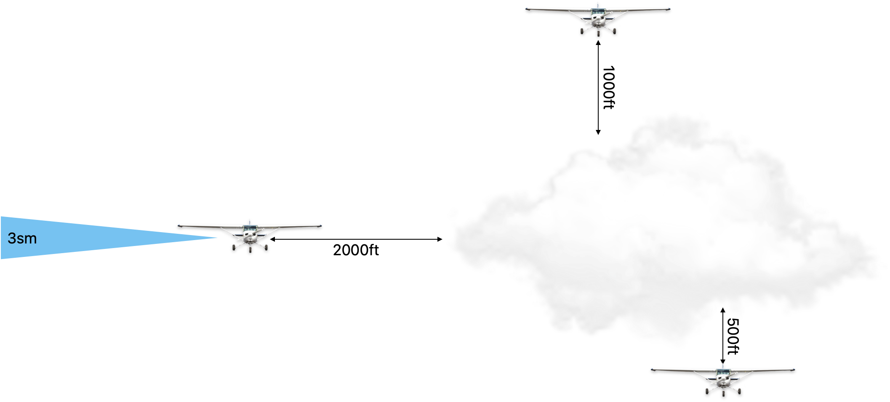

# Uncontrolled Airspace

---

## Class G

**Airplane**: Any
**Pilot**: Any
**ATC**: N/A

**Boundary**: 0 - 700AGL / 1,200AGL / 14,500MSL

   

---

## Class G

**VFR Weather Minimum (Day)** 

- Visibility: > 1sm
- Cloud: Clear of cloud

--------- 1,200 AGL ----------

- Visibility: > 1sm
- Cloud: Clear of cloud

---

## Class G

**VFR Weather Minimum (Night)**

- Visibility: 3sm
- Cloud: 500/1000/2000

