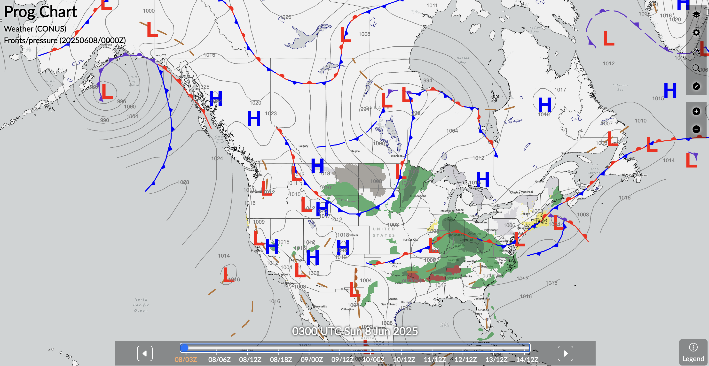
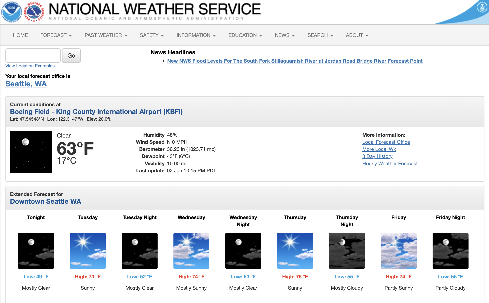
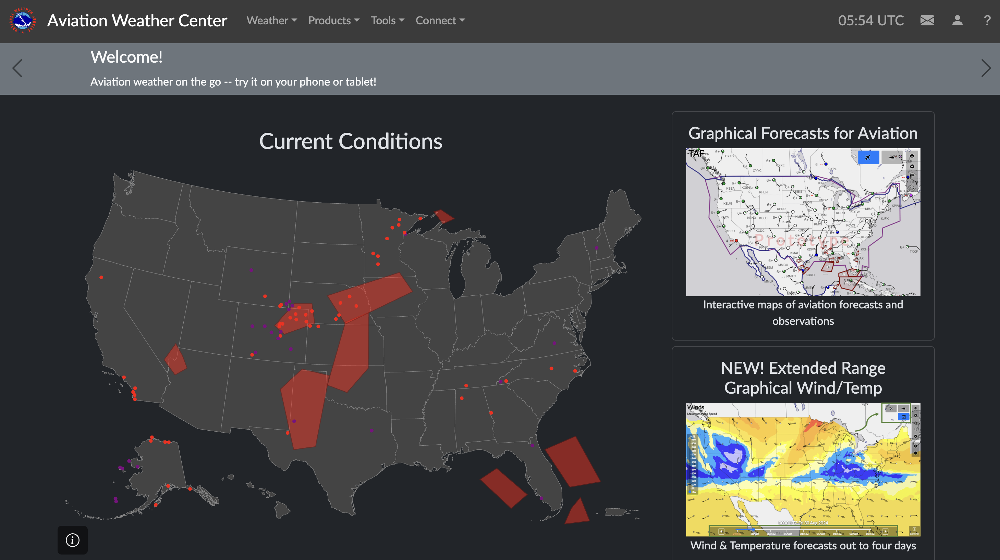
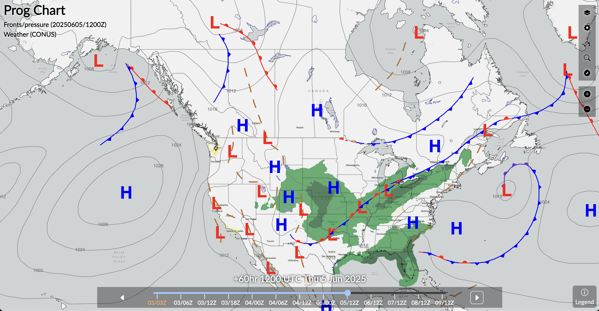
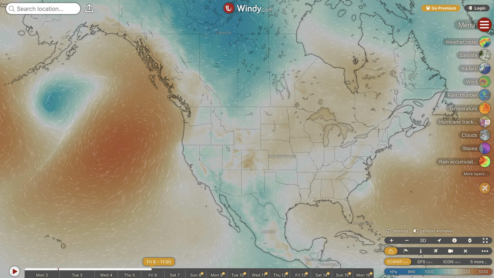

# Big Picture

up to 7 days before the flight.

<!--
"Is there a chance to go?"
-->
---

## Resources

- General weather services
- Aviation weather center
    - Prognostic chart
- Supplemental sites (windy.com)
---

## General Weather Service

---

## [Aviation Weather Center](https://www.aviationweather.gov)

---

## Prognostic Chart

Surface analysis, up to 7 days.

- High/Low Pressure
- Front
- Precipitation
- Weather (haze/smoke/fog/dust)
- (Wind)

---

---

## [Windy](https://www.windy.com)

