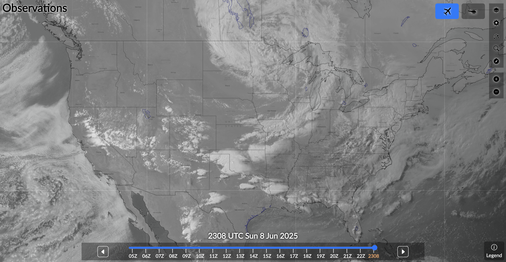
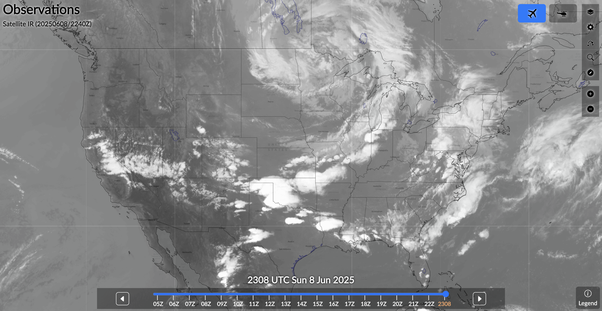
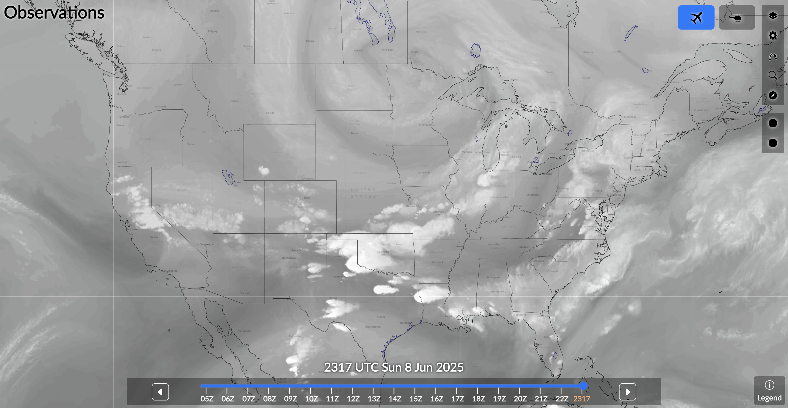
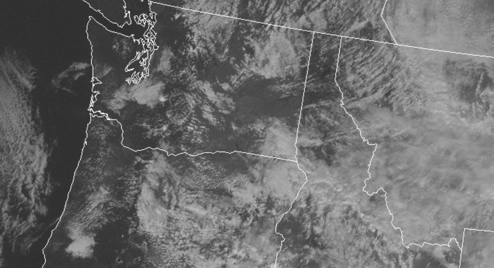
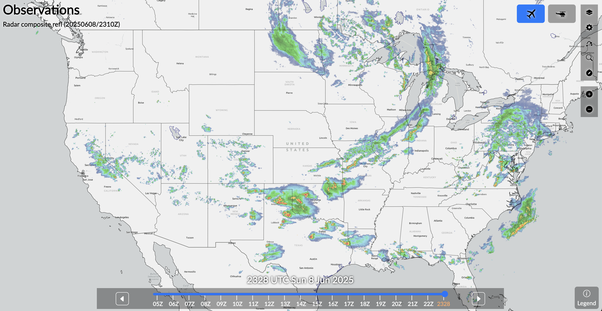
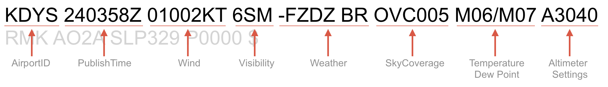
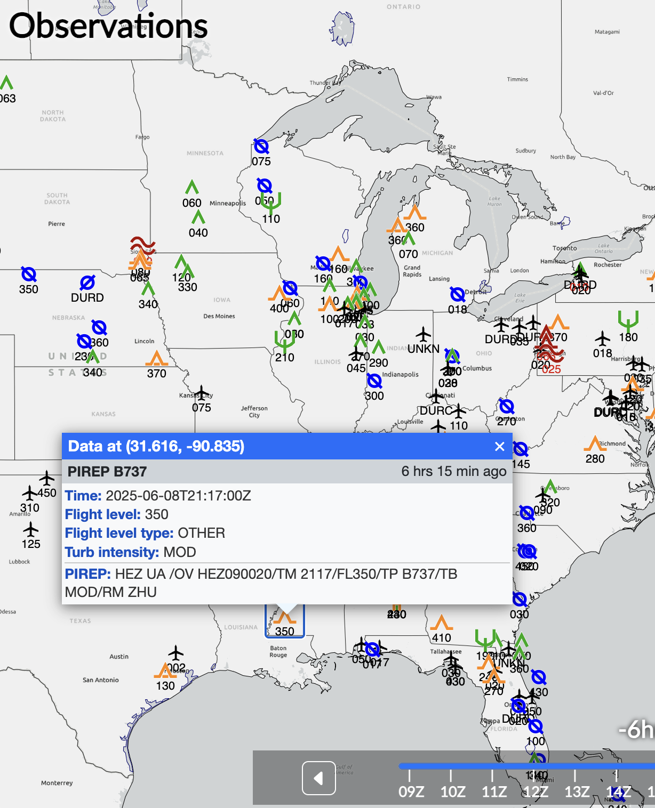
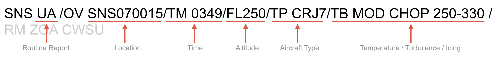
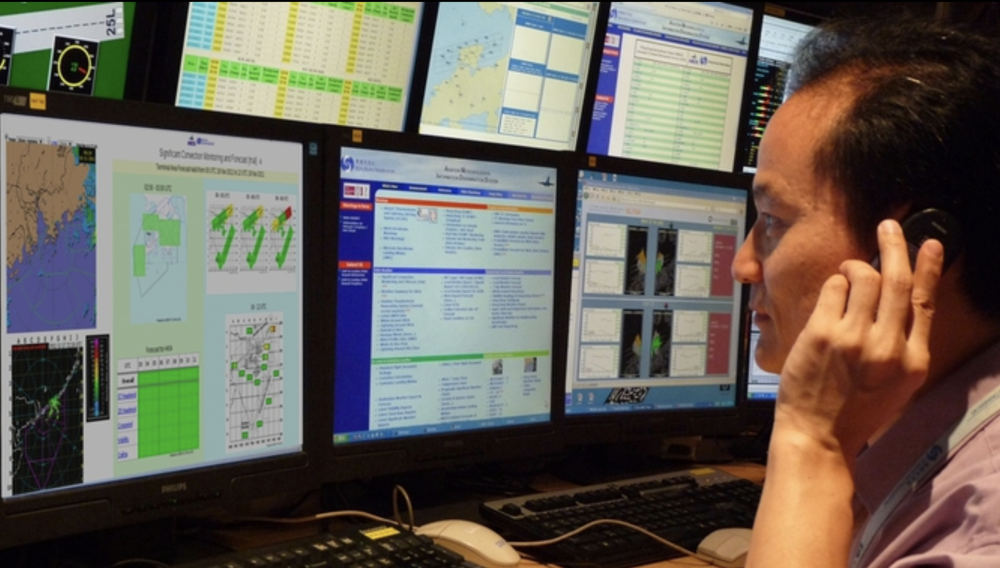

# Current Observation

Right before departure

<!--
"anything changed?"
"go/no-go?"
-->

---

## Resources

- Satellite Image
- Radar Image
- METAR
- Pilot Reports (PIREPs)
- Telephone Briefing

---

<left>

## Satellite Image

Information about clouds.

- Visible Image
  - Cloud Position
  - Cloud Type
  - Mountain Wave
- Infrared Image
  - Cloud Top
- Water Vapor Image

</left>
<right>

</right>

---

## Visible Image
       

---

## Infrared Image
       

---

## Water Vapor Image
       

---

<invert>

## Mountain Wave

</invert>
       

---

## Radar Image

<left>

Information about precipitation:
- Position
- Intensity	
- Movement

</left>
<right>

</right>

<!--
Limitations:
- No detection below lowest tilt angle
- No detection behind cloud shadow (attenuated signal)
- No detection behind terrain
- Noise by birds
- Sun strobes
-->
---

<!--
Local radar: https://radar.weather.gov/
-->

---

## Meteorological Terminal Air Report (METAR)

<left>

- Issued hourly
- SPECI	

</left>
<right>
  
<small>

> KSFO 240456Z 28006KT 10SM CLR
13/M03 A3021 RMK AO2 SLP230 T01281033

> KOSH 240453Z AUTO 21013G21KT 10SM CLR
M13/M21 A3008 RMK AO2 SLP219 T11331211

> KDHT 240453Z AUTO 18006KT 10SM OVC014
M07/M10 A3023 RMK AO2 SLP279 T10721100

</small>
</right>

---

## Pilot Reports (PIREP)

---

## Pilot Reports (PIREP)

<small>

> CHO UA /OV CHO/TM 1905/FL030/TP E170/SK BASE BKN030

> SDA UA /OV SDA/TM 1841/FL075/TP C177/WX -RA/TB NEG

> SGU UA /OV MMM130015/TM 0405/FL190/TP B737/TA M15/IC MOD RIME 150-190/RM ZLAWC AWC-WEB/FAAZLA

</small>

---

## Telephone Briefing

<left>

800-WX-BRIEF
- Standard
- Abbreviated
- Outlook (>6h) 

</left>
<right>

  

</right>