# Detailed Forecast

up to 18 hours before flight

<!--
"When to go?"
"Which areas to avoid?"
"What altitude to best cruise at? How long will the flight be?"
-->
---

## Resources

- Prognostic chart
- Significant weather chart
- SIGMET
- AIRMET
- GFA Forecast
- Terminal Aerodrome Forecast (TAF)
- Area forecast

---

## Significant Weather Chart

<left>

- Turbulence
- Icing
- Cumulonimbus clouds
- Jet stream

</left>
<right>

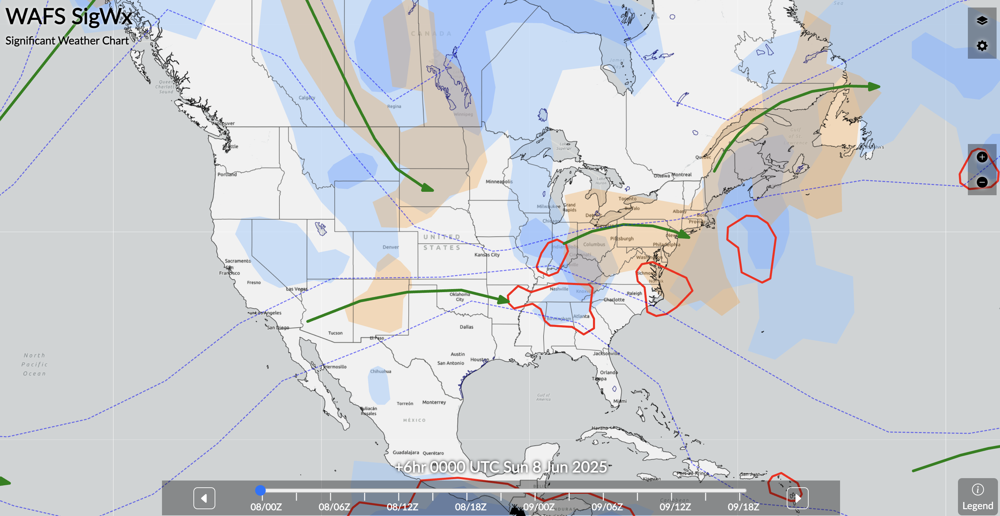

</right>

---

---

## SIGMET (Significant Meteorological Information)

Unscheduled, valid for 4 hours, to all aircraft

<left>

- Severe icing[1]
- Severe turbulence[1]
- Severe CAT[1]
- dust storm[2]
- sand storm[2]
- volcanic ash

<footnote>

[1] not associated with thunderstorm

[2] surface or inflight visibility < 3sm

</footnote>

</left>
<right>

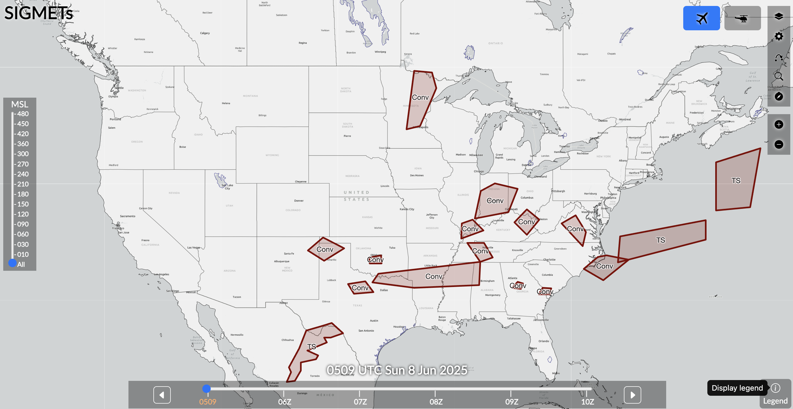

</right>

---

---

## AIRMET (Airman's Meteorological Information)

every 6 hours, to all aircraft, mostly light aircraft

<left>

- Moderate icing
- Moderate turbulence
- surface wind >30kts
- IFR
- mountain obscuration 

</left>
<right>

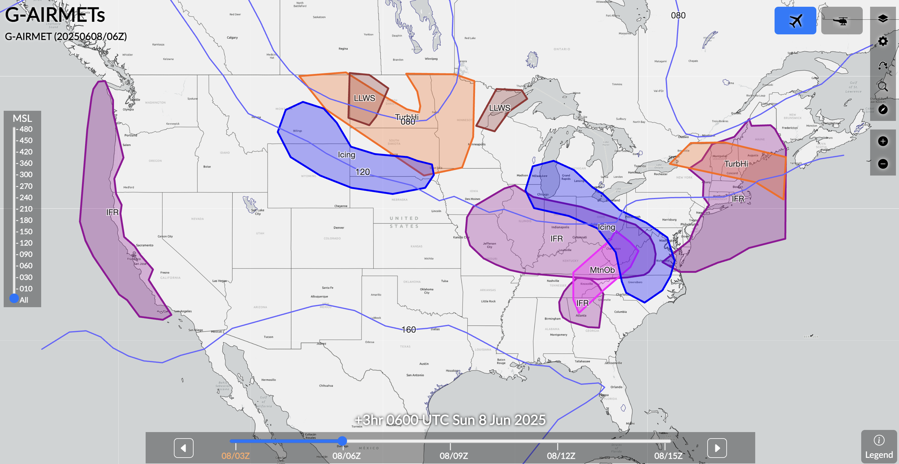

</right>

---

---

<left>

## GFA Forecast

- Ceiling & visibility
- Clouds
- Precipitation
- Thunderstorms
- Temperature
- Winds
- Turbulence
- Icing

</left>
<right>

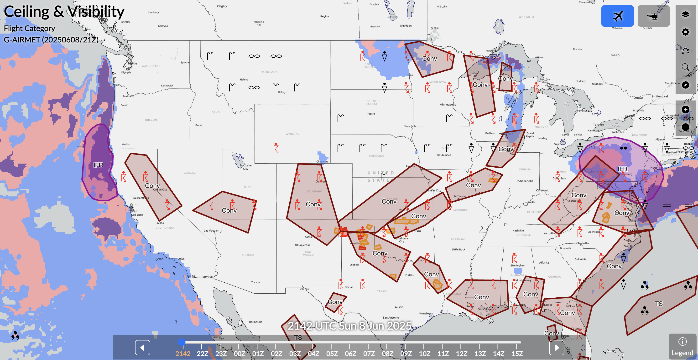 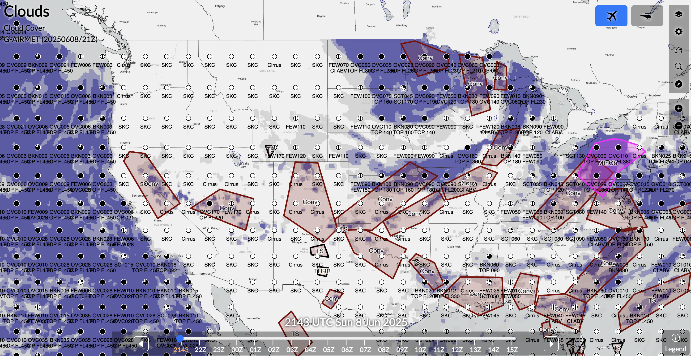
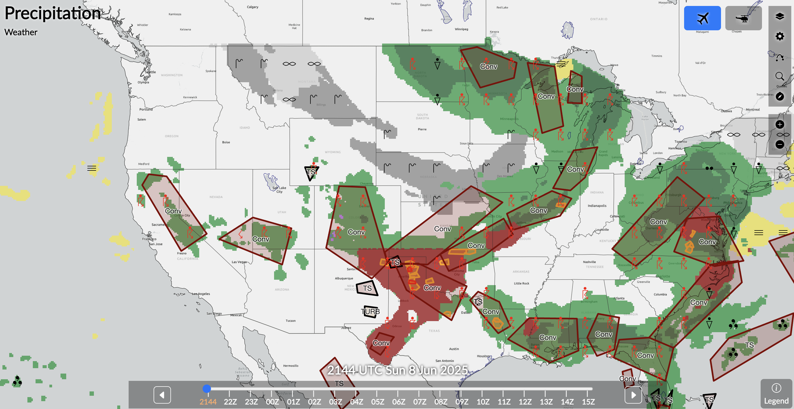 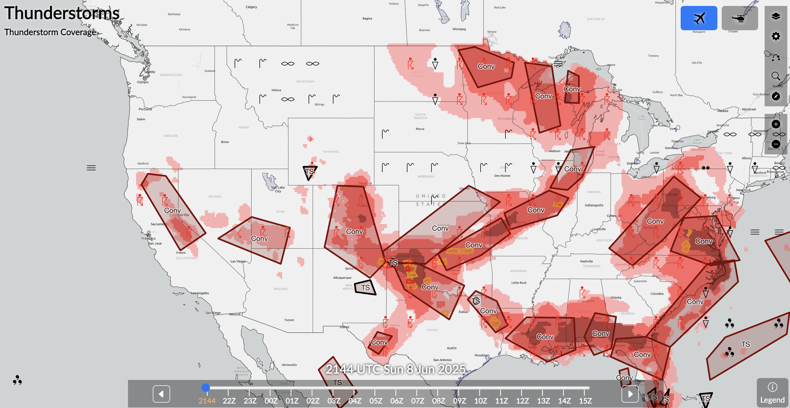
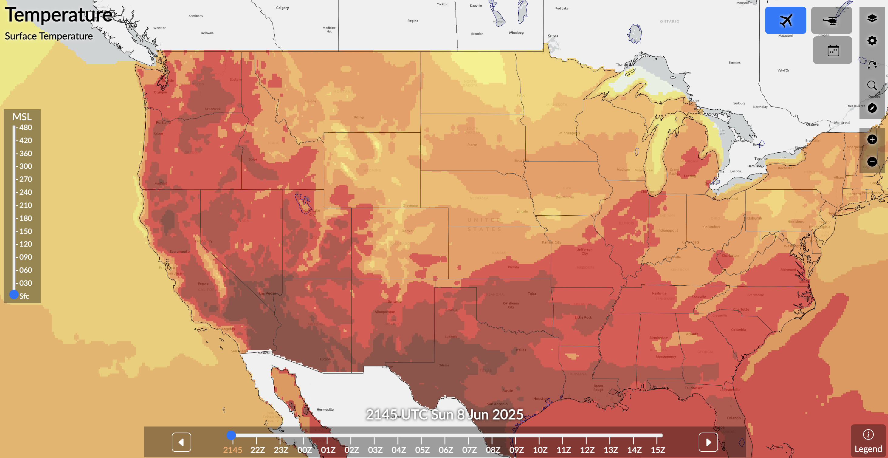 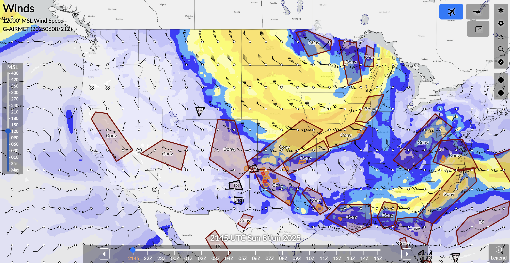
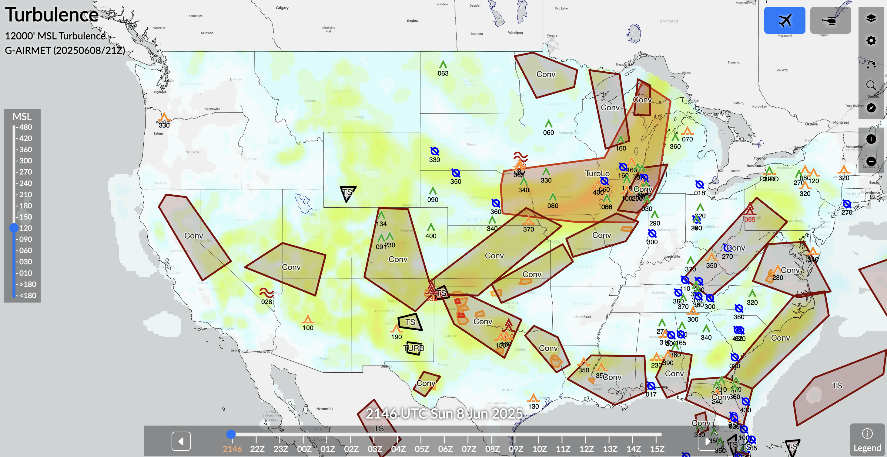 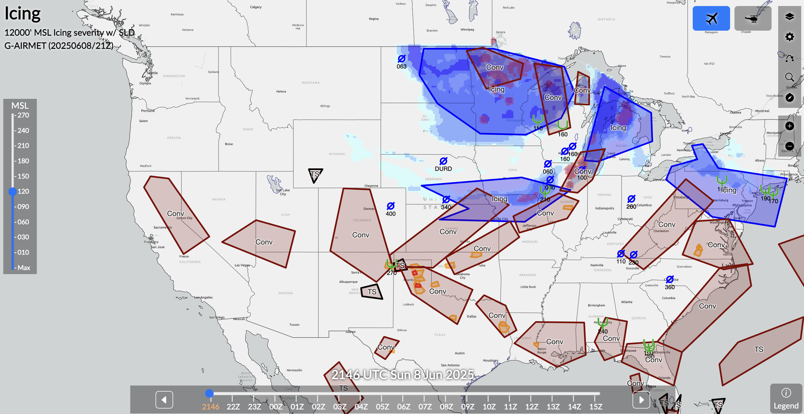

</right>

<!--
Symbols: https://aviationweather.gov/gfa/help/#symbols
-->
---

<left>

## Wins Aloft

- Wind Speed
- Wind Direction (true north)
- Temperature 

</left>
<right>

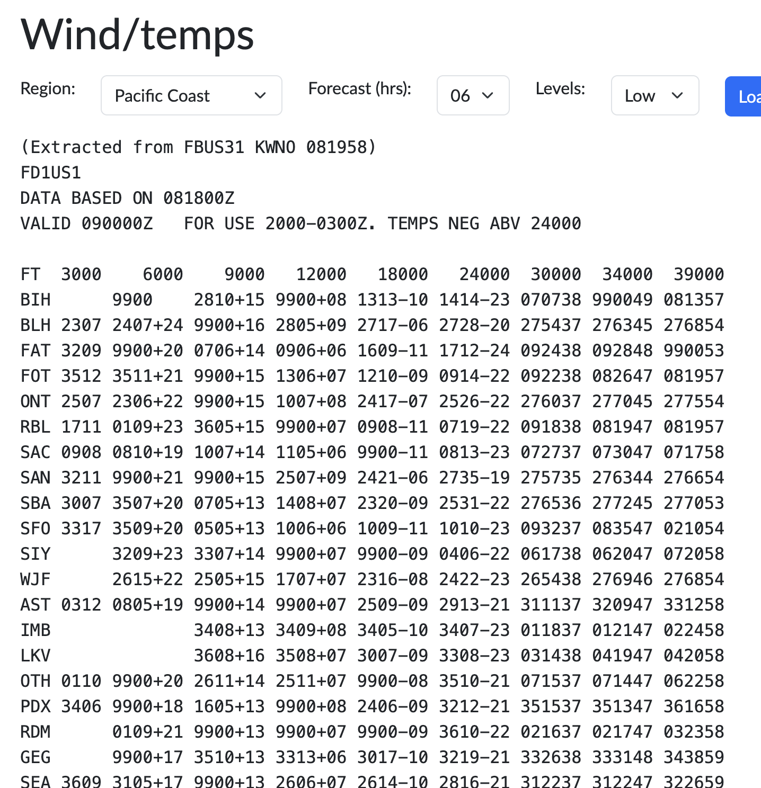

</right>

---

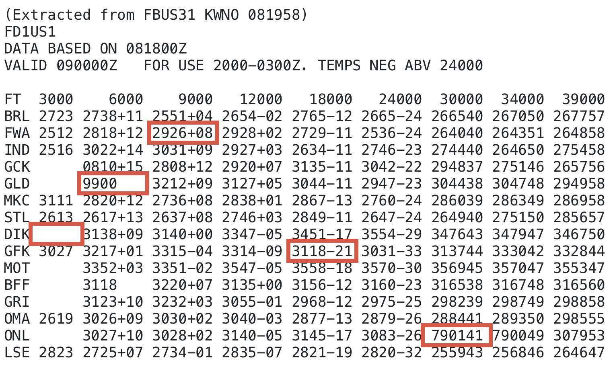

---

## Area Forecast (FA)

- Issued 3 times a day
- Valid: 18h

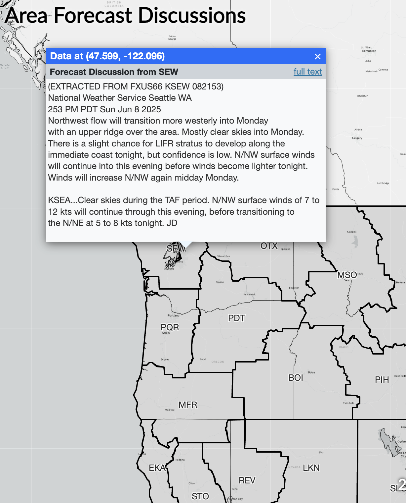

---

## Terminal Aerodrome Forecast (TAF)

<left>

- Issued at 00/06/12/18Z
- Range: 5 miles
- Valid: 24-30h

</left>
<right>

 
<small>

> KSFO 240310Z 2403/2506 35009KT P6SM SKC 
  &nbsp;&nbsp;&nbsp;&nbsp; FM240500 VRB04KT P6SM SKC 
  &nbsp;&nbsp;&nbsp;&nbsp; FM250400 28006KT P6SM FEW009

> KFAT 232334Z 2400/2424 VRB05KT P6SM FEW030 SCT060 
  &nbsp;&nbsp;&nbsp;&nbsp; TEMPO 2402/2404 02009G16KT 6SM HZ SKC

</small>

</right>

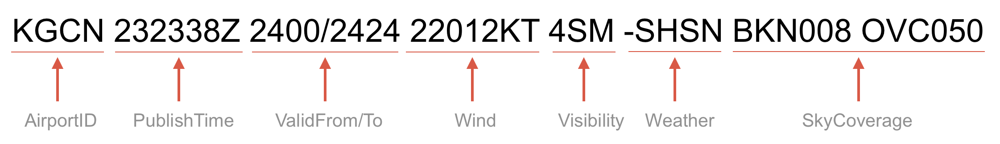
