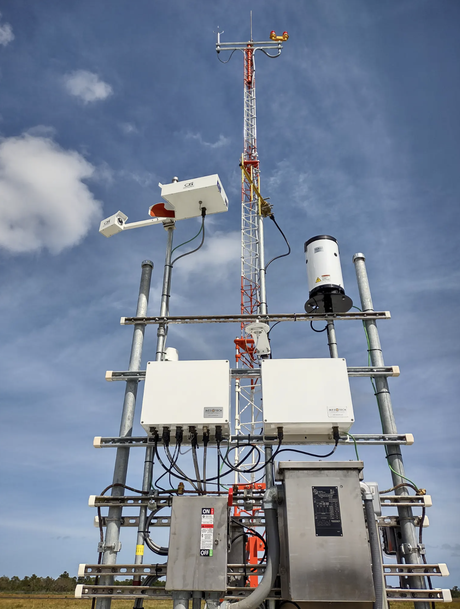
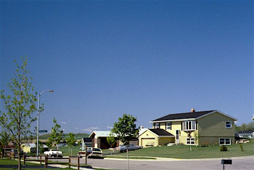
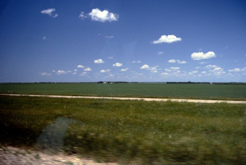
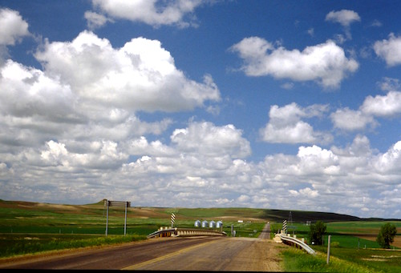
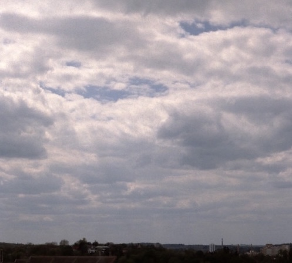
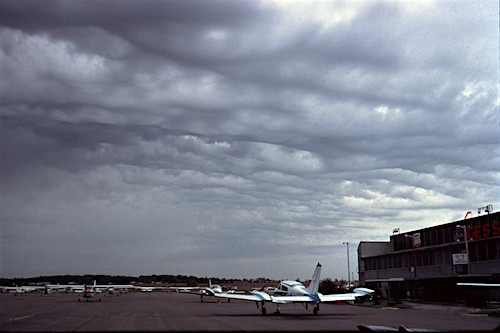

# Aviation Weather Service

---

## Objectives

Become resourceful, knowledgable and wise at making no/no-go decisions.

---

## Units

- Temperature: ℃
- Distance: Statute Mile (sm)
- Direction: 0-360°
- Time: Zulu

---

<left>

## Cloud Coverage

- Sky Clear (SKC, CLR)
- Few (FEW)
- Scattered (SCT)

<footnote>

---------------- ceiling ---------------------

</footnote>

- Broken (BKN)
- Overcast (OVC)

</left>
<right>

 
 

<!--
SKC: worldwide. In North America: human generated report.
CLR: no cloud < 12,000ft (U.S.) or <10,000ft (Canada). In North America. Automated.
FEW: 1-2 oktas
SCT: 3-4 oktas
BKN: 5-7 oktas
OVC: 8 oktas

Multiple layers.
-->

---

## Flight Category

||Instrument Meteorological Conditions (IMC)|Visual Meteorological Conditions (VMC)|
|--:|:--:|:--:|
|Ceiling|<1000ft|1000ft~3000ft (marginal) >3000ft|
|Visibility|<3sm|3-5sm (marginal) >5sm|
|Rule|Instrument Flight Rule (IFR)|Visual Flight Rule (VFR)|

---

## Assessment Flow

1. [-7d] [Big Picture](big-picture.md)
1. [-1d] [Detailed Forecast](detailed-forecast.md)
1. [-0d] [Current Observation](current-observation.md)
1. [inflight] [Updated Observation](updated-observation.md)