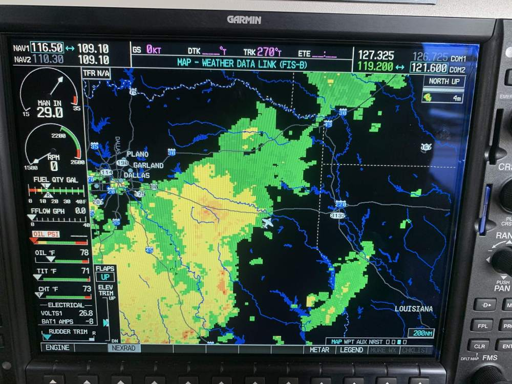
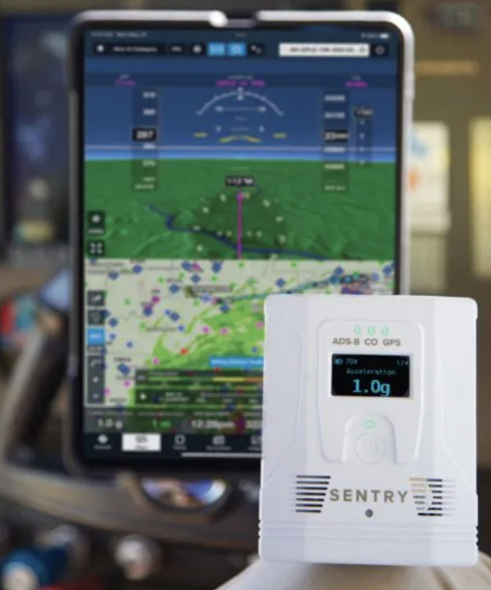

# Updated Observation

---

## Enroute Flight Services

- ATIS / AWOS / ASOS
- Flight Information Service - Broadcast (FIS-B)
- XM Satellite Weather 
- Flight Service Stations (FSS)
- ~~Flight Watch (122.0MHz)~~
- ~~TWEBs (Transcribed Weather Broadcasts)~~
- ~~HIWAS (Hazardous Inflight Weather Advisory Service)~~

---

## ATIS / AWOS / ASOS

<!--
AWOS 3P: type of precipitation (rain, snow, etc)
AWOS 3PT: type of precipitation + thunderstorm/lightning
-->
---

## Flight Information Service - Broadcast (FIS-B)

 
