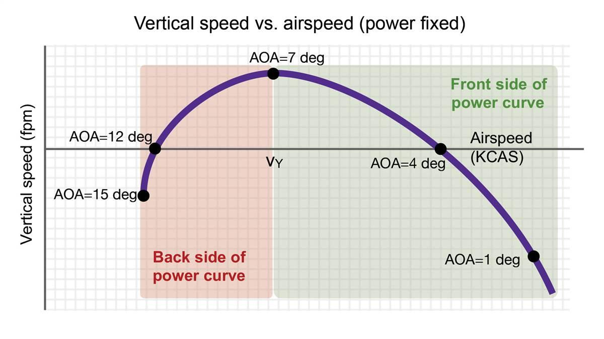

# Basic Maneuvers

---

## Objectives

Learn to guide the airplane to go where you want it to, with minimum effort.

- Straight & Level Flight
- Turns
- Climb & Descent

---

## Visual Reference

These are visual maneuvers. Look outside!

[image: cockpit, instrument, outside, horizon]

<!--
- 90% time: look outside
- 10% time: cross check with instruments
-->

---

## Primary & Secondary Controls

**Always use primary flight controls first**

- Yoke / Stick => Pitch & Bank
- Rudder => Yaw (Coordination)
- (Throttle) => Power

Always use secondary controls afterwards, to free you from using primary flight controls.

- Trim

<!--
- Yoke / stick: controls pitch (horizontal acceleration / airspeed) & bank
- Rudder: -
- Throttle: power output (vertical acceleration / altitude)
-->

---

## Pointing Exercise

**Workout #1**
[pitch only] point reference point at mountain top, horizon, lake.

**Workout #2**
[bank only] point left wingtip at mountain top, horizon, lake.

**Workout #3**
[bank & rudder] keep wing level, point reference point to left/right of a mountain

**Workout #4**
[pitch & trim] workout #1, with trim and hands off

---

## Box Drawing Exercise

1. Pitch up
2. Hold pitch; yaw to the right
3. Hold yaw, release pitch
4. Release yaw

---

## Experiment: Pitch Control

What happens if you pitch up?

- Airspeed ⬇
- Vertical speed: ⬆  =>  Altitude: ⬆

What happens if you pitch down?

- Airspeed ⬆
- Vertical speed: ⬇  =>  Altitude: ⬇

<!--
Only demo within front side of power curve.
-->

---

## Straight & Level Flight

**Primary flight control**

- Bank: level wings
- Power: 50%
- Pitch: bring reference point 3" below horizon

then...**Secondary flight control**

- Trim & <red>HANDS OFF</red>

<!--
- Throttle: ballpark position; RPM / load gauge
-->

---

## Climb

Smoothly increase power

**for max performance climb**

- Power: 90%
- Pitch: bring reference point slightly above horizon

---

## Descend

- Power: 

---

## Level Turns

