# Primary Flight Controls

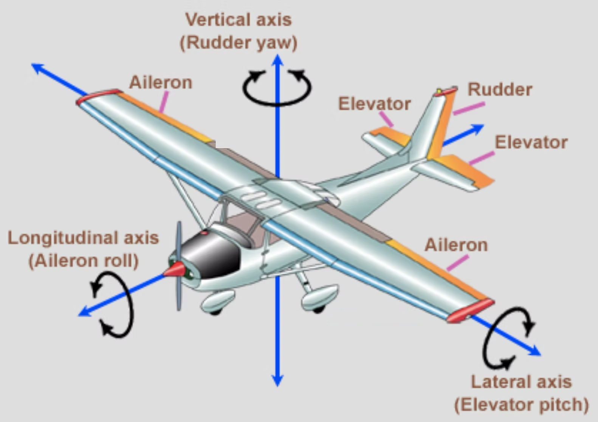

---

## How do airplanes takeoff / climb?

---

## Takeoff / Climb

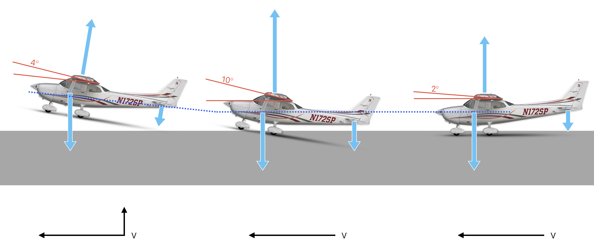

---

## Elevator

Pitch around lateral axis

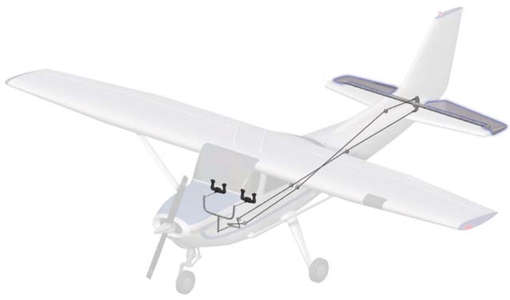

---

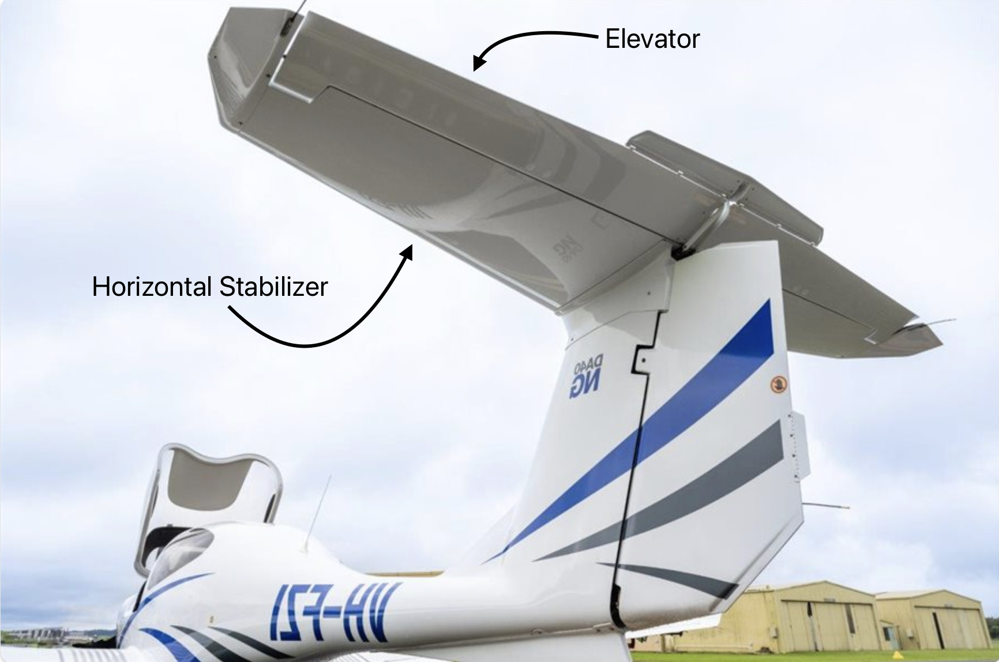

---

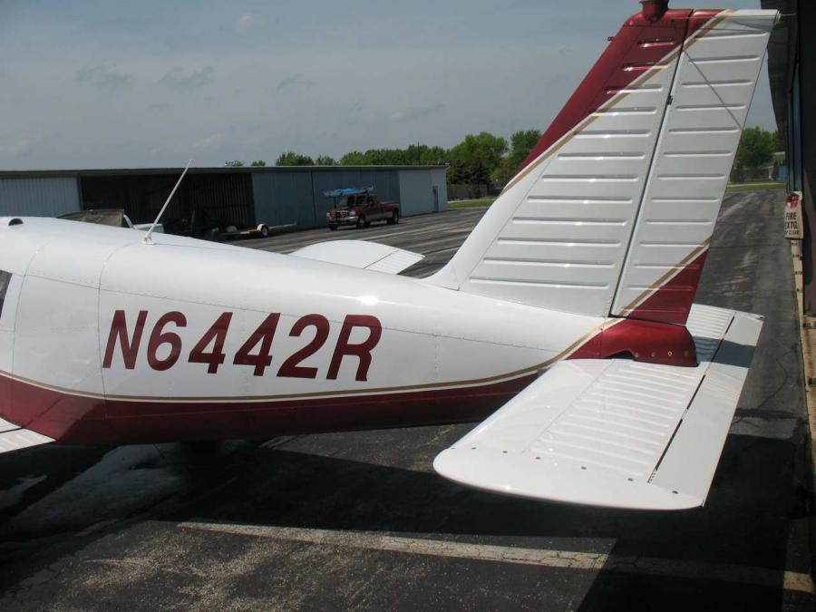

---

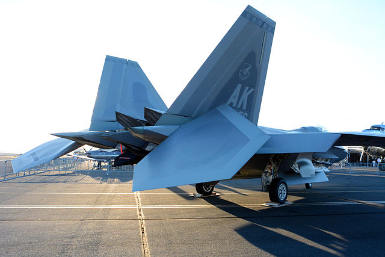

---

## Rudder

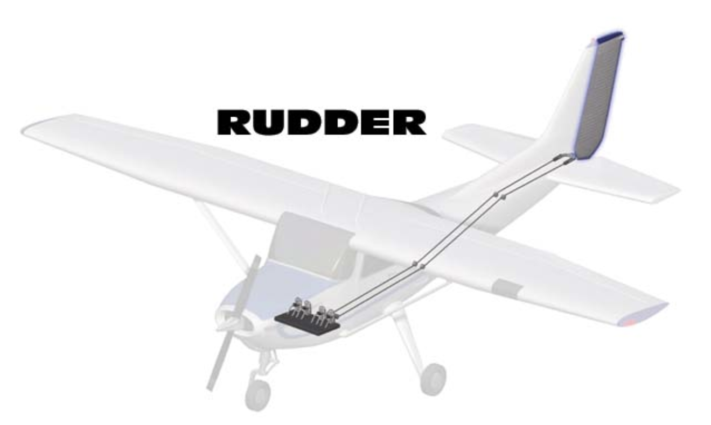

---

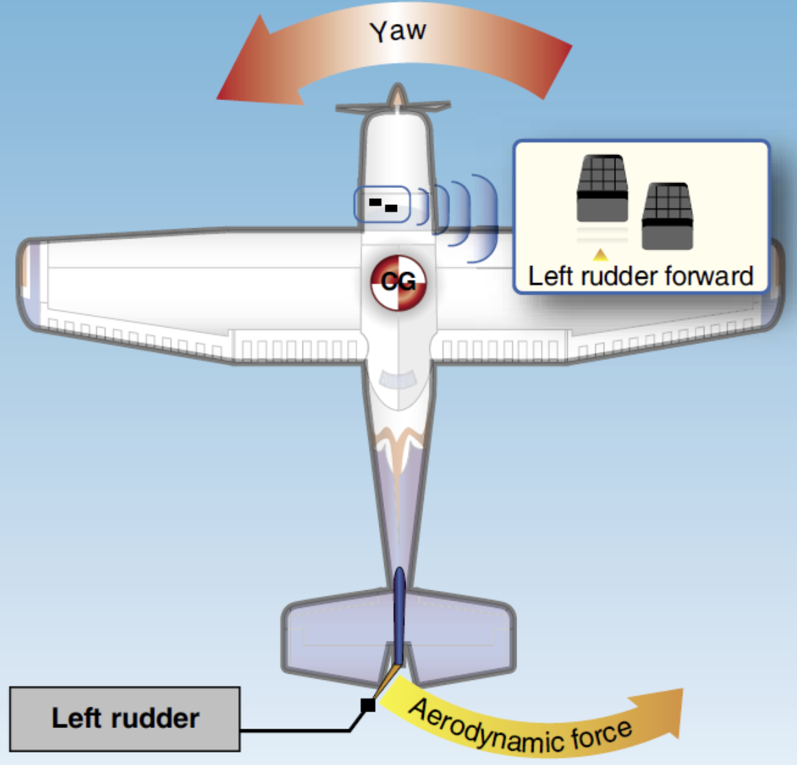

---

## Turn - The Inefficient Way

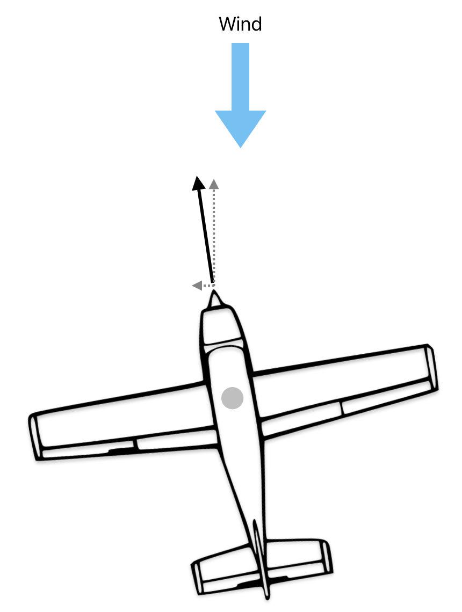

---

## Turn - Efficient Way

$Lift = \frac{1}{2} \times \rho \times V^2 \times C_L \times S$

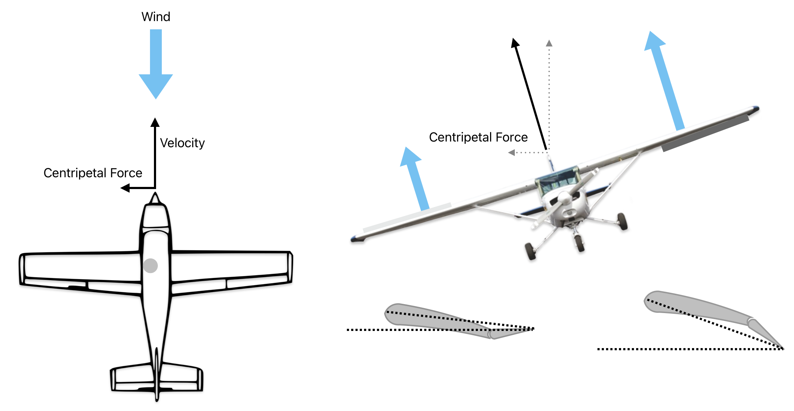

---

## Aileron

Roll around longitudinal axis

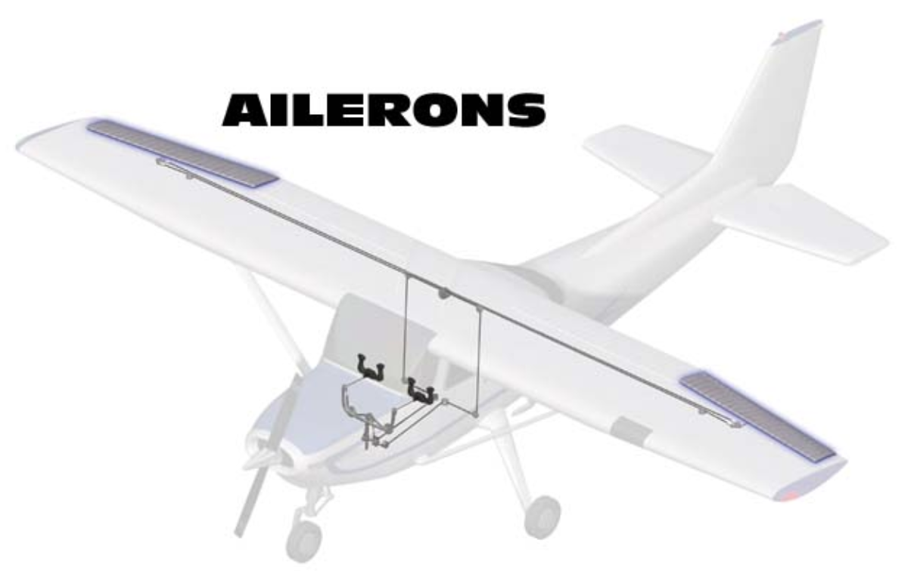

---

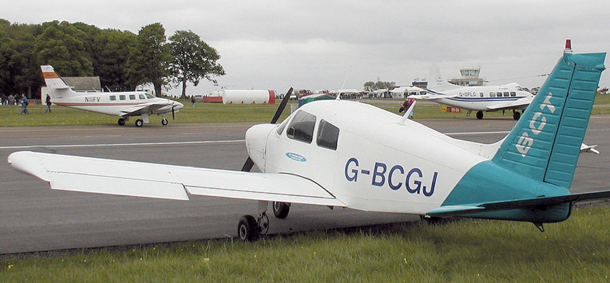

---

---

## Initiate and Maintain Turn

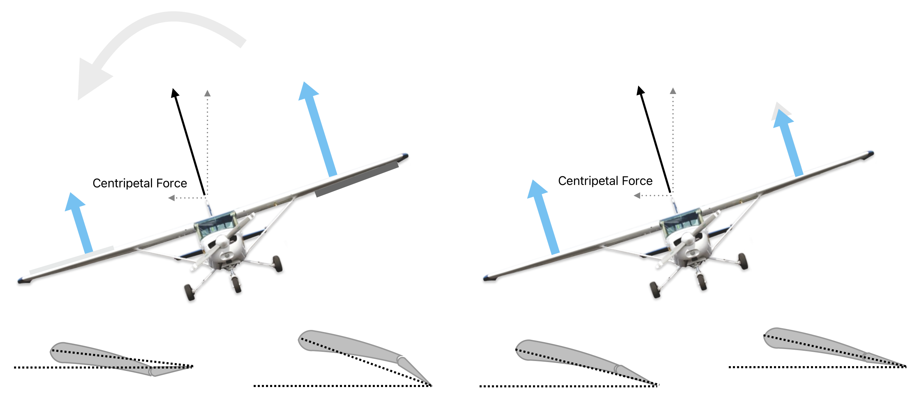

---

## Aileron - Adverse Yaw

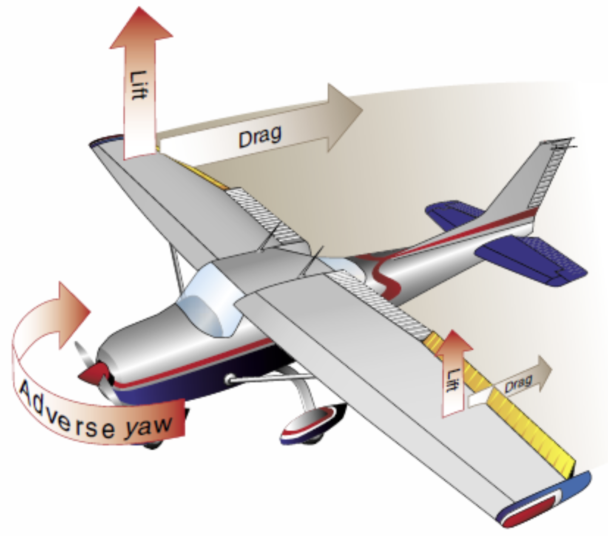

---

## Aileron - Adverse Yaw - Mitigation

<left>

- Apply Rudder
- Differential Aileron
- Coupled Aileron-Rudder
- Frist-Type Aileron

 

</left>
<right>

||
|--|
|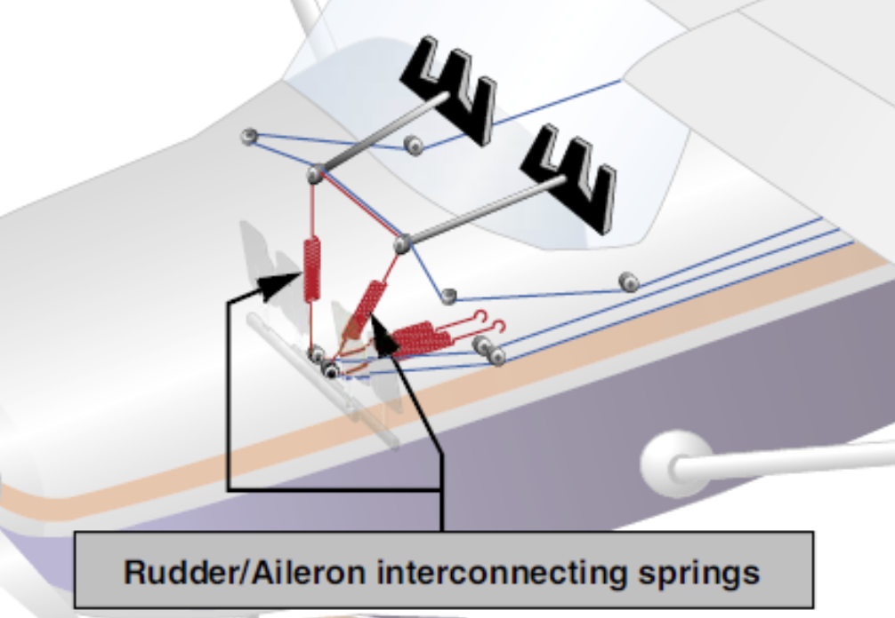|
|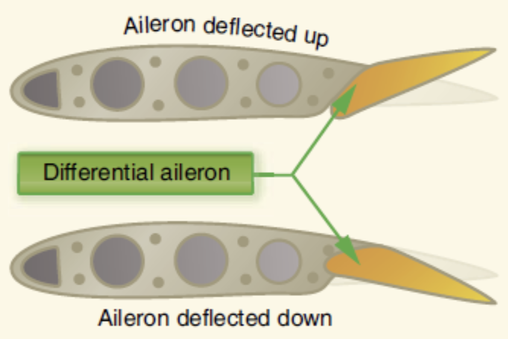|

</right>

<!--
- Differential aileron: up aileron deflects more 
- Coupled aileron-rudder: aileron moves rudder
- Frist-type aileron: bottom of up aileron pivots into airstream, creating form drag

-->

---

## Takeaway

- Use **elevator** to pitch airplane up & down
- Use **aileron** to bank airplane left & right, to turn
- Use **rudder** to make perfect turns