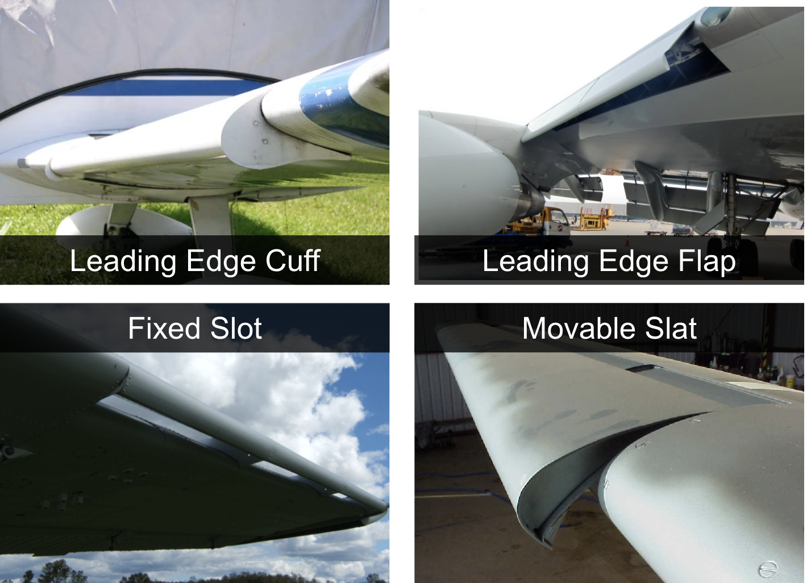
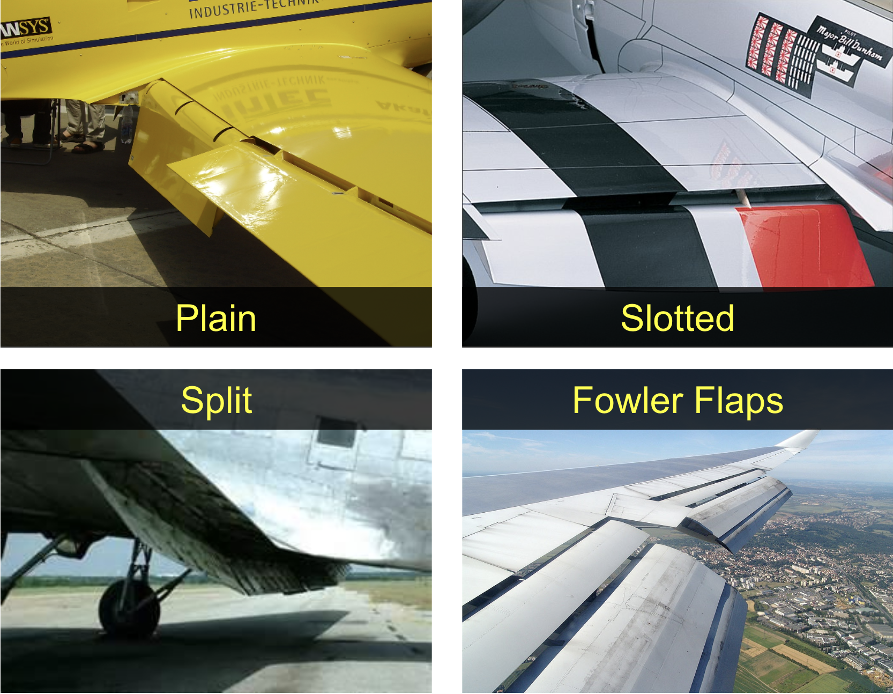
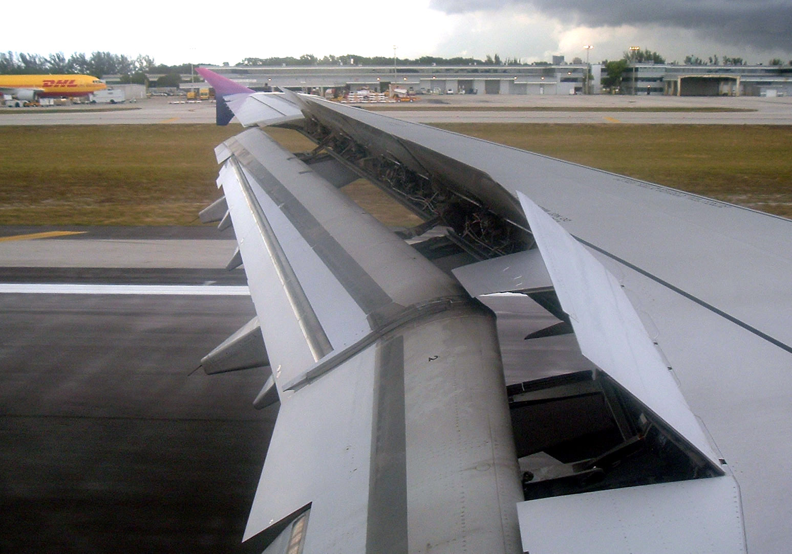
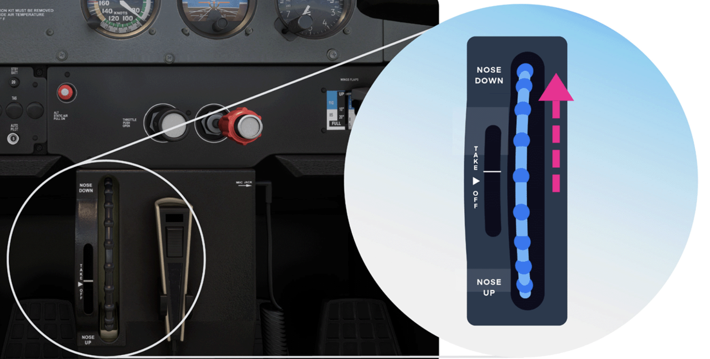
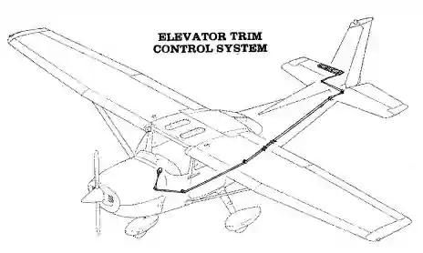
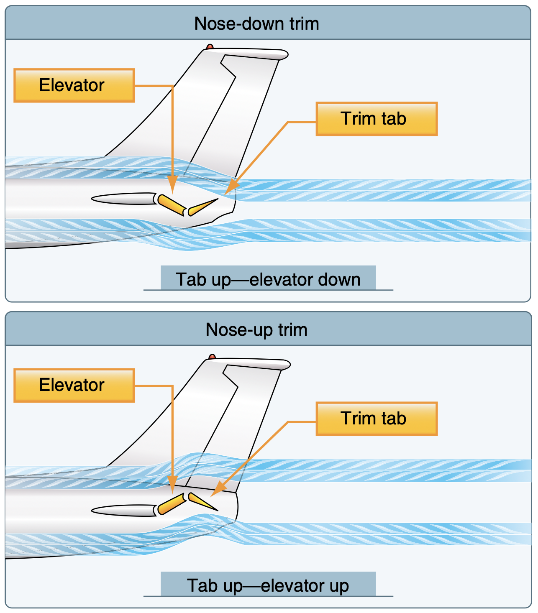
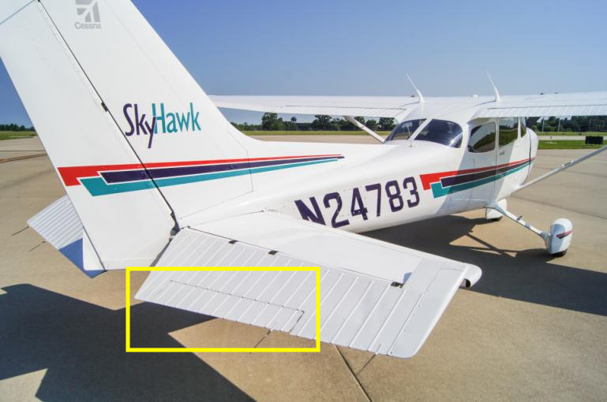
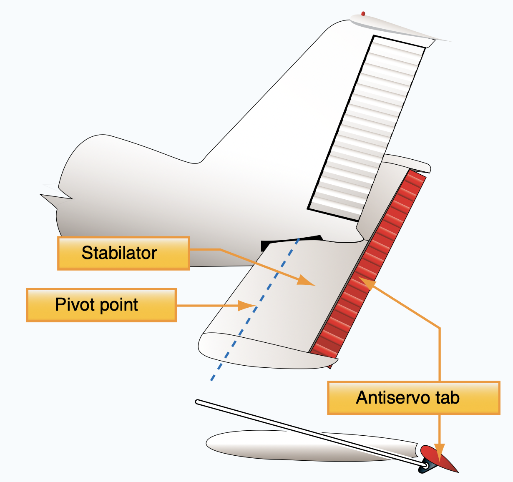
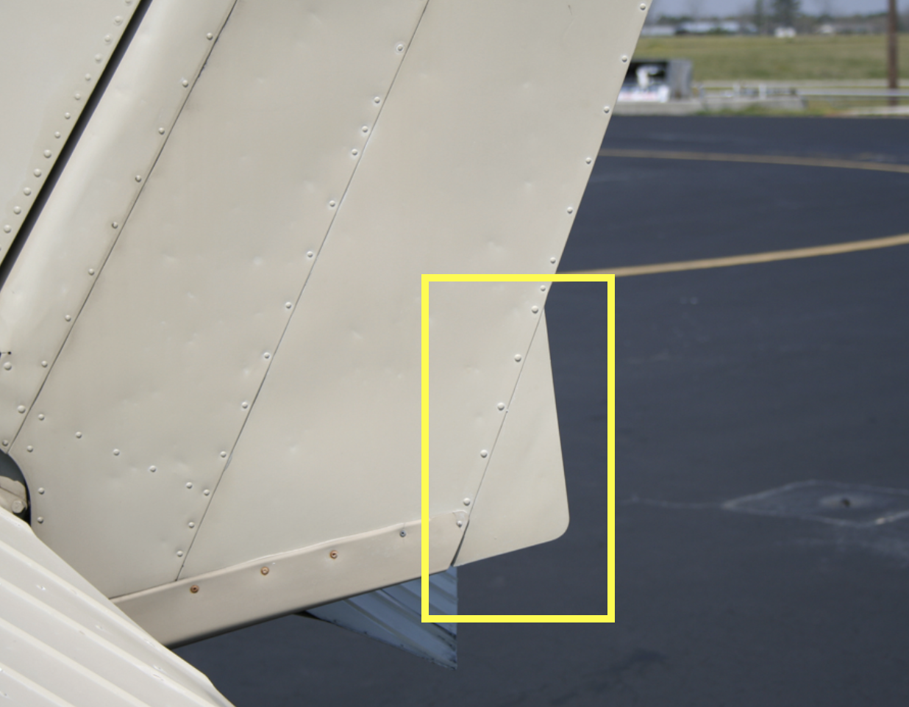
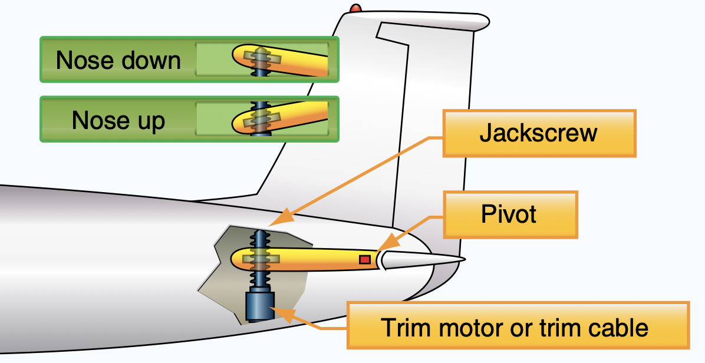

# Secondary Flight Controls

---

$$Lift = \frac{1}{2} \times \rho \times V^2 \times C_L \times S$$

<!--
Question: how to lift off sooner?
-->

---

## Leading Edge Devices

<!--
Main purpose: delay air separation
-->

---

## Flaps

<!--
Main purpose: increase lift & drag, steepen descent angle
-->

---

---

<invert>

## Spoiler

Landing
- +Drag
- -Lift
- +Weight on Wheel

 

Turning
- -Adverse Yaw

</invert>

---

## Elevator Trim

---

## Elevator Trim

---

## Trim

|Trim (Servo) Tab|Anti-Servo Tab|Ground Adjustable Tab|Adjustable   Stabilizer|
|--|--|--|--|
|||||

<!--
Anti-servo tab: moves in the same direction as trailing edge of stabilator, to decrease sensitivity.
-->

---

## Takeaway

- Use flaps for takeoff & landings
- Always trim (and relax with hands off)