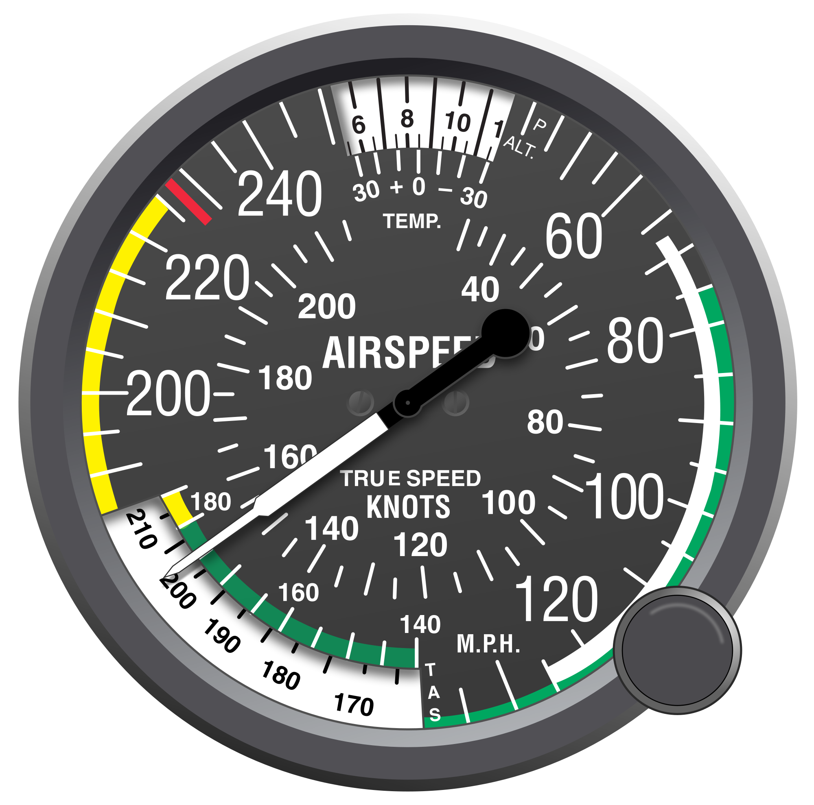
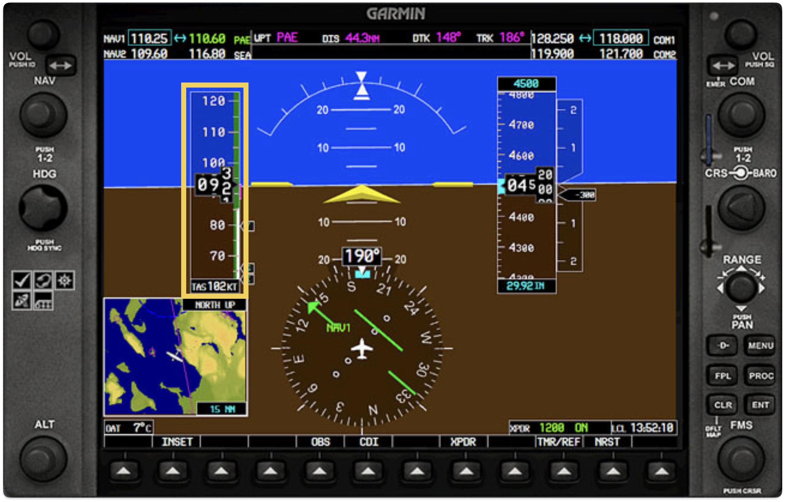
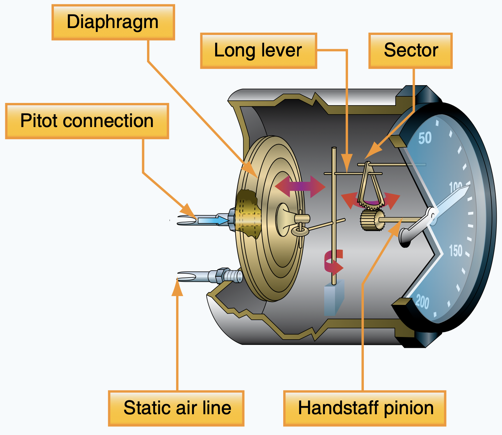
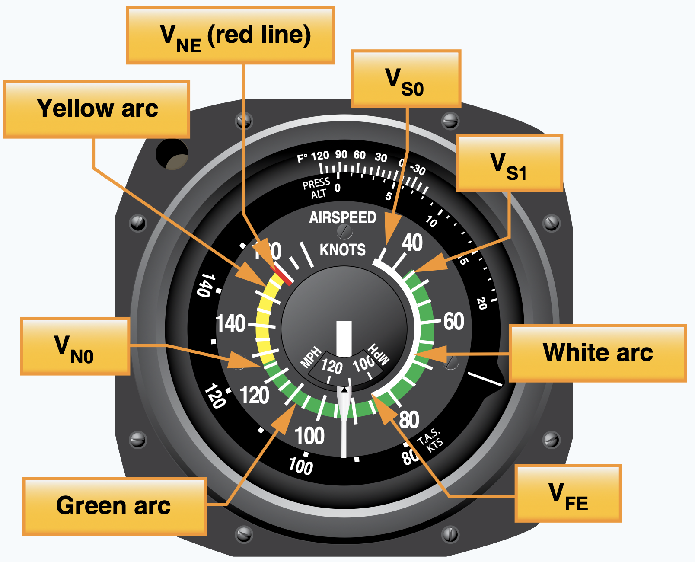

# Airspeed Indicator
Indication of current speed
(relative to air)

---

## Why is it important?

<!--
  - to calculate ETA
  - to ensure airplane flies within its limit (stall & overspeed)
  - to achieve best outcome during key phases of flight (best rate-of-climb, best angle-of-climb, traffic pattern)
  - to follow traffic control for adequate separation
-->

---

## Airspeed Indicator

 

---

## Airspeed Indicator

Pressure difference between:
- Ram air
- Static air

---

---

## Type of Airspeed

- Indicated Airspeed (IAS) - airspeed indicator reading
- Calibrated Airspeed (CAS) - IAS, corrected for installation error
- True Airspeed (TAS) - CAS corrected for altitude and temperature
- Ground Speed (GS) - TAS corrected for wind

<non-key>

- Equivalent Airspeed (EAS) - CAS corrected for adiabatic compression error

</non-key>

---

### V-speeds

<left>

- $V_{S0}$ – Stall speed with landing configuration
- $V_S$  – Stall speed with clean configuration
- $V_X$ – Best angle of climb
- $V_Y$ – Best rate of climb
- $V_{FE}$ – Flap extension
- $V_A$ – maneuver speed
- $V_{NO}$ – Max structural cruising speed
- $V_{NE}$ – Never exceed speed

</left>
<right>

</right>