# Altimeter
Indication of current altitude (sort of)

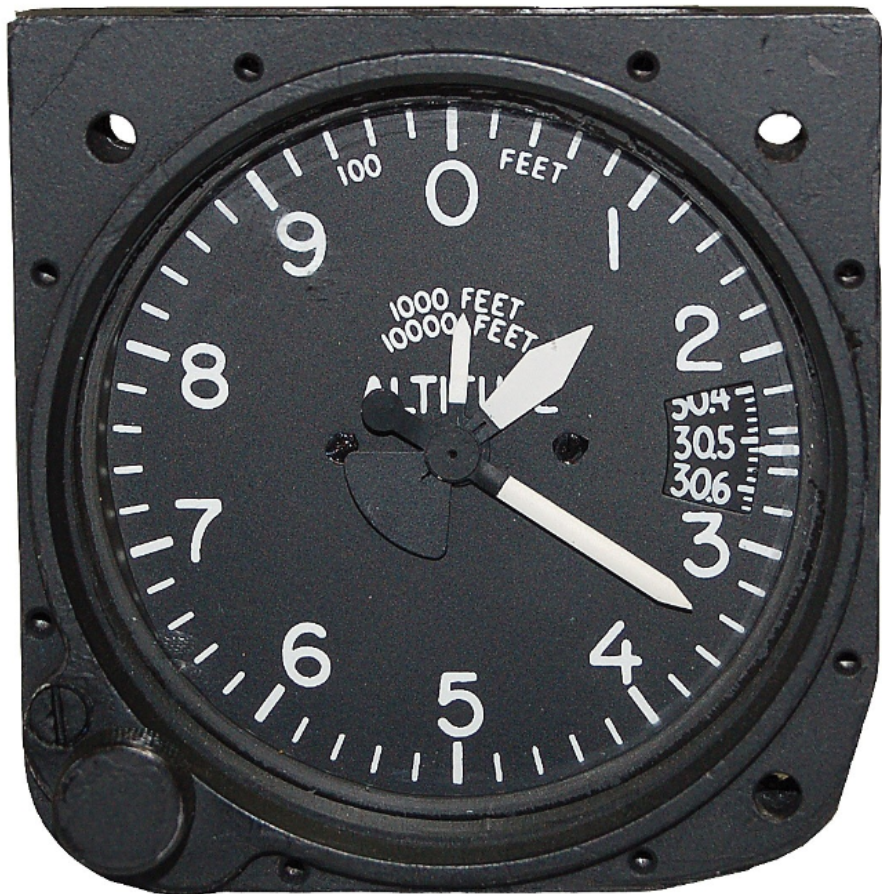

---

## Why is it important?

<!--
- To (more comfortably) clear terrain & obstacles
- To clear airspaces
- To follow traffic control for adequate separation
- To better judge height during landings
-->

---

## Altimeter

Pressure difference between:
- Sea level
- Current altitude

Based on assumptions:
- 1 in / 1000ft
- 2°C / 1000ft

---

## Altimeter

 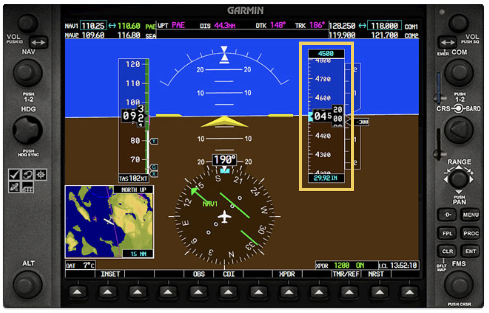

<!--
Traditional Gauge
- 100ft, 1000ft, 10000ft pointer
- kollsman window
- adjustment knob

G1000
- altitude reading
- target altitude
- altimeter settings
-->

---

## Altimeter

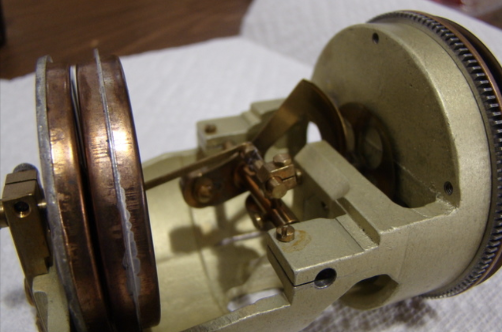
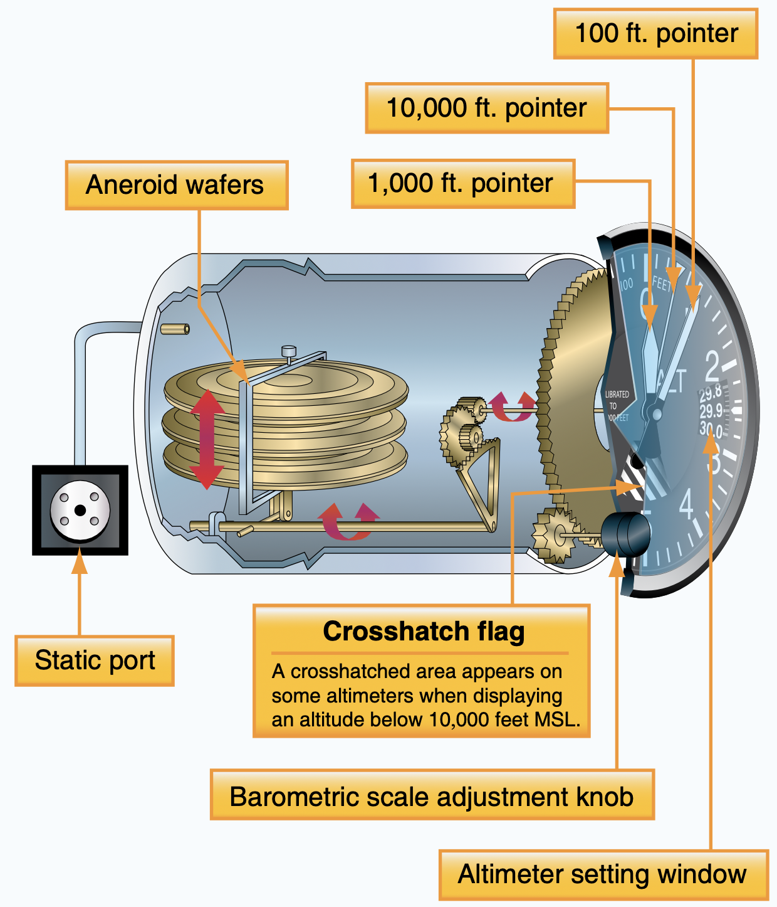 

---

---

## Altimeter Reading Exercise

<!--
https://flightapps.erau.edu/interactive/3Dinstruments/altimeter.html
-->

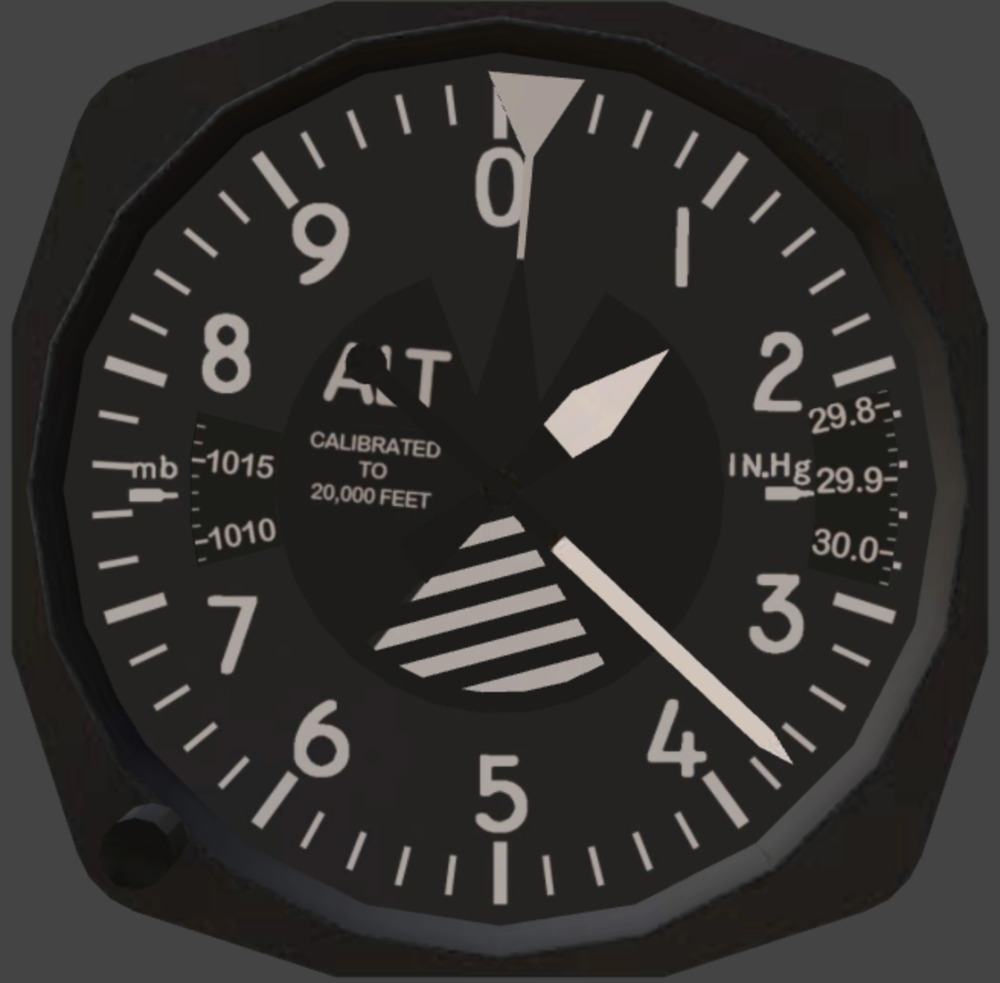 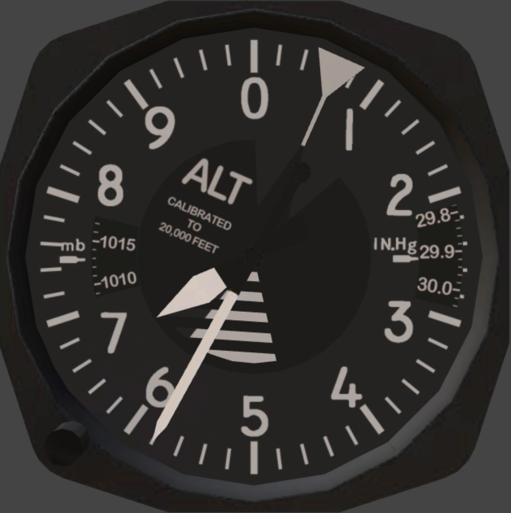 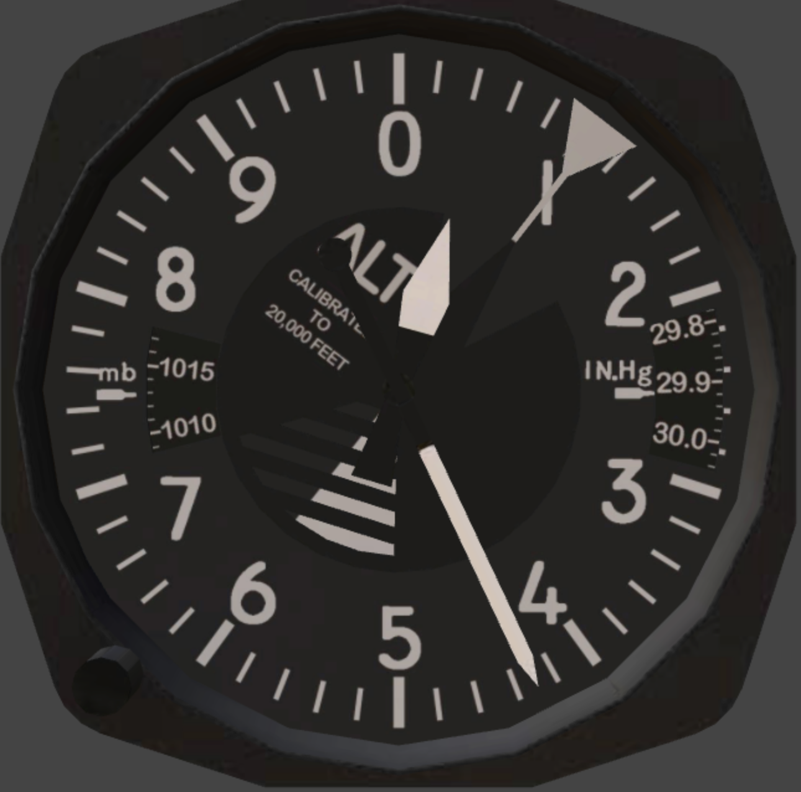

---

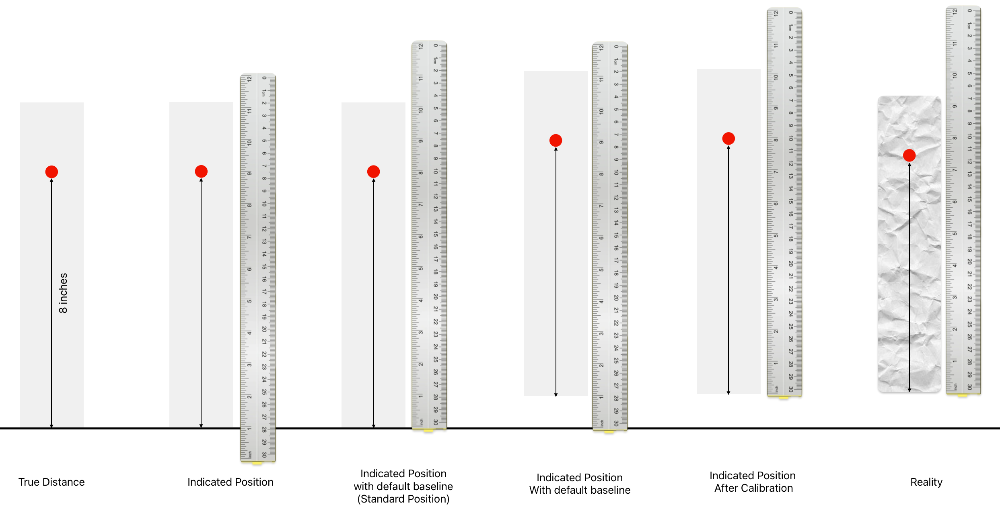

---

## Types of Altitude

- True Altitude (MSL)
- Absolute Altitude (AGL)
- Indicated Altitude
- Pressure Altitude
- Density Altitude

---

## True Altitude (MSL) & Absolute Altitude (AGL)

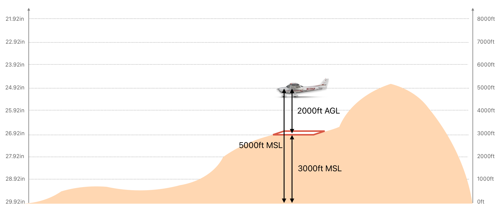

<!--
- True Altitude (MSL): Height above sea-level
- Absolute Altitude (AGL): Height above terrain
-->

---

## Indicated Altitude & Pressure Altitude

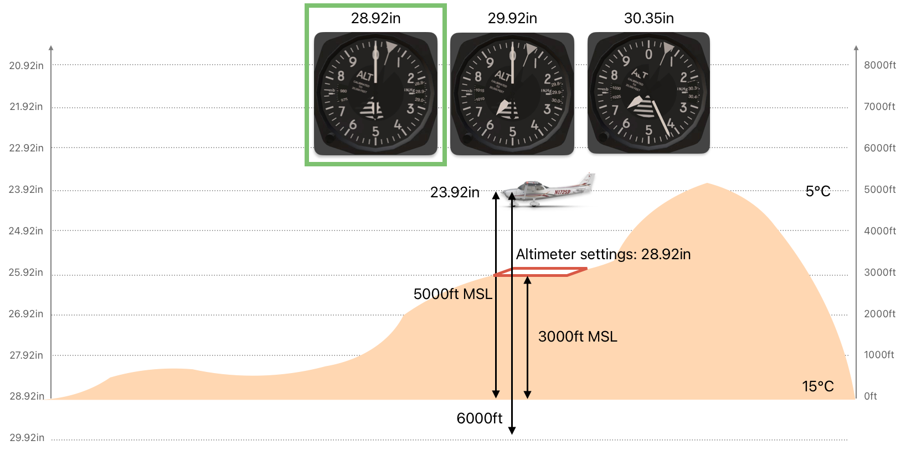

<!--
- with random altimeter settings: meaningless;
- with standard altimeter settings (29.92): pressure altitude
- with local altimeter settings: (almost) correct altitude

For traffic separation purpose, this is sufficient.
-->

---

## Temperature Correction

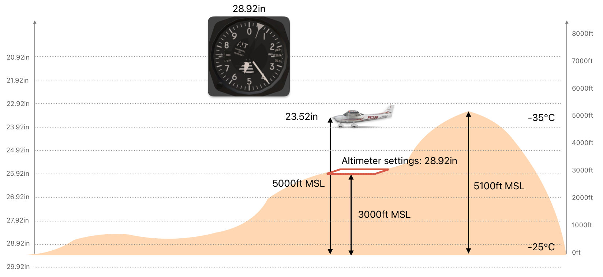

<!--
For every 10°C below ISA, reduce 100ft.
-->

---

## Density Altitude

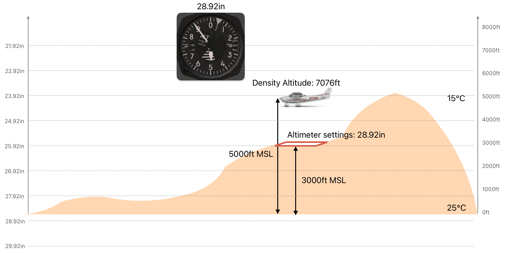

---

## Altimeter Settings

*"High to low, look at below"*

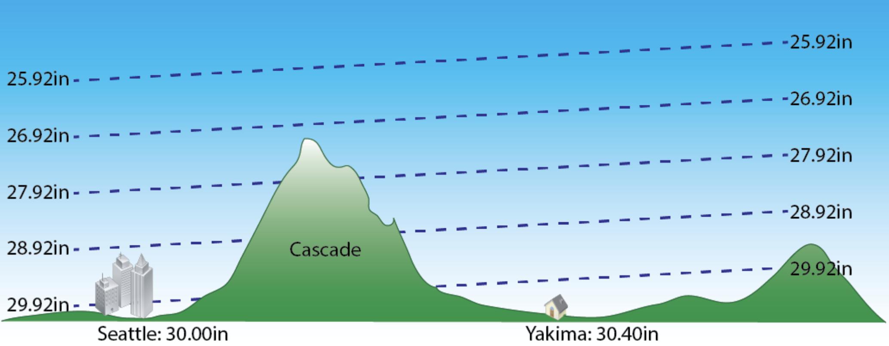

---

## Altimeter Settings

*"High to low, look at below"*

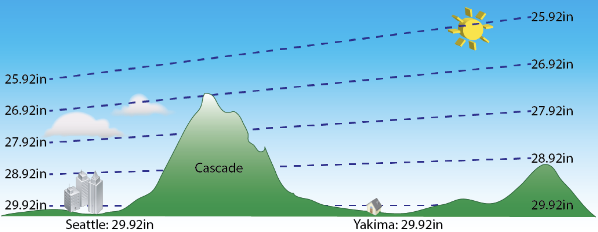

---

## Takeaway

- Always set to local altimeter settings
- Be careful when too cold
- Be careful when too hot