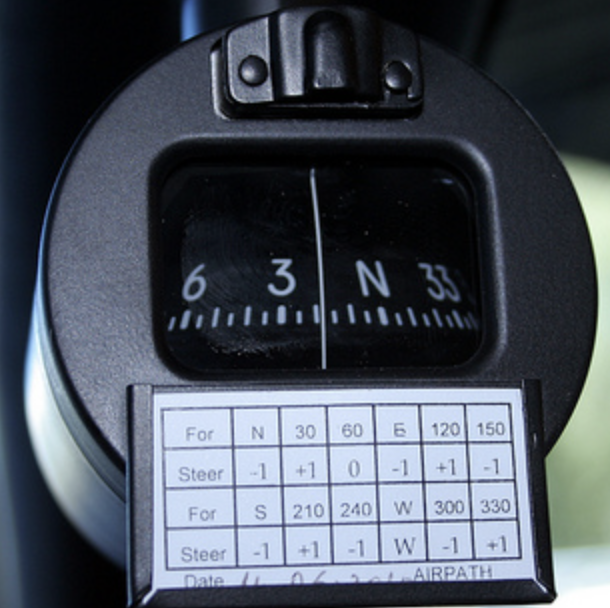
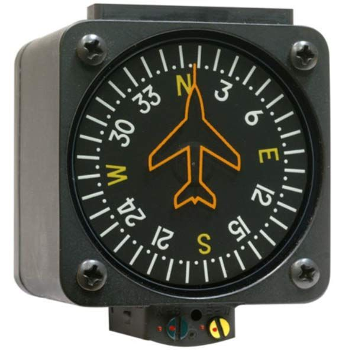
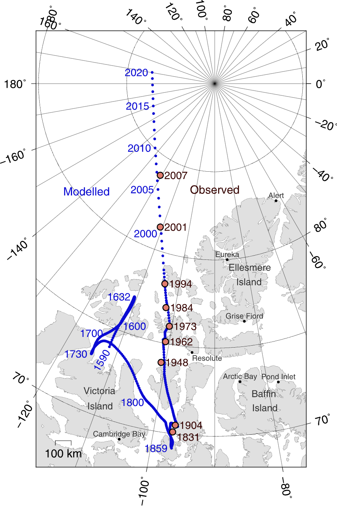
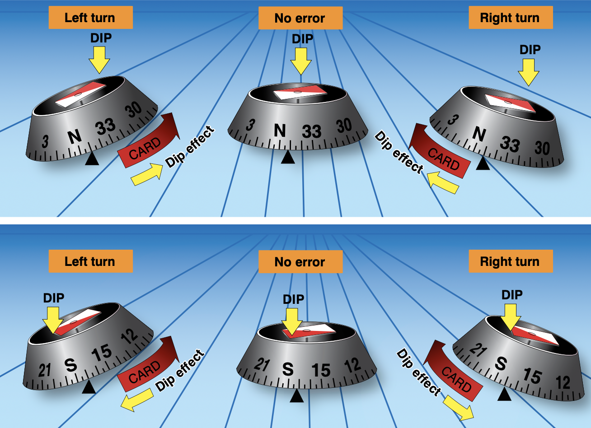
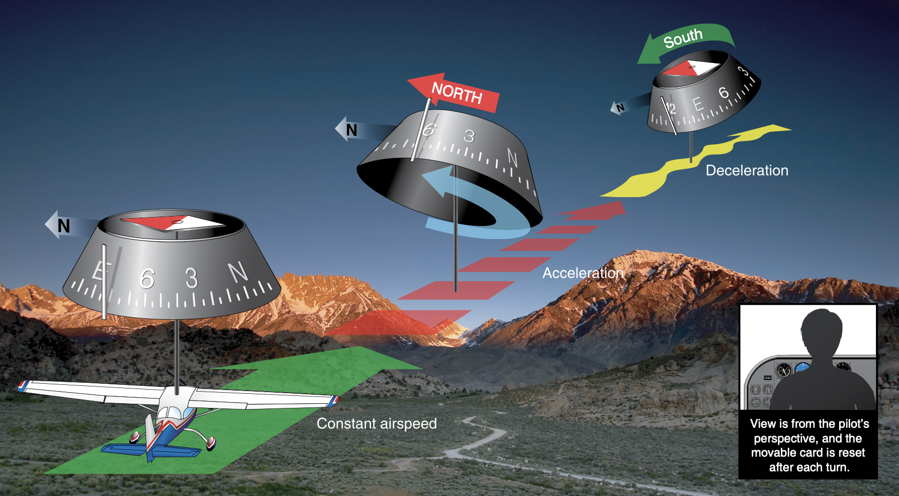

# Magnetic Compass

indication of direction

---

## Why is it important?

<!--
High reliability: doesn't depend on anything else to work
-->

---

 

---

## Magnetic Compass Errors

- Variation
- Deviation
- Dip Error
- Oscillation Error

---

## Variation Error

- True North
- Magnetic North

---

## Deviation Error

Due to local magnetic fields

---

## Dip Errors

Northerly turning error (SAND)
- when turning South: Advanced
- when turning North: Delayed

---

## Dip Errors

Acceleration error (ANDS)
- when Accelerate: North turn
- when Decelerate: South turn

---