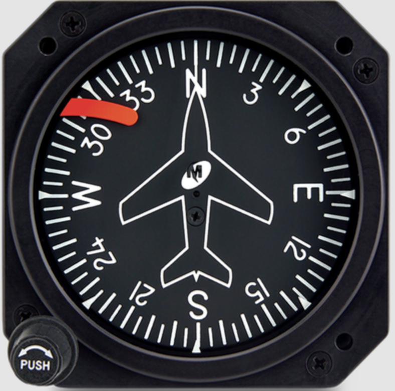
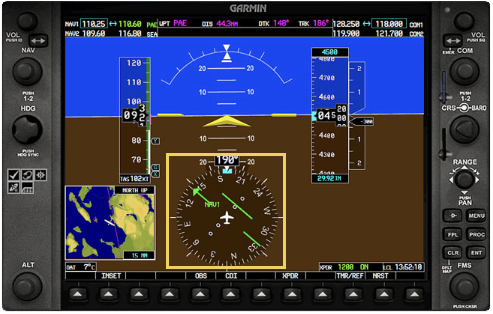
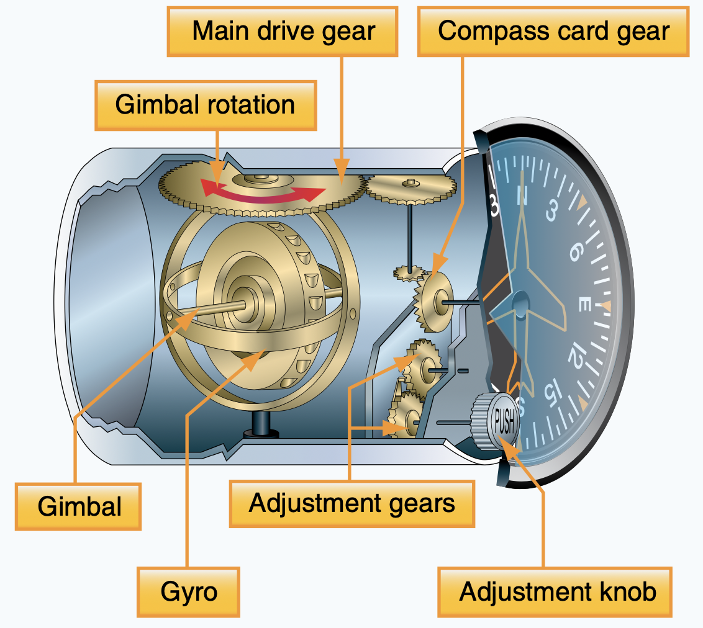

# Heading Indicator

---

## Heading Indicator

<simulation>

[simulation][1]

[1]: https://flightapps.erau.edu/interactive/3Dinstruments/heading.html
</simulation>

 

<timer>00:01</timer>

---

## Why is it important?

It provides:
- Current heading

with:
- stable reading during maneuvers / accelerations
- not susceptible to interference
- almost no error

---

## How does it work

No dependency on magnetic field

---

## Errors

- Low vacuum => Drift
- Friction => Precession => Drift
- Earth rotation => 15°/h (max)

Adjust: every 15min

<!--
## Earth rotation

Gyro's rigidity: remain fixed in space.
Earth: constant moving and rotating.
worst at poles. magnetic north keeps moving with earth rotation.
-->