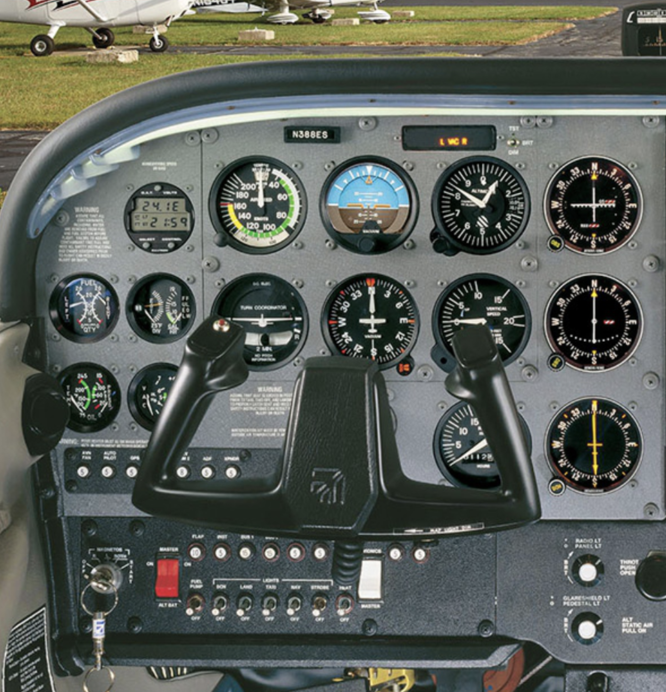
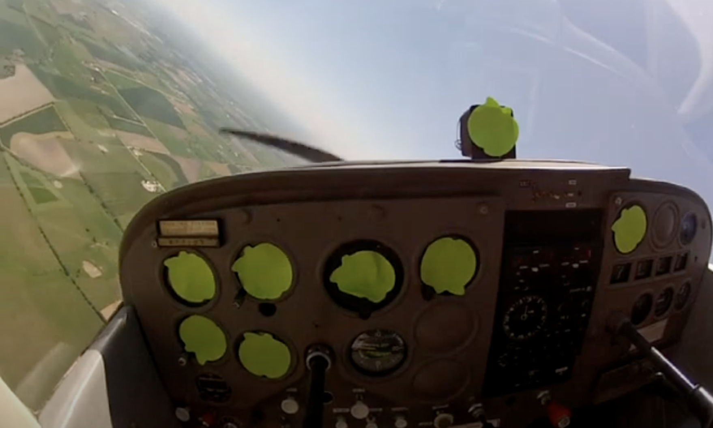
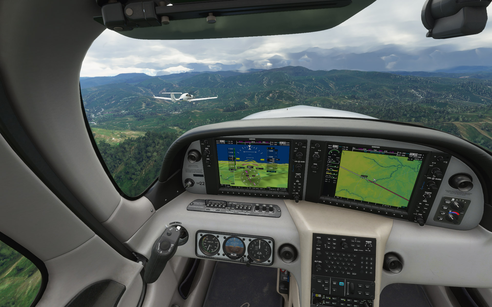
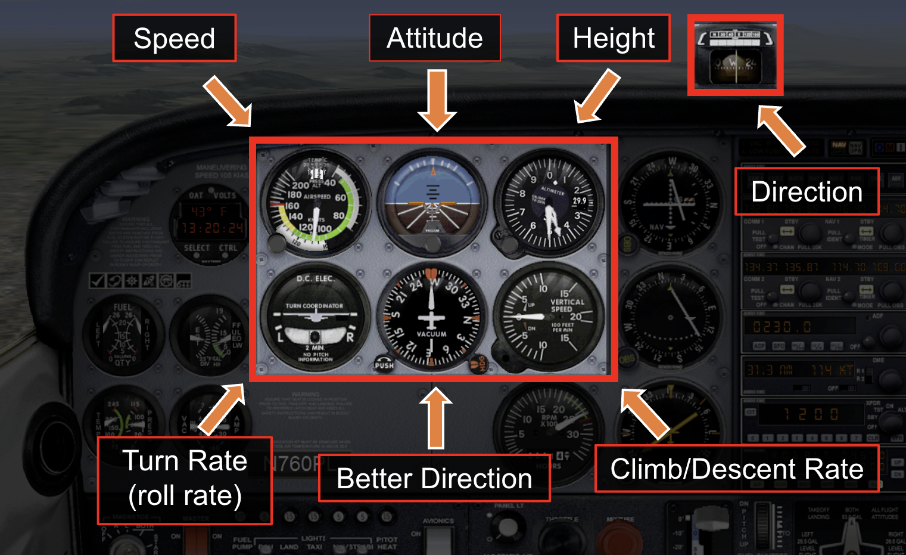
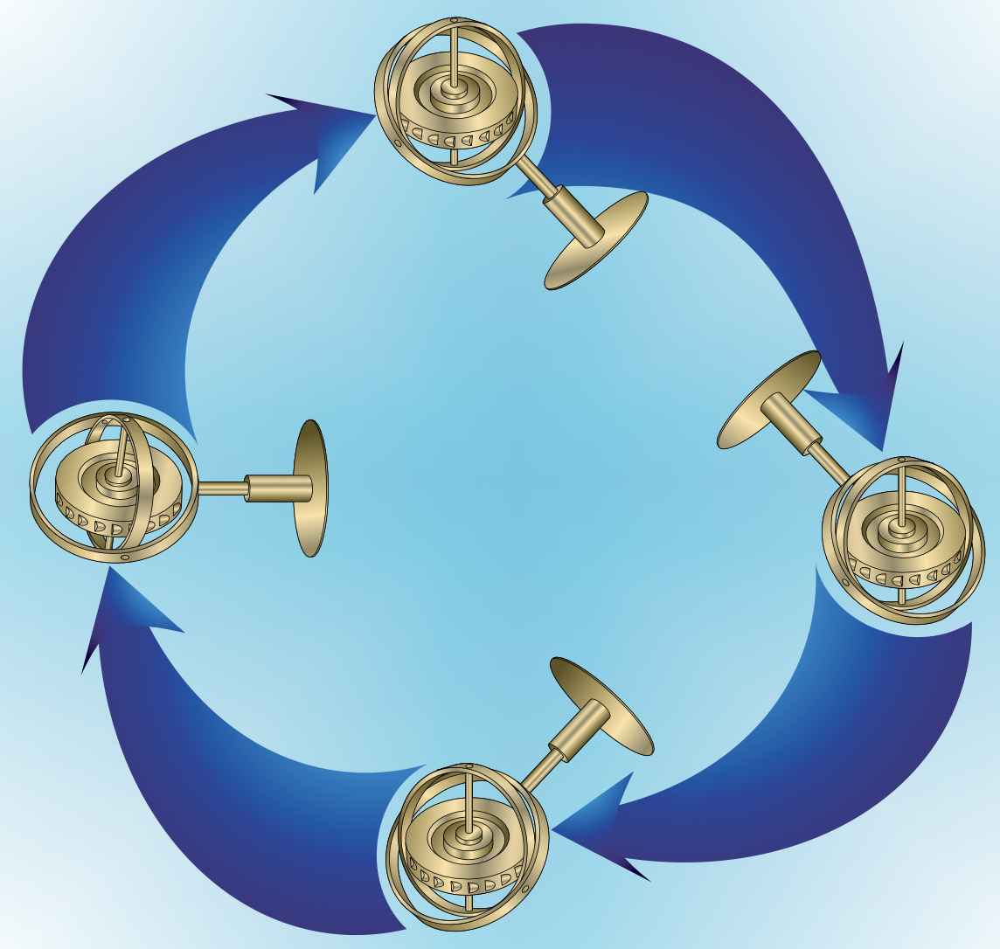
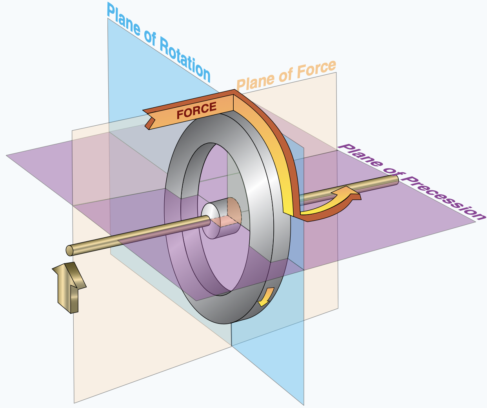
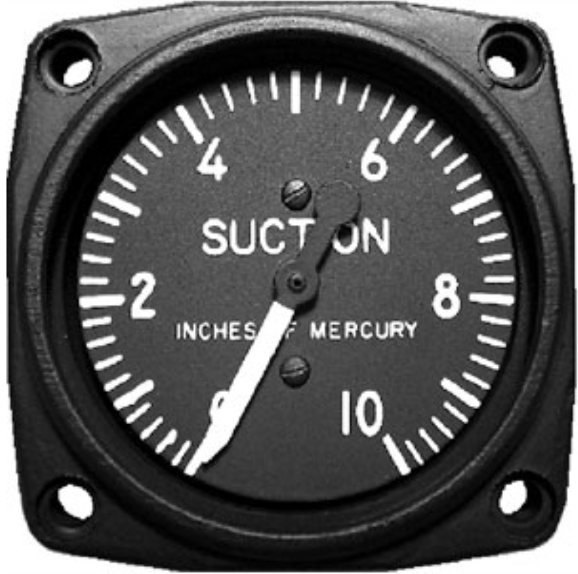
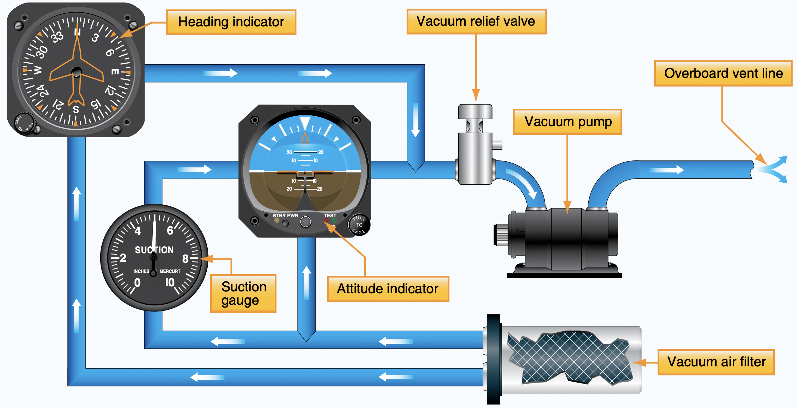

# Flight Instruments

Bowen Zhang | Dream of Flight, Inc

---

## Objective

Interpret essential instruments and recognize their limitations, failure modes.

---

## Prep

- Read "Pilot's Handbook of Aeronautical Knowledge":
  - [Chapter 8: Flight Instruments][1]
- Fly [Microsoft Flight Simulator][2] or [X-Plane][3]
  *see if you can fly the airplane without looking at the instruments.*

[1]: https://www.faa.gov/regulationspolicies/handbooksmanuals/aviation/phak/chapter-8-flight-instruments
[2]: https://www.flightsimulator.com/
[3]: https://www.x-plane.com/

<!--
Instructor prep:
  - gyro
  - attitude indicator sim: https://flightapps.erau.edu/interactive/3Dinstruments/attitude.html
  - heading indicator sim: https://flightapps.erau.edu/interactive/3Dinstruments/heading.html
-->

---

<invert>
          

## Can you fly safely without instruments?

</invert>

<!--
When is the last time you stared at your dashboard while driving (if there's no speed limit)?
-->

---

<!--
- Speed: by power settings, gap between horizon and engine cowling
- Bank: by angle between horizon and engine cowling
- Direction: visual reference
- Altitude: just don't hit something
-->

---

<invert>

## Look outside!

</invert>

<!--
As a private pilot in visual flight condition, spend 90% time looking outside!

Instruments allow you to fly perfectly, but first, fly it.
-->

---

## What instruments do you need to fly (better/easier)?

- Altitude
- Lateral Speed
- Vertical Speed
- Turn Coordination

and when you start to lose visual references...
- Attitude
- Direction

---

---

## Pitot-Static Instruments

  1. [Altimeter](altimeter.md)
  1. [Vertical Speed Indicator](vertical-speed-indicator.md)
  1. [Airspeed Indicator](airspeed-indicator.md)
  1. [Pitot-Static System](pitot-static-system.md)

---

## Compass

[compass](compass.md)

---

## Gyroscope

<col-2>

**Rigidity**
remains in fixed position

</col-2>
<col-2>

**Precession**
tilting in response of deflective force

</col-2>

---

## Gyroscope Instruments

  1. [Attitude Indicator](attitude-indicator.md)
  1. [Heading Indicator](heading-indicator.md)
  1. [Turn Coordinator](turn-coordinator.md)

---

## Gyroscope - Source of Power

- Vacuum (5in Hg, engine driven)
- Electric
- Pressurized Air

---

