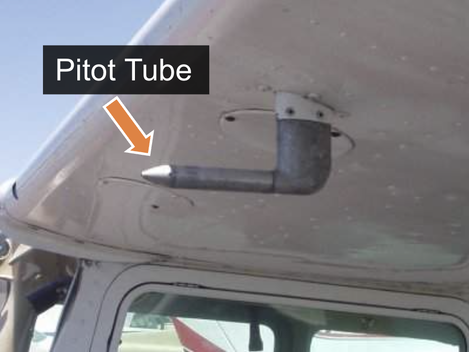
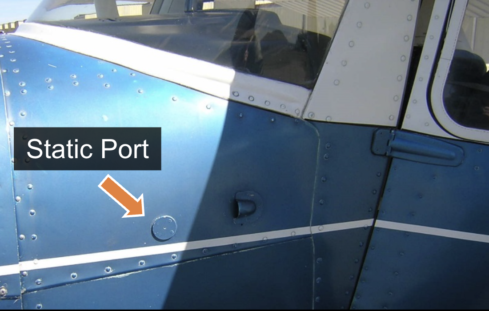
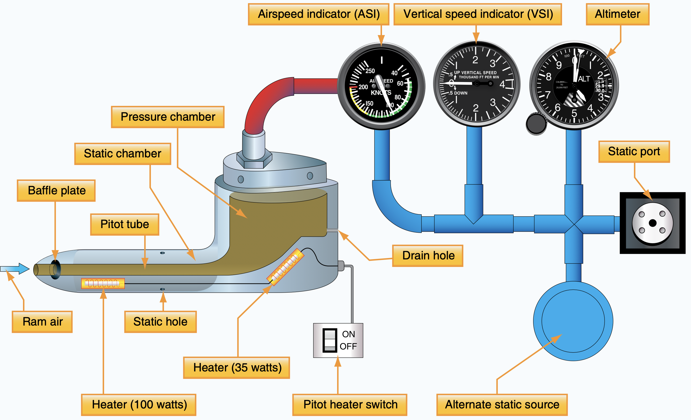

# Pitot-Static System

---

<left>

## Components

- Pitot tube
- Static port
- Alternate Static Source
- Heating

</left>
<right>

</right>

---

---

## Failure Modes

Case 1: During climb/descent, altimeter shows no change, VSI shows 0 fpm.

Case 2: during takeoff roll, airspeed indicator shows 0 kts.

Case 3: during climb, airspeed indicator shows acceleration.

<!--
3 failure points:
- pitot tube
- pitot drain hole
- static port

Case 1: blocked static port
Case 2: blocked pitot tube
Case 3: blocked pitot tube & drain hole
-->