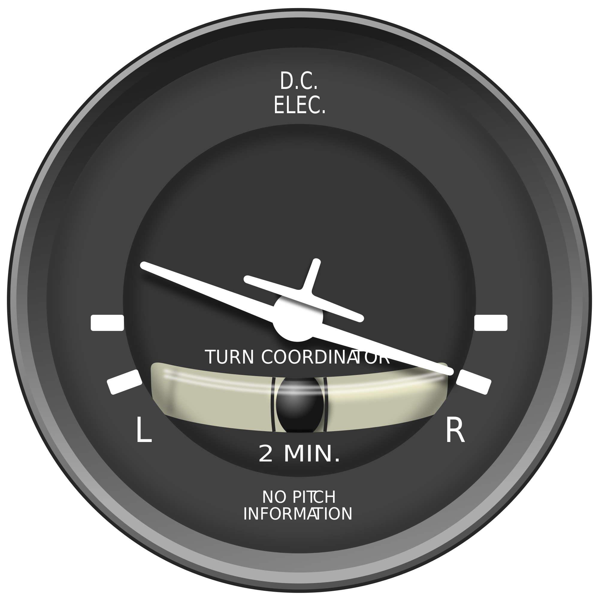
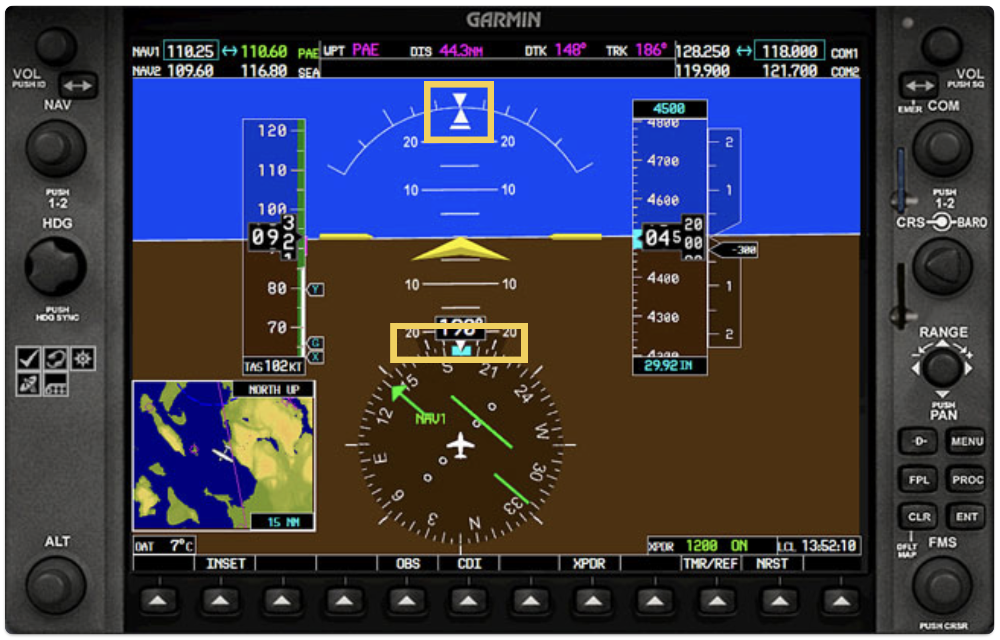
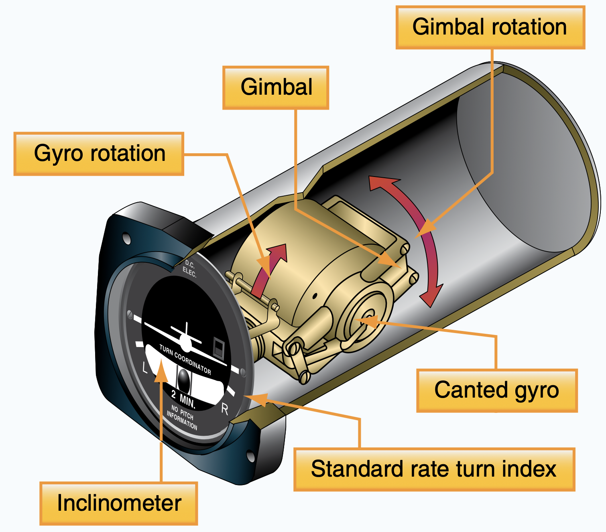
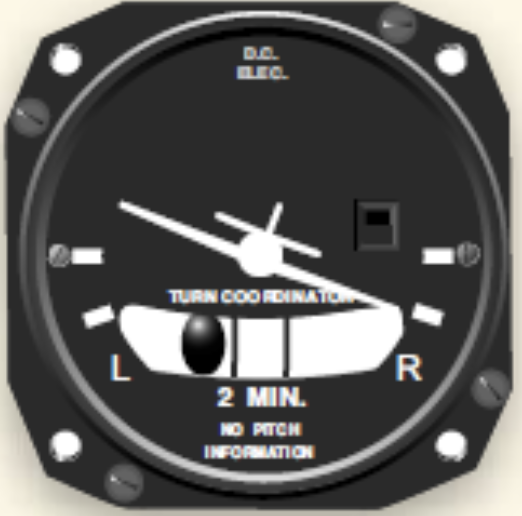
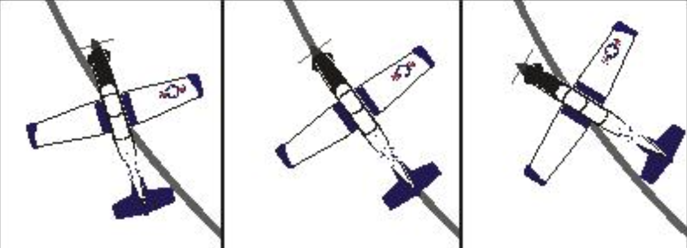
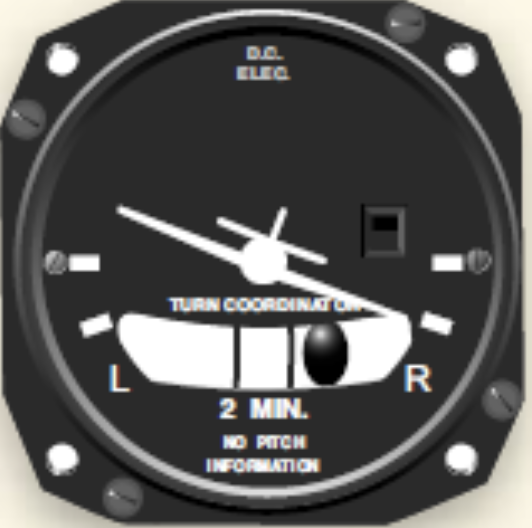

# Turn Coordinator

---

## Why is it important?

<!--
- Coordinated turn
- IFR: with standard rate turn, turn radius = f(airspeed)
- When heading indicator fails: turn by stopwatch
-->

---

## Turn Coordinator

 

---

## Turn Coordinator

Rate of Turn & Rate of Roll
- Standard-rate turn: 360° in 2min (3°/sec)
- No bank info

Coordination

---

## Turn Coordinator

---

## Skidding Turn (Drifting)

---

## Uncoordinated Turn

|Skidding Turn||Slipping Turn|
|:--:|:--:|:--:|
|turn rate > bank angle||turn rate < bank angle|
|Too fast||Too slow|
|Too tight turn||Too wide turn|
|Too shallow bank||Too steep bank|
||||

