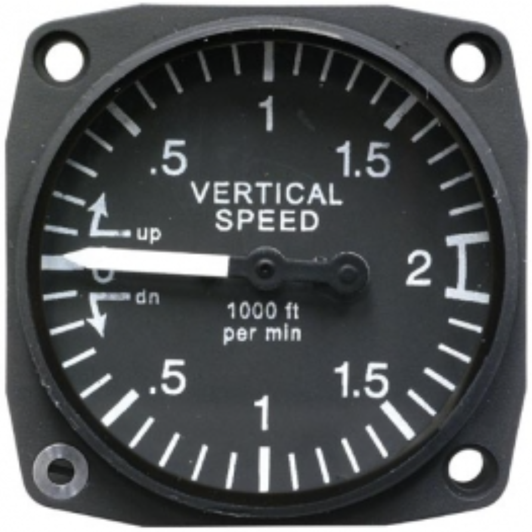
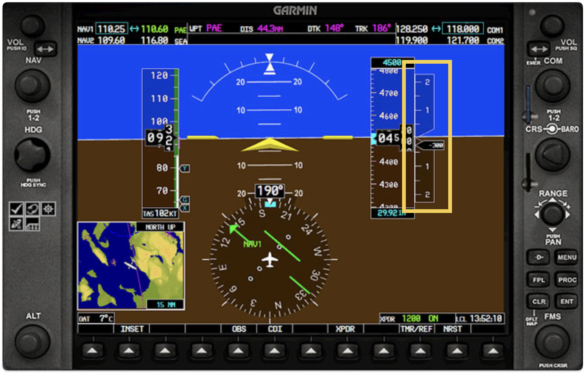
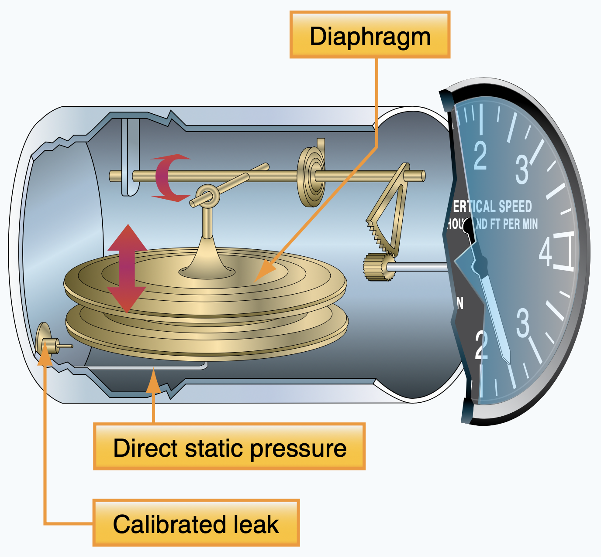

# Vertical Speed Indicator (VSI)
Indication of current vertical speed (with delay)

---

## Why is it important?

<!--
- To ensure adequate rate of climb for terrain/obstacle clearance
- To ensure comfortable rate of descent
-->

---

## Vertical Speed Indicator

 

---

## Vertical Speed Indicator

Rate of Pressure Change gauge
- Lag: 6-9s
- Avoid rough control

