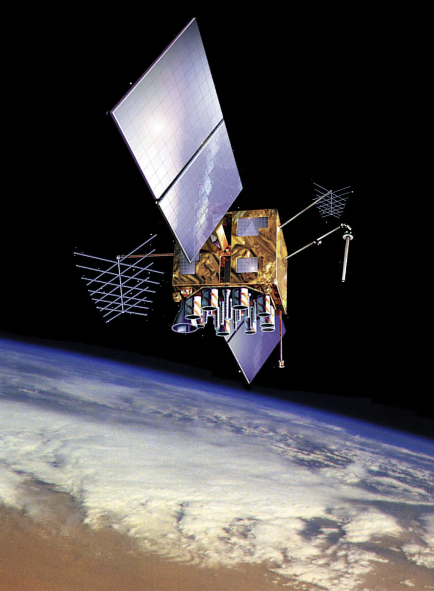
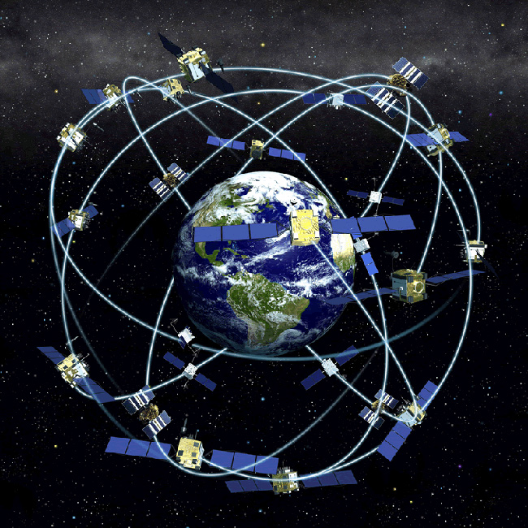
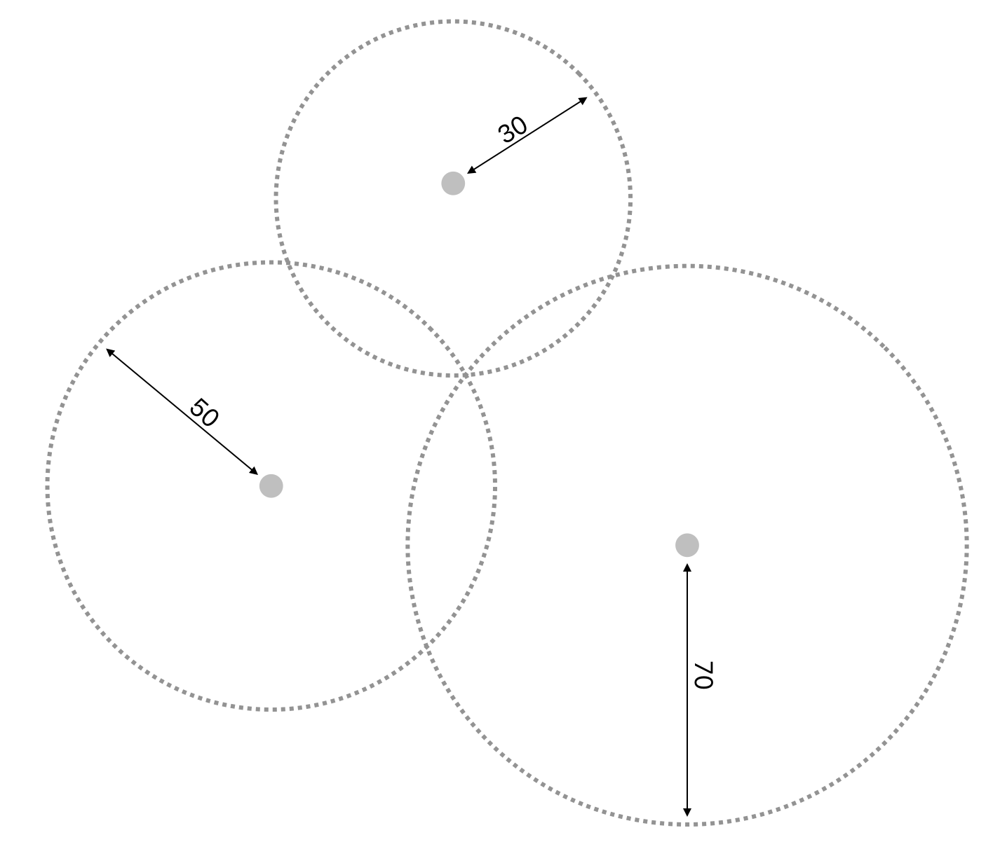
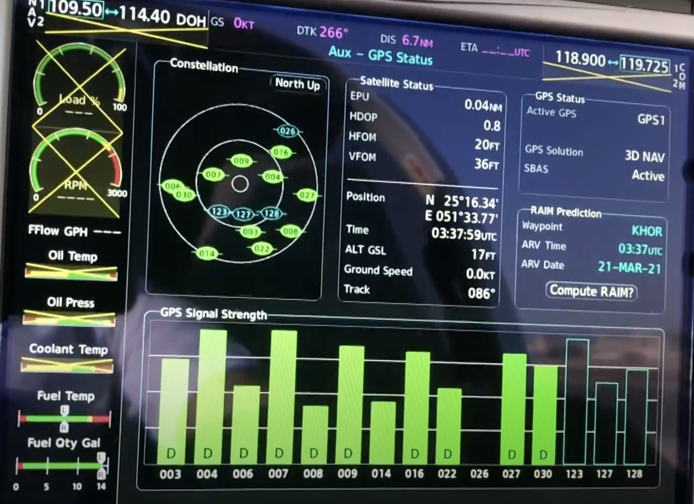
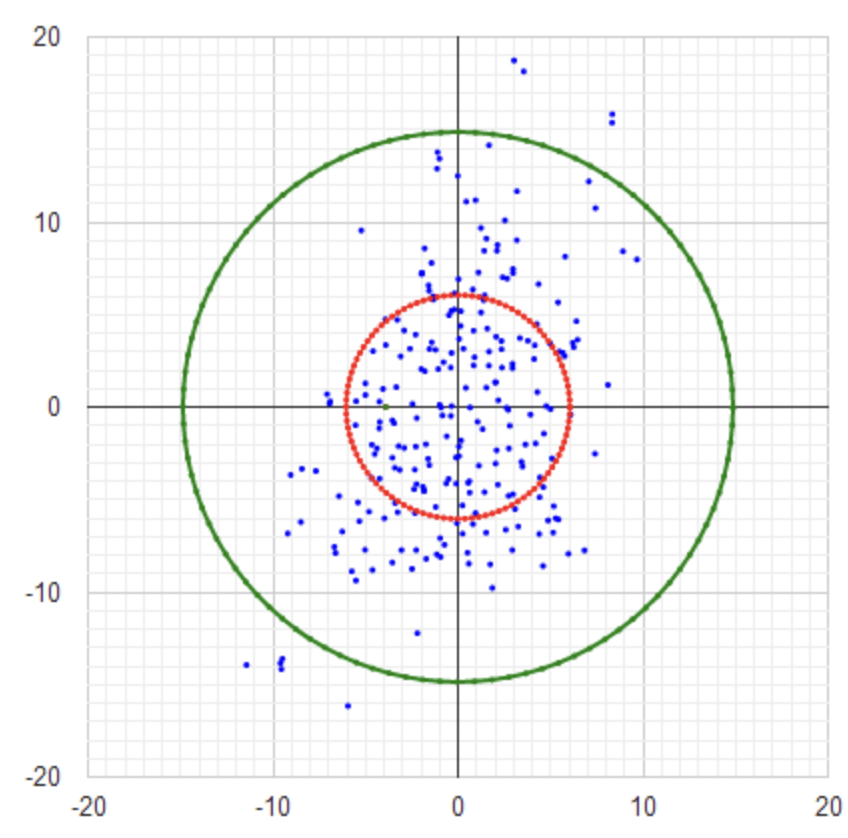
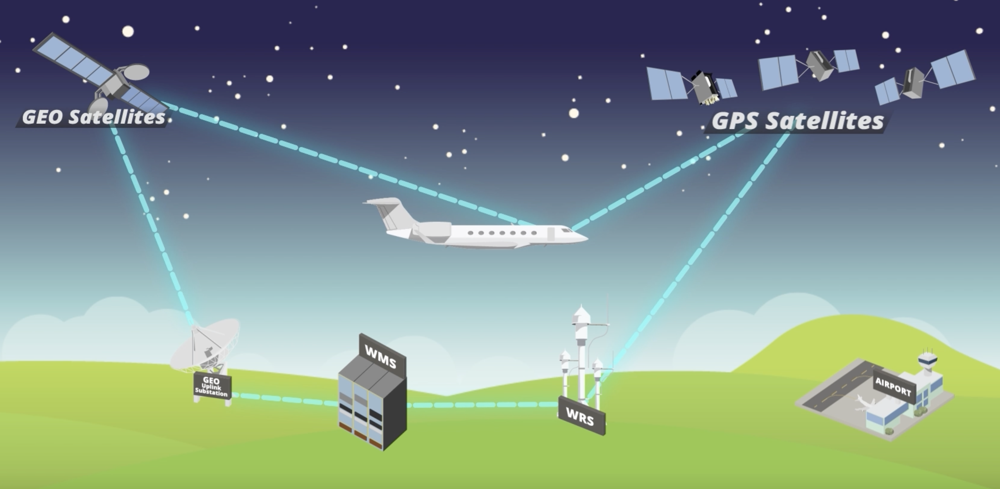
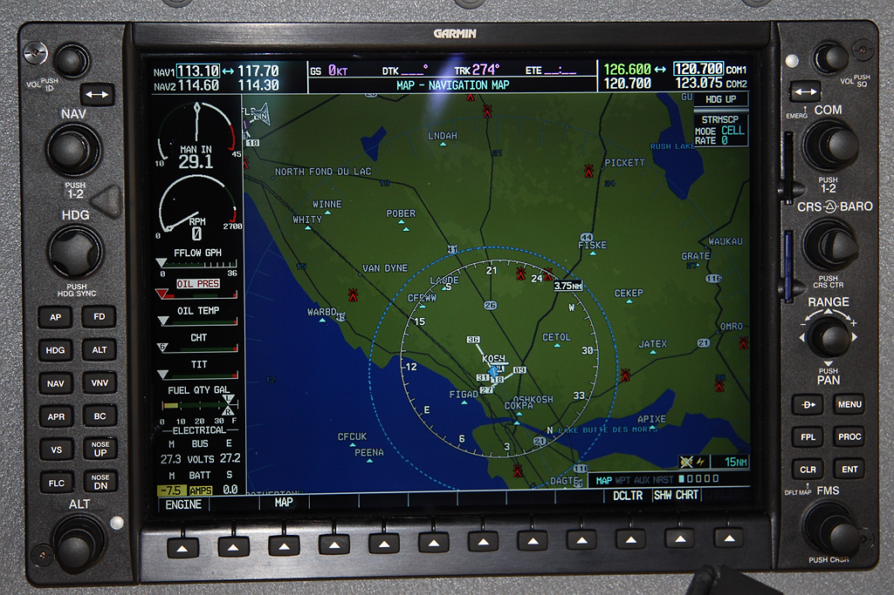
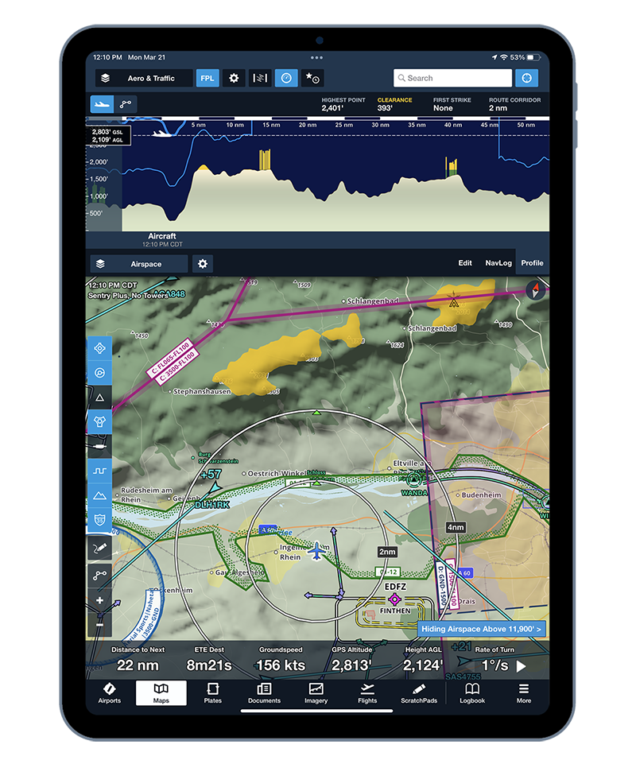
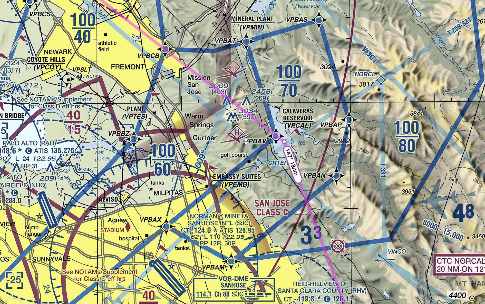

# GPS

---

## GPS (Global Positioning System)

<non-key>

satellite radio navigation and time dissemination system developed and operated by the U.S. Department of Defense (DOD).

</non-key>

<left>

- 31 operational GPS satellites

</left>
<right>

</right>

<!--
- baseline: 24 satellites
- 6 orbital planes
- 4 operational satellites + 1 spare satellite slot
- 12,550 miles above earth (Medium Earch Orbit)
-->

---

## Receiver Autonomous Integrity Monitoring (RAIM)

- 3 satellites for lateral position
- 4th satellite for altitude
- 5th satellite for integrity detection
- 6th satellite for auto correction

   

<!--
- G1000: auto check if no WAAS
- Not every receiver has RAIM
-->
---

## GPS Accuracy

<left>

- 300ft with Selective Availability
- 20 ~ 60ft
- SLO: <6.6ft @ P95 (with WAAS)
- Actual: <2.1ft @P95 (with WAAS) 

</left>
<right>

</right>

<!--
- Selective Availability: ended in May 2000
- Dual frequency
-->

---

## Wide Area Augmentation System (WAAS)

<!--
WAAS Test: https://www.nstb.tc.faa.gov/ 
-->

- 38 ground reference stations
- 3 ground master stations
- 3 GEO satellites

      

---

## GPS Receiver & Display

- Certified
- Portable

  

---

<!--
Watch out:
- terrain
- airspace
Be prepared for:
- emergency landing spot
- GPS failures
-->