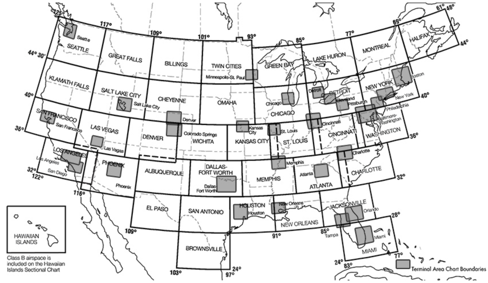
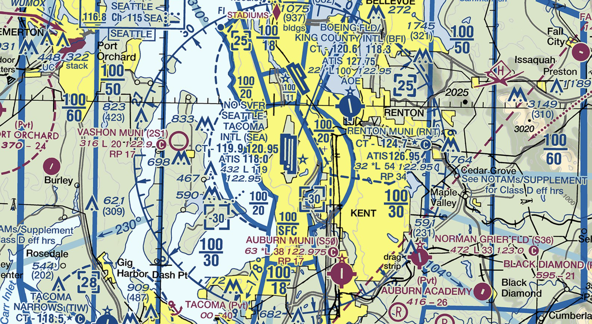
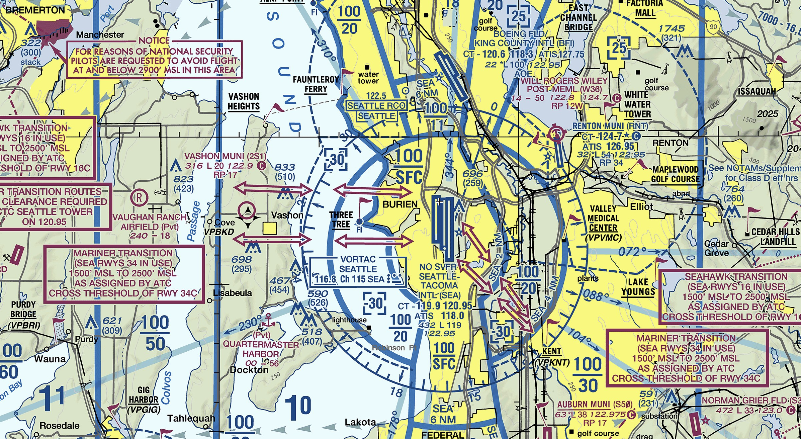

# Navigation

---

## Objectives

Master all the different ways to navigate so you never get lost.

---

## Prep

- Read "Pilot's Handbook of Aeronautical Knowledge":
  - [Chapter 16: Navigation][1]

[1]: https://www.faa.gov/regulationspolicies/handbooksmanuals/aviation/phak/chapter-16-navigation

<!--
Instructor prep:
  - Map
  - E6B
  - Plotter
-->

---

## Aeronautical Charts

- VFR Sectional Chart
<non-key>1:500,000, 6 months</non-key>
- VFR Terminal Area Chart (TAC)
<non-key>1:250,000, 6 months</non-key>

<!--
- WAC: discontinued since 2015.
-->
---

<backdrop>

## VFR Sectional Chart

</backdrop>
            

---

<backdrop>

## VFR Terminal Area Chart

</backdrop>
            

---

- [GPS](gps.md)
- [Pilotage](pilotage.md)
- [Radio Navigation](radio_navigation.md)
- [Radar Vector](radar-vector.md)
- [Dead Reckoning](dead_reckoning.md)
