## Pilotage

---

<left>

## Pilotage - Daytime

- Road
- River
- Railroad tracks
- Lakes (be aware)
- Power lines
- Airport
- Bridge
- Special shaped island/coast 

</left>
<right>

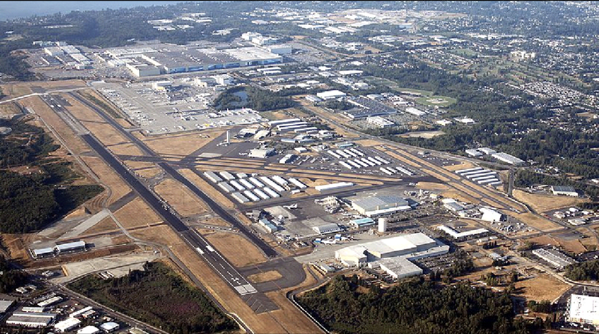 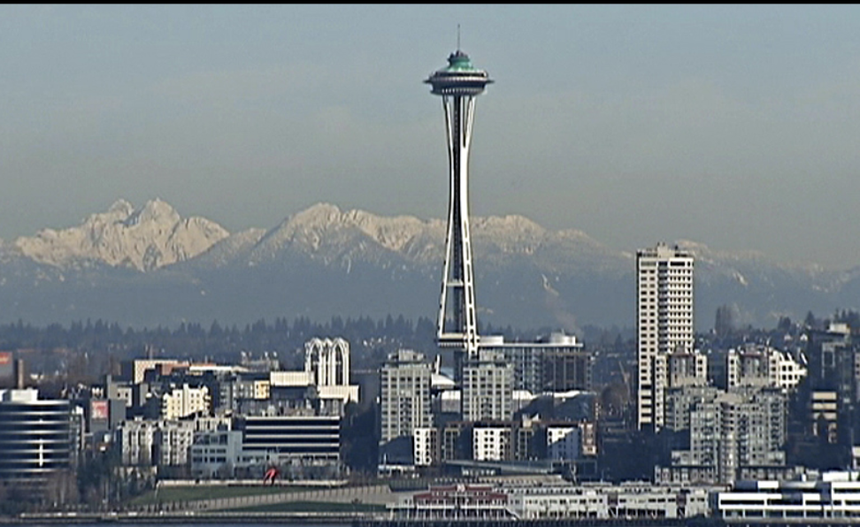
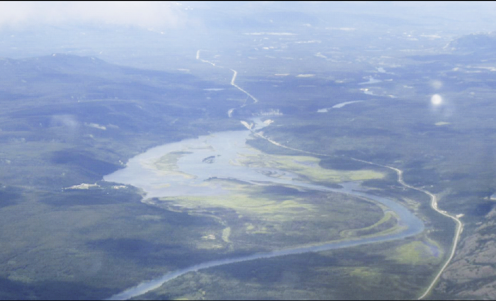 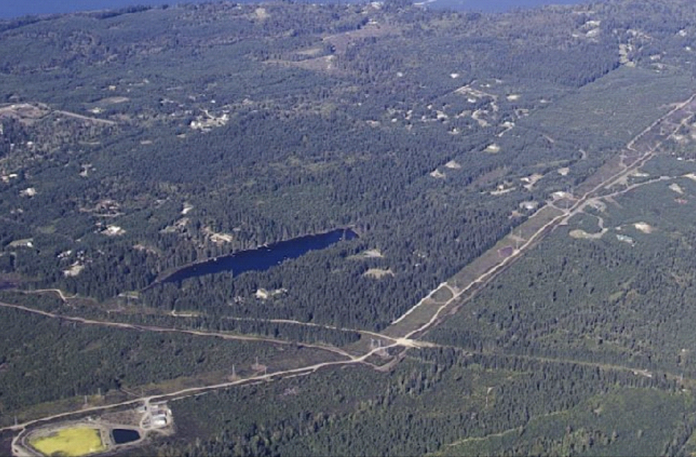
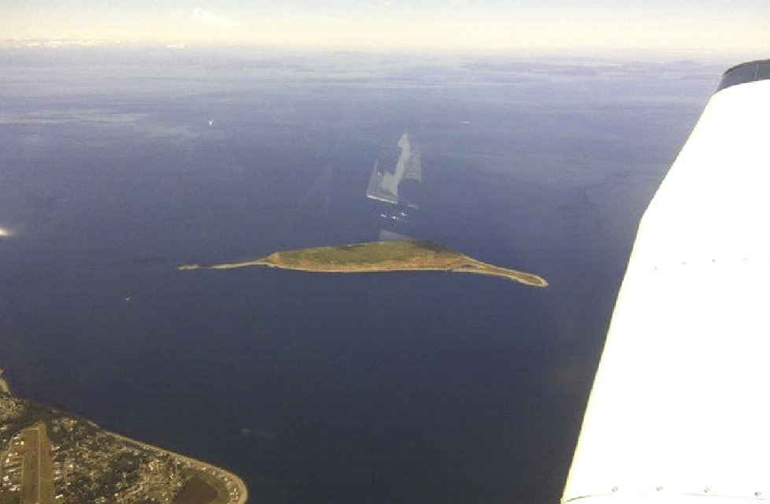 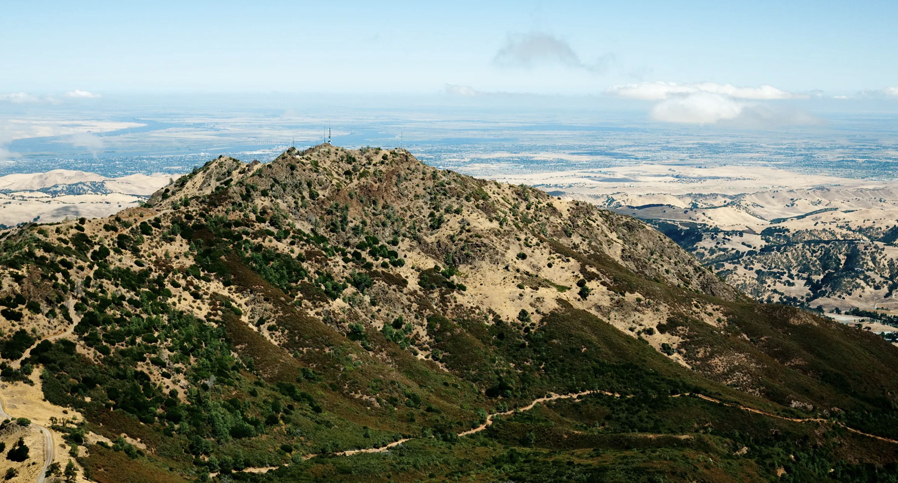

</right>

---

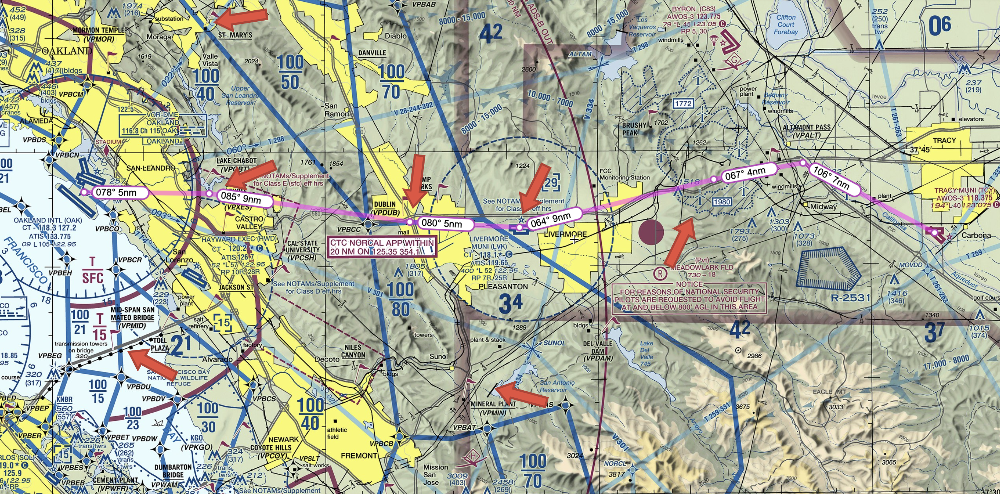

---

<right>
<invert>

## Pilotage - Nighttime

- City
- Highway
- Airport 

      

</invert>
</right>

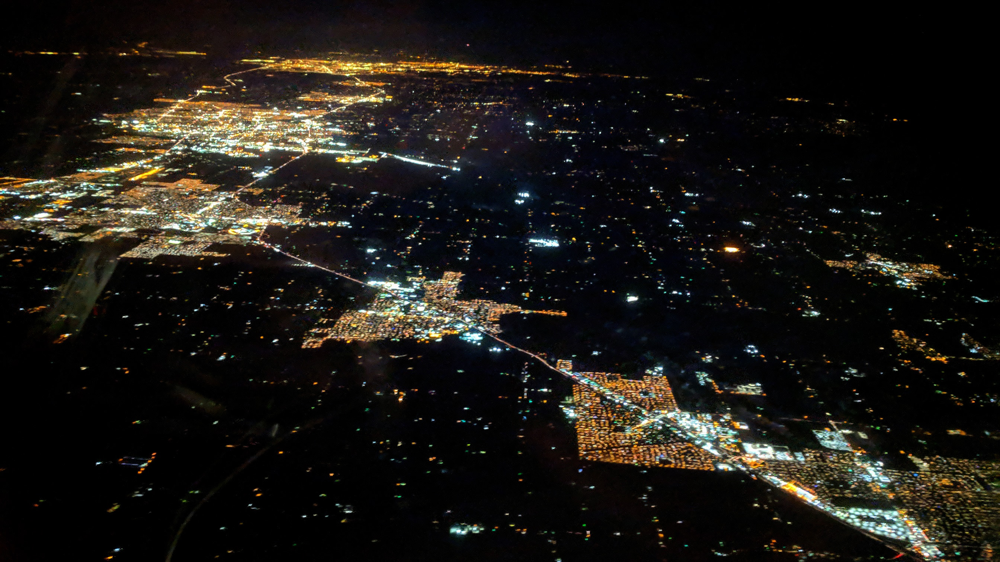
 
<!--
https://skyvector.com/?ll=37.79350761724512,-121.15887450810206&chart=301&zoom=1&fpl=%20KOAK%203743N12206W%203742N12155W%203742N12149W%203744N12139W%203744N12134W%20KTCY
-->

---

## Exercise

Plan a flight from KBFI to KHQM using pilotage

 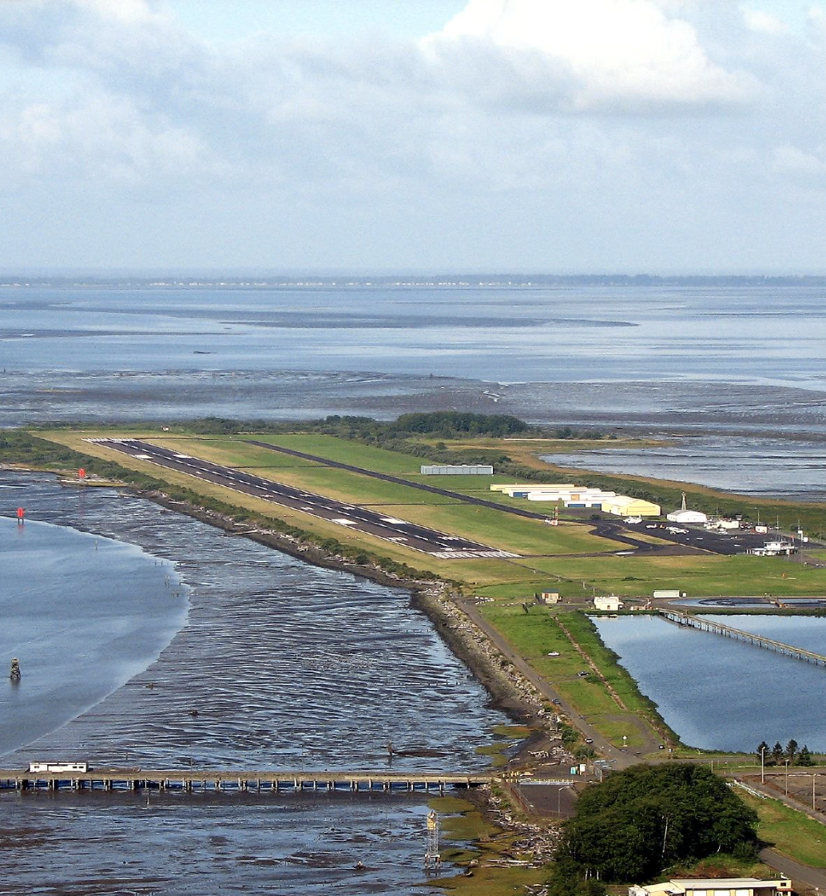 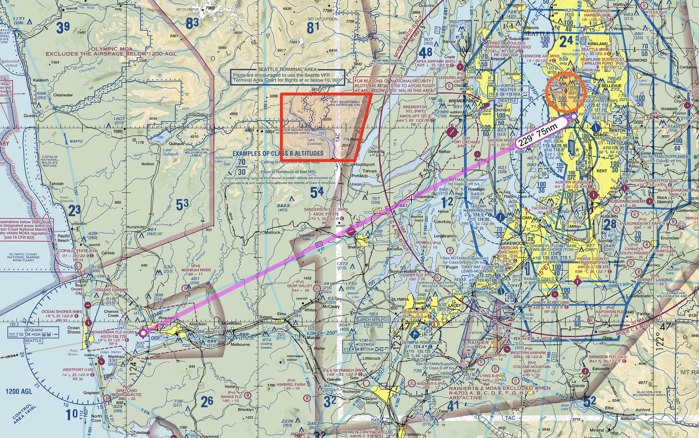 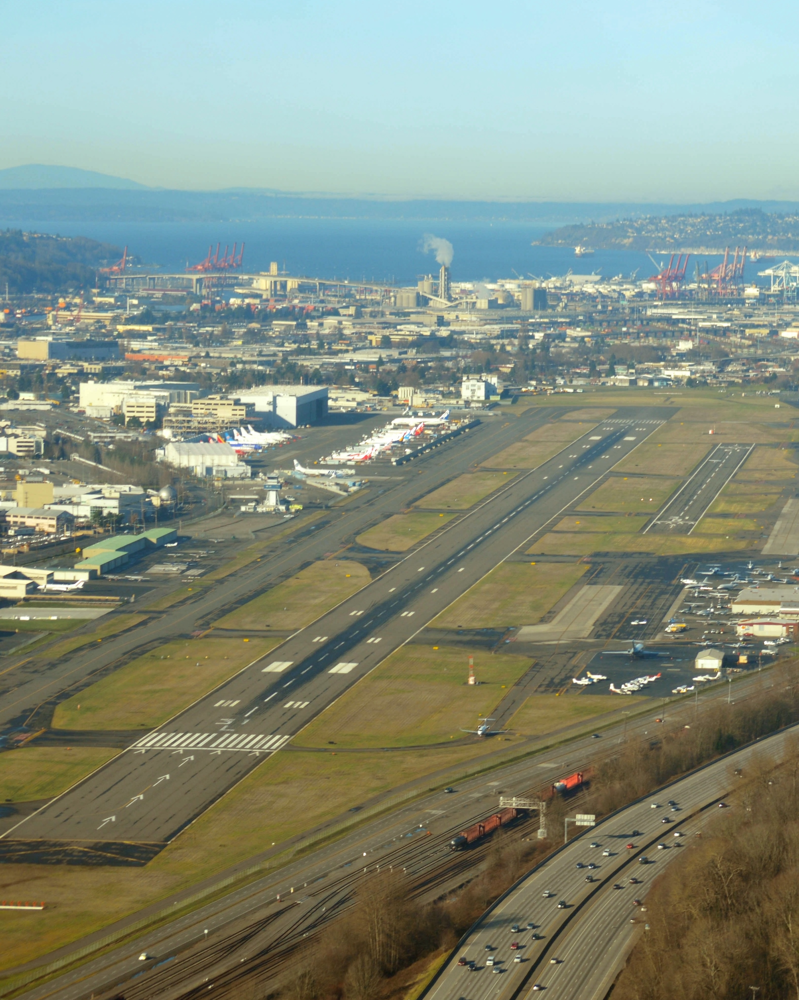