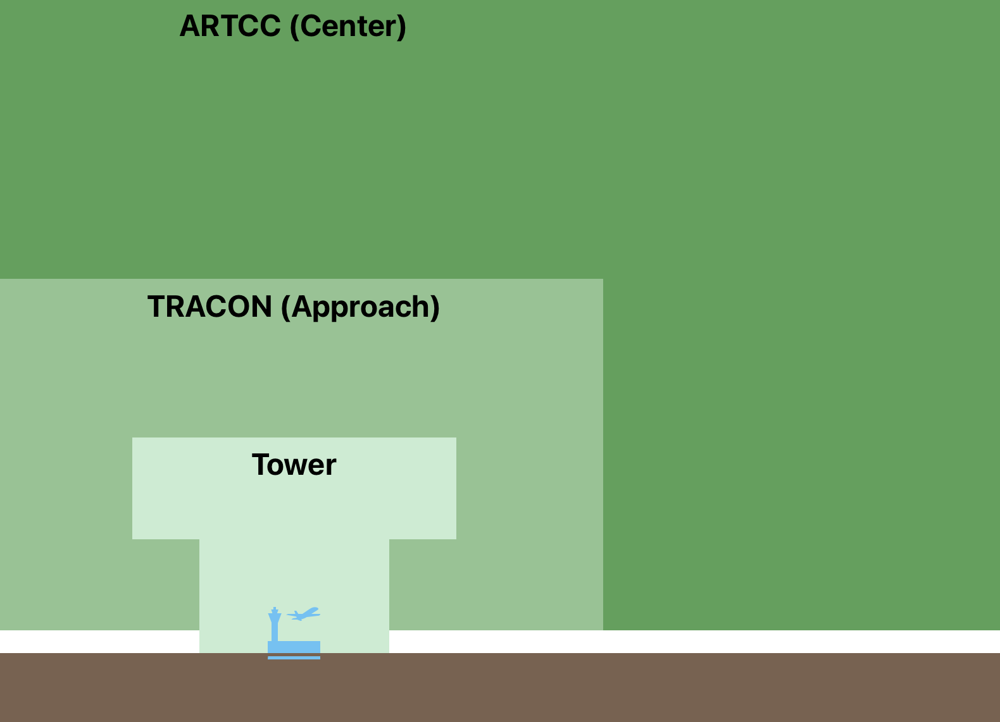
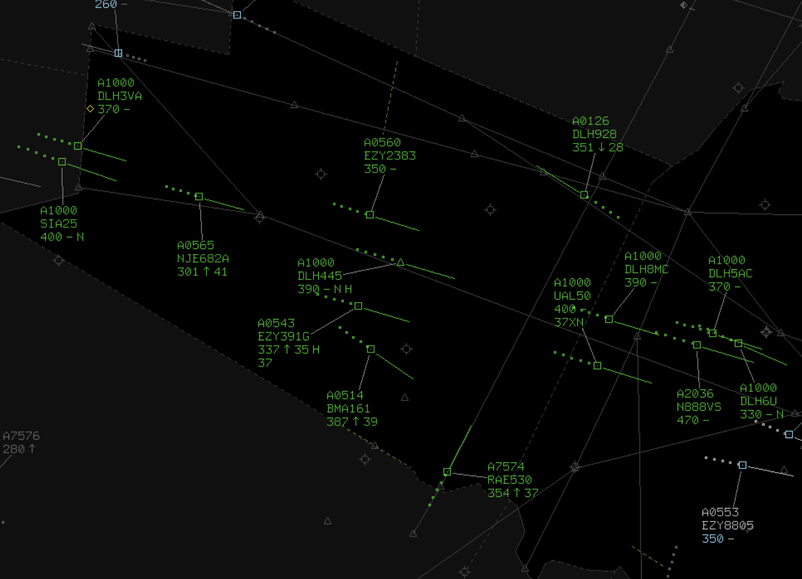
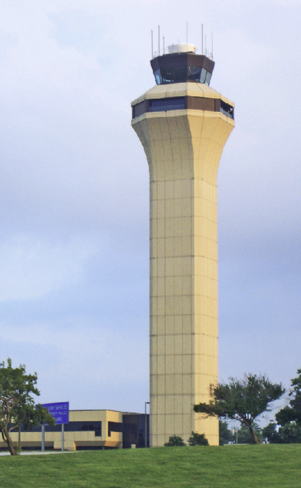
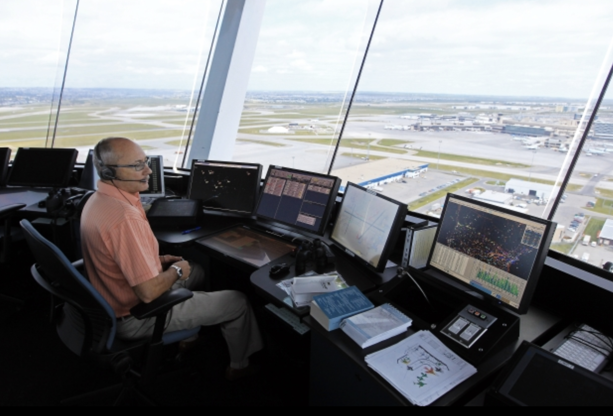
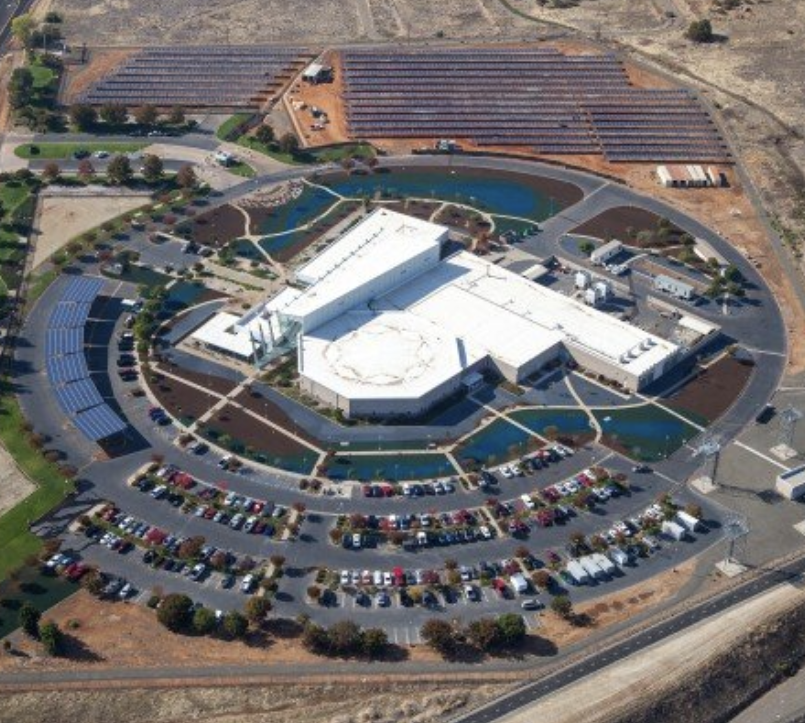
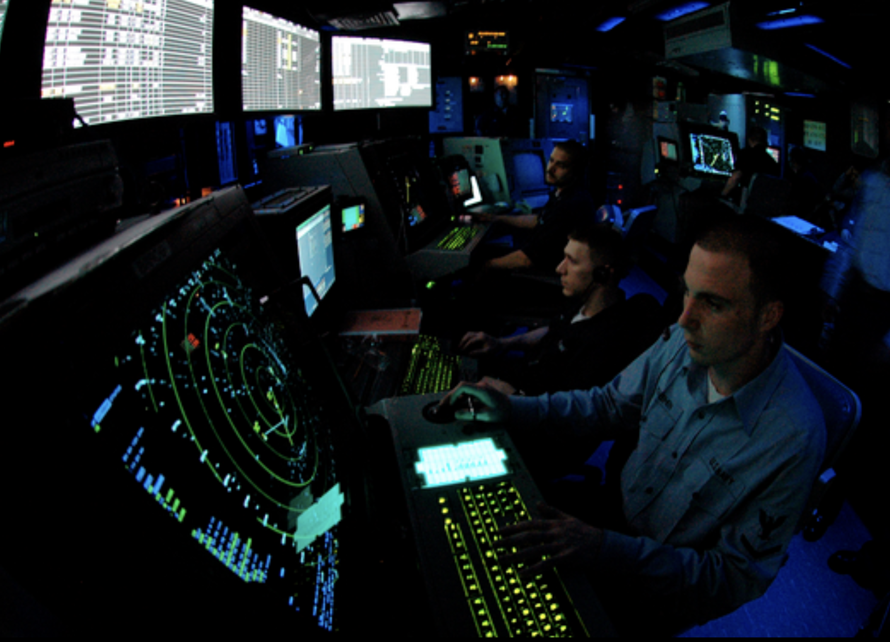
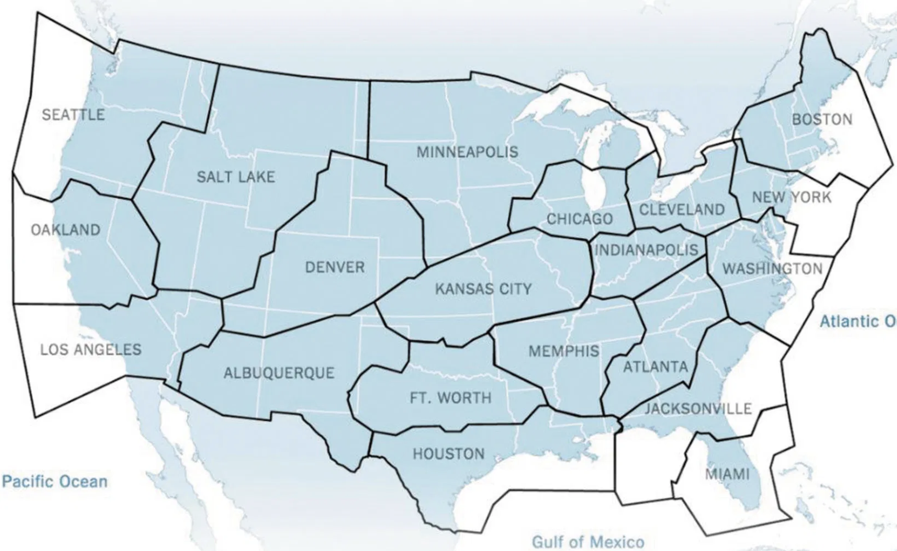
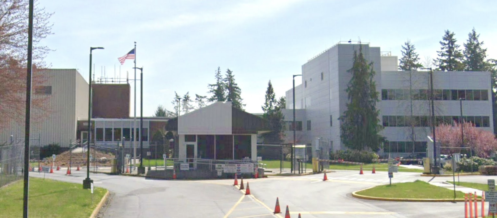
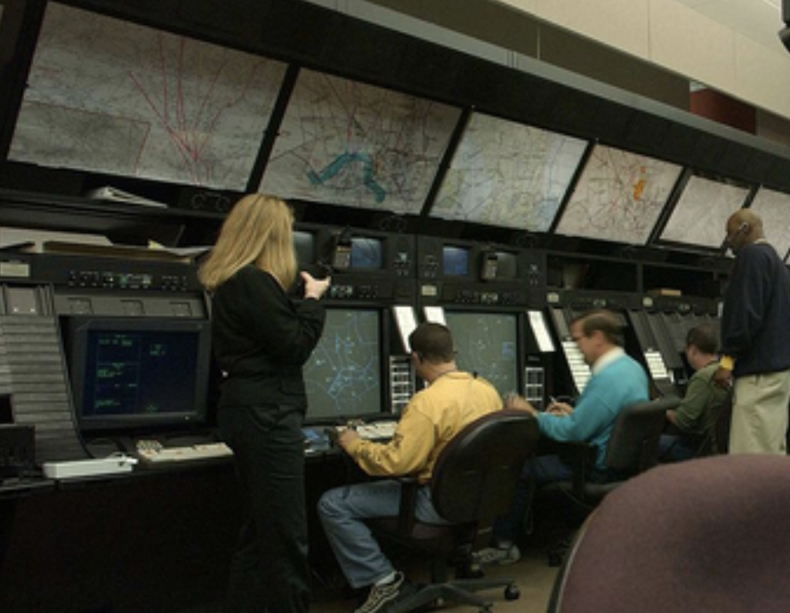
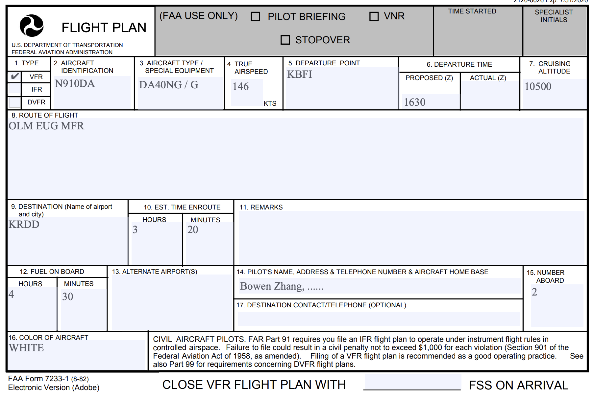

# Radar Vector

---

## Radar Vector

- Tower
- Approach <non-key>(Terminal Radar Approach Control)</non-key>
- Center <non-key>(Air Route Traffic Control Center)</non-key>
 

---

## ATC Tower

 

---

## Terminal Radar Approach Control (TRACON)

 

---

## Air Route Traffic Control Center (ARTCC)

<left>

</left>
<right>

</right>

---

## Flight Following

for traffic & weather advisory

|||
|--|--|
|**Pilot**|"Seattle Approach, Cessna 12345, VFR request."|
|**ATC**|"Cessna 12345, Seattle Approach, go ahead."|
|**Pilot**|"Seattle Approach, Cessna 12345, DA40NG, 10nm north of Olympia VOR, level 4500, request VFR flight following to KRDD."|
|**ATC**|"Cessna 12345, squawk 4636."|
|**Pilot**|"Squawk 4636, Cessna 12345."|
|**ATC**|"Cessna 12345, radar contact, 10nm north of Olympia VOR, maintain VFR."|

---

## VFR Flight Plan

- File before flight
<non-key>via 800-WxBrief / ForeFlight</non-key>
- Activate after takeoff
<non-key>with Flight Service Station (FSS)</non-key>
- Close after landing
<non-key>via 800-WxBrief / ForeFlight</non-key>

