# Radio Navigation

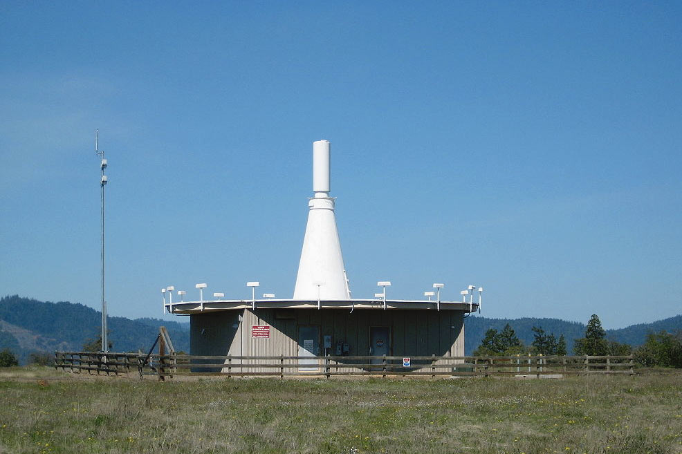

<!--
https://www.faa.gov/air_traffic/flight_info/aeronav/acf/media/Presentations/19-02-NAVAID-SSV-DME-VOR-and-TACAN-DCourtney.pdf
-->
---

## Very-High-Frequency Omnidirectional Range (VOR)

<col-2>
<non-key>
VHF radio transmitting ground station that projects straight line courses (radials) from the station in all directions.
</non-key>
</col-2>
<col-2>

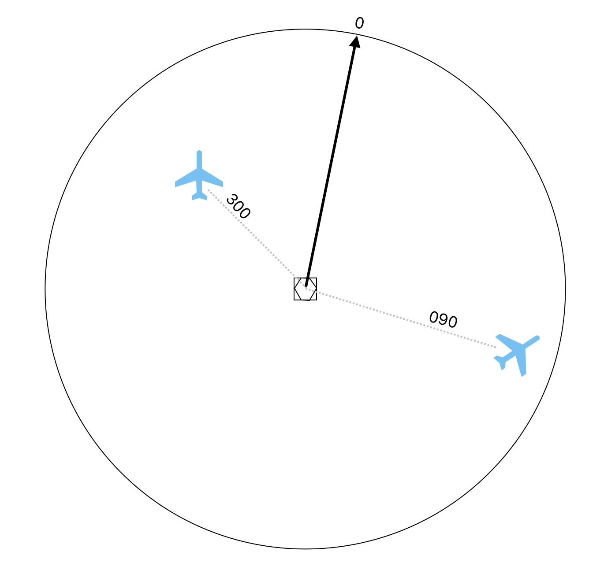

</col-2>

---

## Course Deviation Indicator (CDI)

<left>

- Which radial am I at (FROM)
- Fly towards VOR station (TO)
- Intercept VOR radial (TO)

 

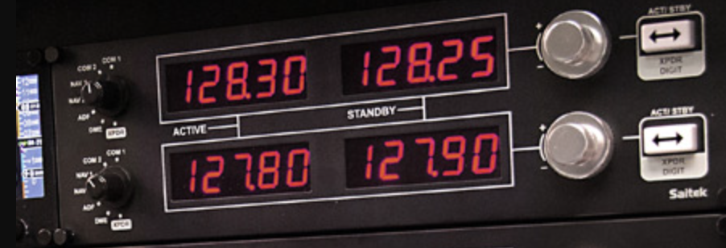

</left>

<right>

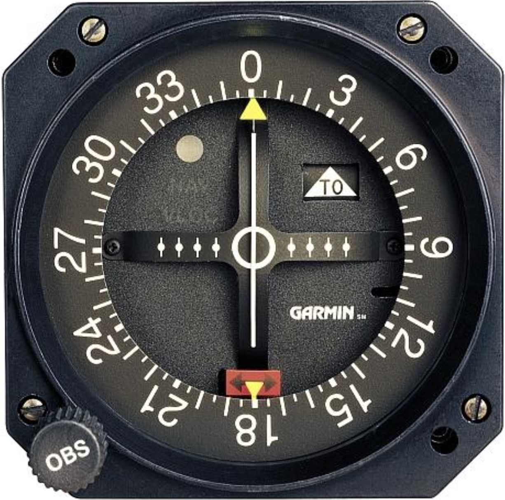

</right>

---

## Simulation

https://www.ryancfi.com/SlantAlpha/

<!--
Task 1: identify position
Task 2:fly to station
Task 3: fly away from station
Task 4: intercept VOR radial
-->

---

<left>

## VOR Data

- Name
- ID
- Frequency
- Morse Code

</left>
<right>

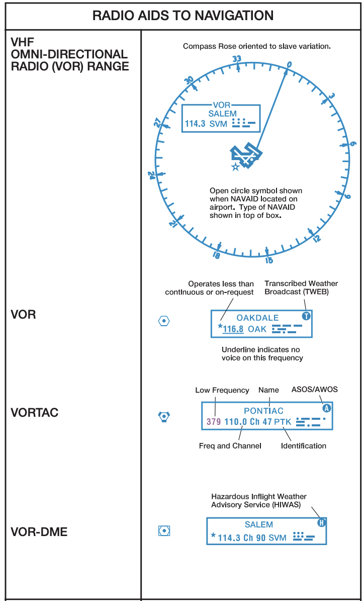 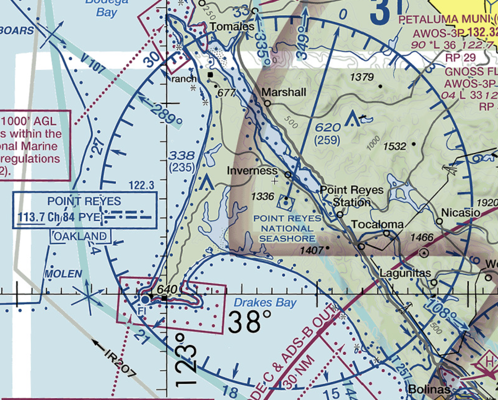

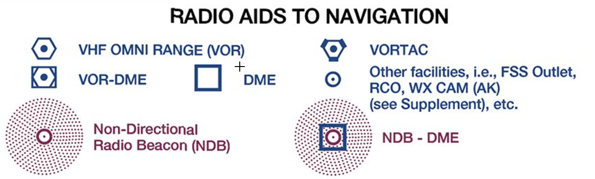

</right>

<!--
VORTAC: VOR+TACAN, for both civilian and military

https://www.boldmethod.com/learn-to-fly/navigation/the-types-of-vors-and-how-to-identify-each-one-of-them/
-->

---

## VOR Data

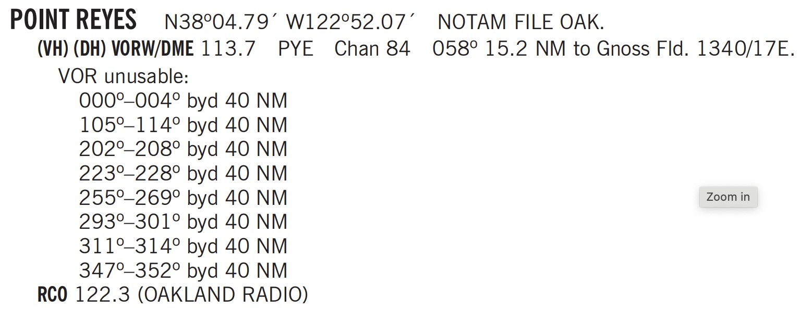

---

## VOR Range

Generally: > 1000 AGL, < 40nm
 

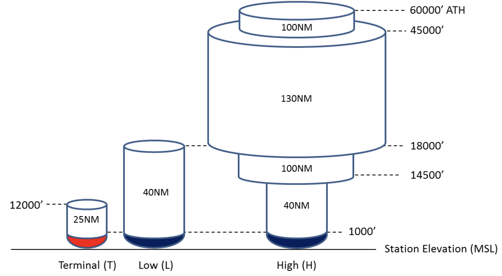 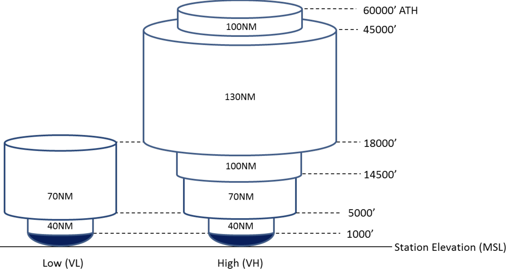

---

## Distance Measuring Equipment (DME)

Slant range in nm 

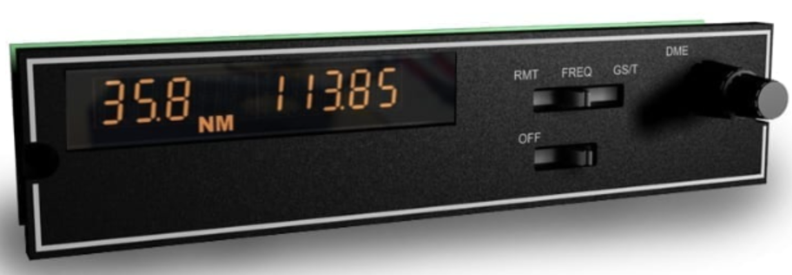

  

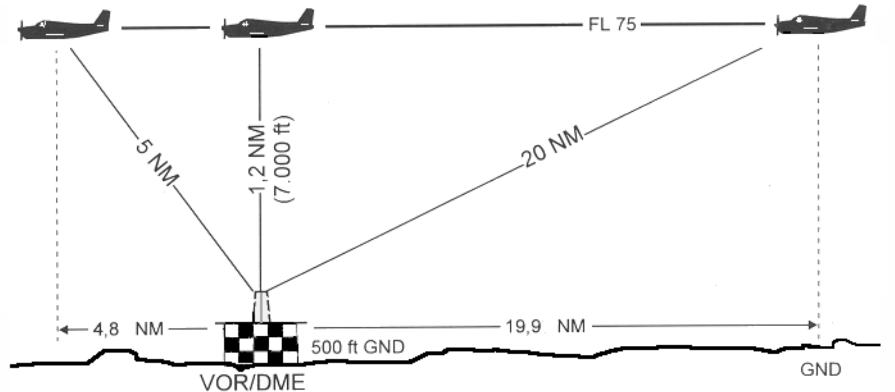

---

## DME Range

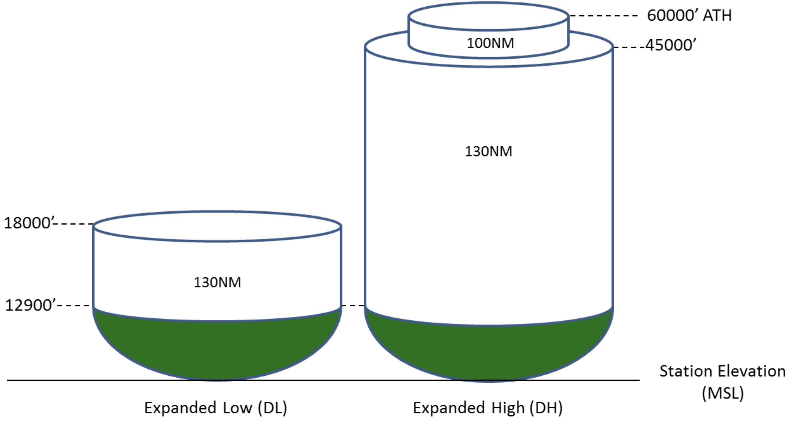

---

## Exercise

Plan a flight from 0S9 to KHQM using VOR/DME.
