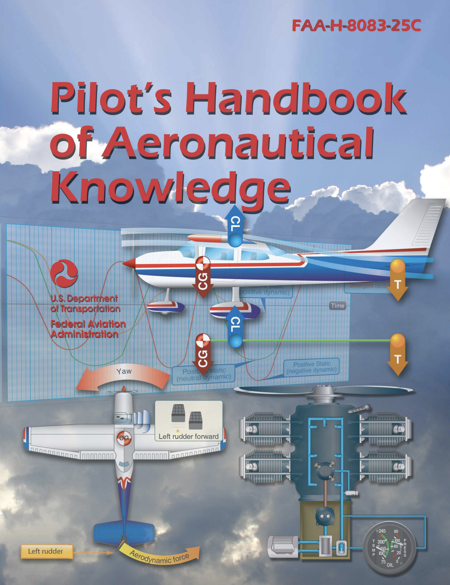
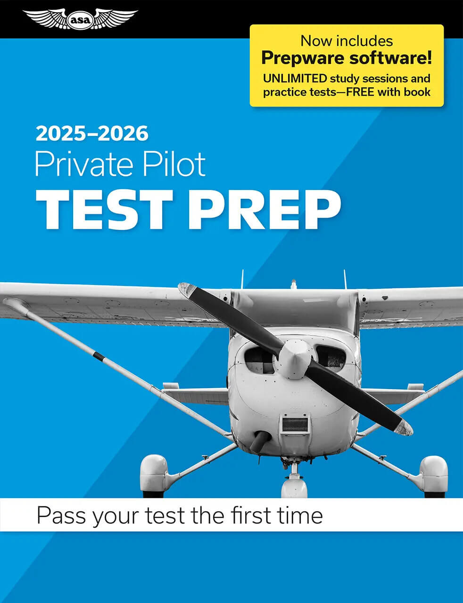
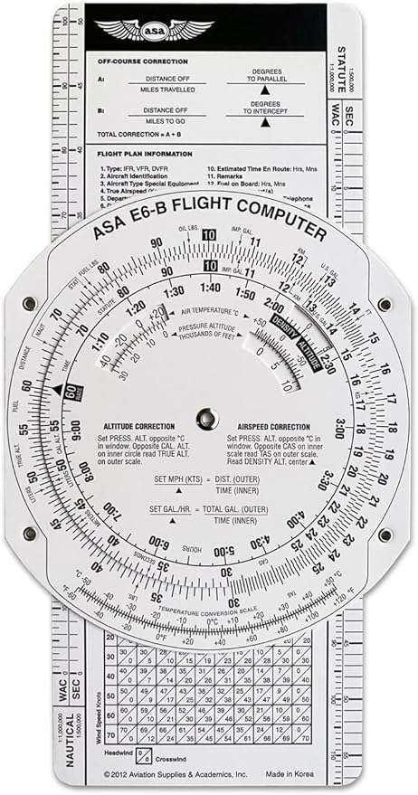
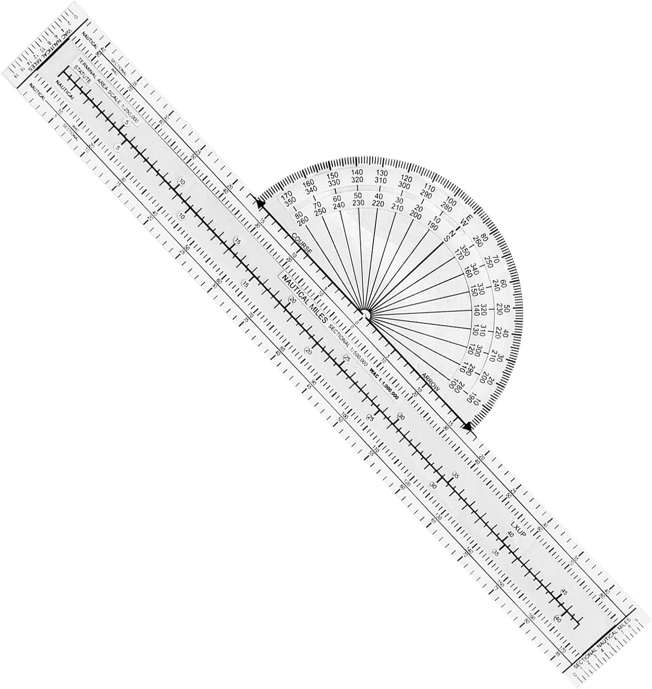
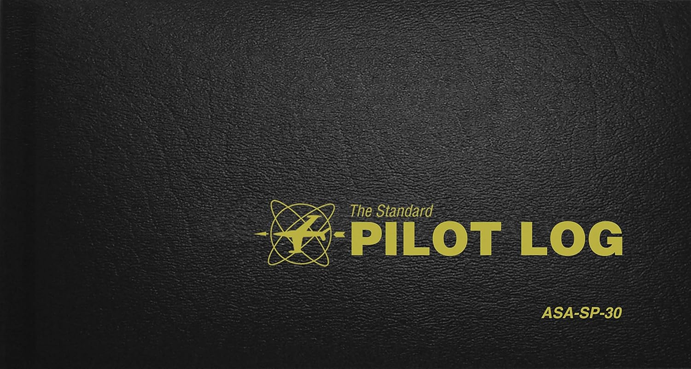

# Prep

---

## Books

[**Pilot's Handbook of Aeronautical Knowledge**][1]
- Official textbook from FAA.
- Available for free on FAA website.

Alternative: [Jeppesen Private Pilot][2]

 

**Usage**
Read before each ground session.

[1]: https://www.faa.gov/regulations_policies/handbooks_manuals/aviation/phak
[2]: https://a.co/d/0wxHsss

---

## Books

[**ASA Private Pilot Test Prep**][1]
- For written exam preparation.

 

**Usage**
Complete questions of corresponding chapter
after each session.

Any questions sent to bowen@dreamofflight.net
will be reviewed at beginning of next session.

[1]: https://a.co/d/78xDdKc

---

## Tools

<left>

[][1] [][2]

[1]: https://a.co/d/6T9Ihhh
[2]: https://a.co/d/1sqPUpe

</left>
<right>

[**E6B Calculator**][1] & [**Plotter**][2]
- For flight planning

**Usage**
These tools will be used during
- Navigation lesson
- Written exam
- Checkride

<footnote>
An electronic version of E6B may
be used as well.
</footnote>

</right>

---

## Logbook

<left>

</left>
<right>

[**Pilot Logbook**][1]
To record flight & ground lessons, and
endorsement from flight instrcutor.

Alternative: [ForeFlight][2], [LogTen Pro][3]

[1]: https://a.co/d/3yxOTWq
[2]: https://foreflight.com/products/logbook/
[3]: https://logten.com/

</right>

---

## FAA Written Exam

**FAA Requirements**
- Complete ALL ground lessons
- Receive logbook entries and endorsement from flight instrcutor

**To Receive Endorsement From Me**
- Complete 3 sample tests with scores > 90
- Review incorrect questions with me