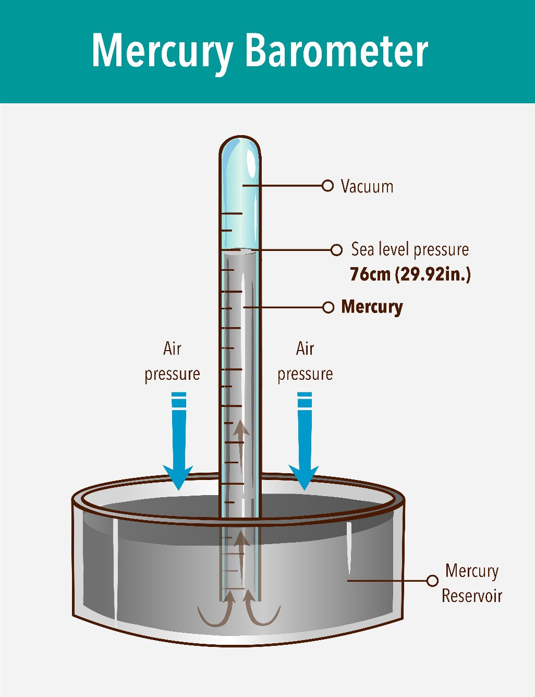
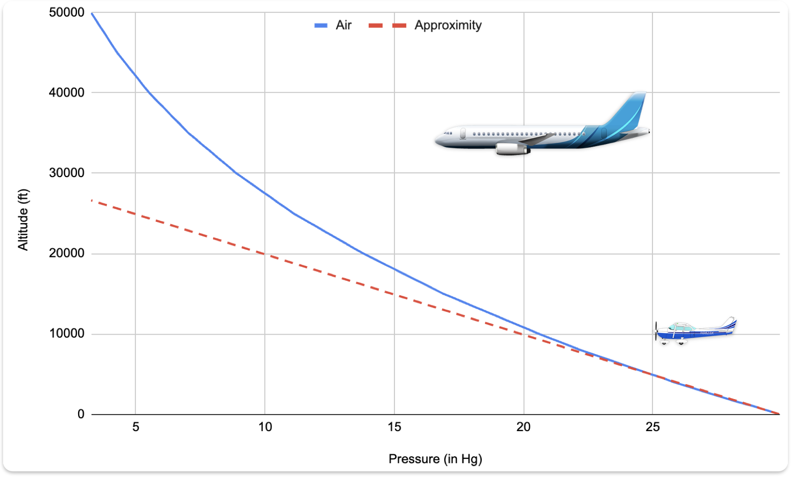
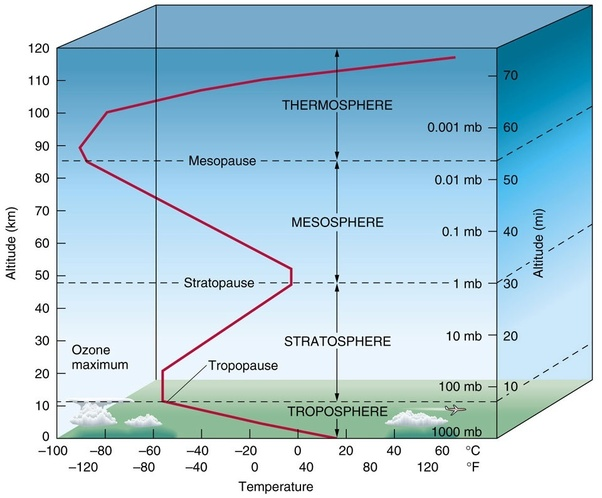

# Atmosphere

---

## Pressure

- ~ 29.92 in Hg @ sea level
- ~ -1 in / 1000ft

---

---

## Temperature

- -2°C / 1000ft (<40,000ft)

---

## Density

- ∝ Pressure
- ∝ 1 / temperature
- ∝ 1 / humidity

---

## Standard Day

- Sea level
- 29.92 in Hg
- 15°C