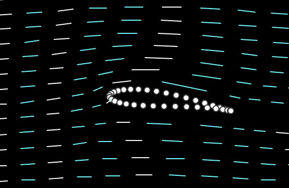

# Bernoulli's Principle

---

## Airflow Visualization

<!--
Airflow demonstration:
  - Place a flat wing in a smokey wind tunnel. Start with 0 degree angle of attach. Turn on smoke and fan. Gradually increase angle of attack.

Observation
  - Air closes to the wing surface slows down
  - Air above the wing moves faster then air below the wing
-->

---

## Bernoulli's Principle

High Speed <=> Low Pressure
Low Speed <=> High Pressure

Pressure difference => Force

---

## Airfoil

---

## Lift Demonstration

<!--
Lift (Airspeed) demonstration:
  - Place a flat wing in a high CFM wind tunnel. Start with 2 degree angle of attack and no wind. Observe weight on scale.
  - Turn on the fan and gradually increase airspeed. Observe weight on scale.

Observation: watch speed!

Lift (Angle of Attack) demonstration:
  - Set to a moderate airspeed and gradually increased angle of attack. Observe weight on scale.

Learning: angle of attack does the magic!
Drawing: first half of lift <> angle of attack chart

Explanation: this is why paper airplane starts to climb.
Question: where does the energy come from?
Answer: airplane's kinetic energy => air's potential energy => airplane's potential energy

Question: how does such energy transfer happen?
-->

---

---

## Lift Formula

$$
Lift = \frac{1}{2} \times \rho \times V^2 \times C_L \times S
$$

<!--
Expanations
  - Heavier airplanes need to fly fast with powerful engine.
  - Every airplane has a max altitude that it can fly.
  - Given a fixed weight, speed <> angle of attack.
  - Given a fixed weight, speed <> surface area.
-->
