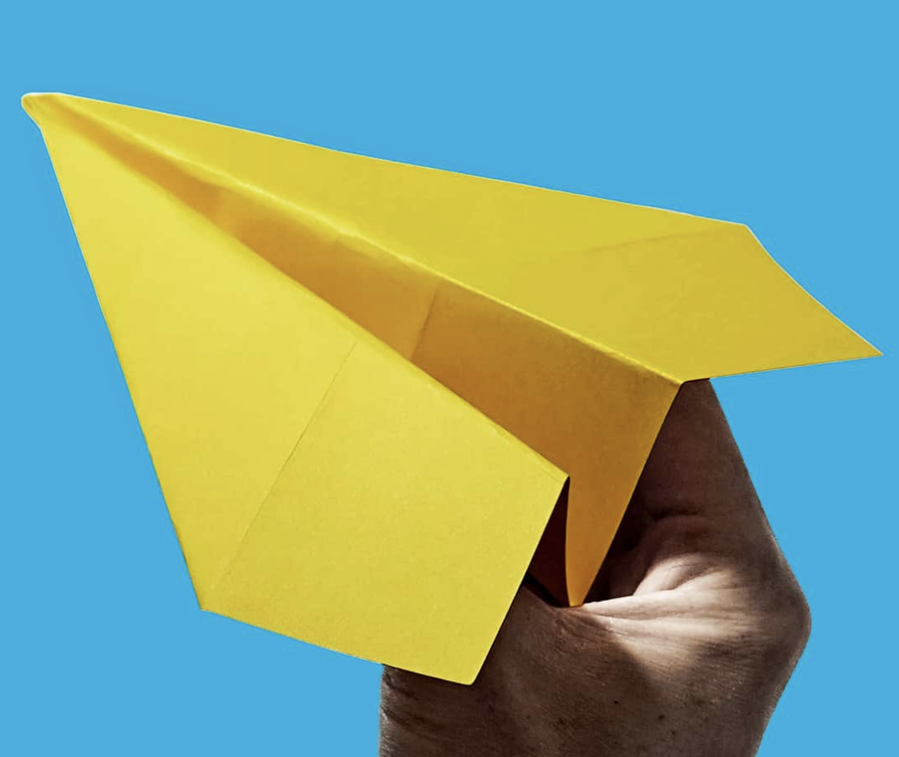
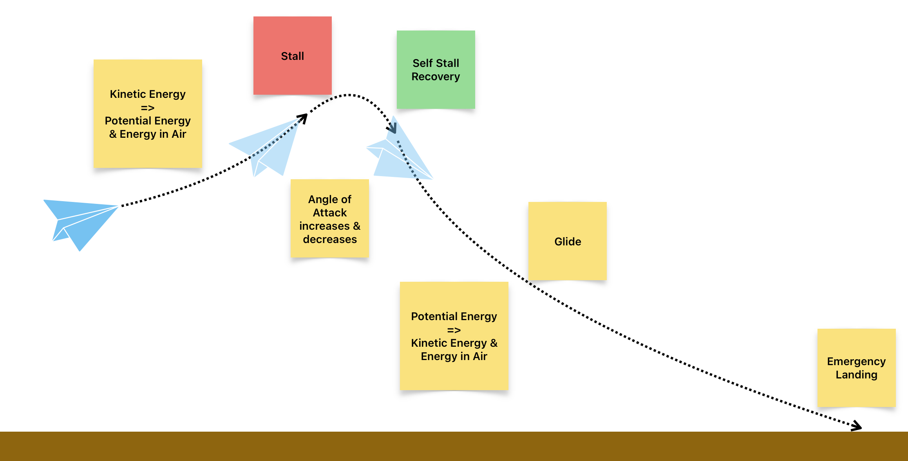

# Let's build an airplane!

[instructions](https://www.foldnfly.com/1.html#Basic-Dart)

<!--
I bet many of you knew how to fly an airplane already, don't you.
Let's try.

Activity: build a paper airplane, and fly it.

Question: what do you observe?
Answer: (see next page)
-->

---

## What do you observe?

---

## What do you observe?

- takeoff
- climb
- stall
- stall recovery / longitudinal stability
- glide
- turns
- (emergency) landing
- flare & touch down

---

## Energy!

- Kinetic Energy: the energy possessed by an object due to its motion. (VELOCITY)
- Potential Energy: the energy stored by an object due to its position. (HEIGHT)

---

<!--
Takeoff:
  - forward speed

Climb:
  - Kinetic energy => potential energy (and energy in air)

Angle of Attack
  - Pitch up & down

Stall
  - Minimum speed
  - Falling / lose of lift

Stall Recovery
  - By itself / by design
  - Reduces angle of attack
  - Potential energy => kinetic energy (and energy in air)

-->

---

## Takeaways

- Airplane can indeed fly
- ...as long as it has <key>ENERGY</key>
- ...as long as it has <key>SPEED</key>
- Even after stall, it can self recover