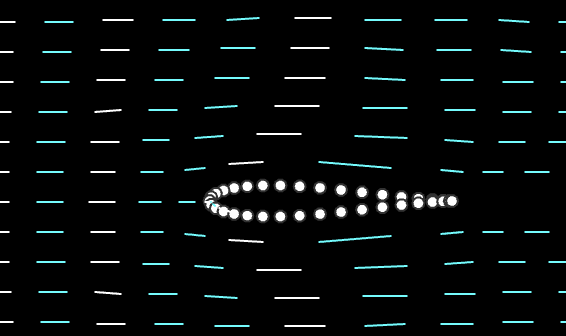
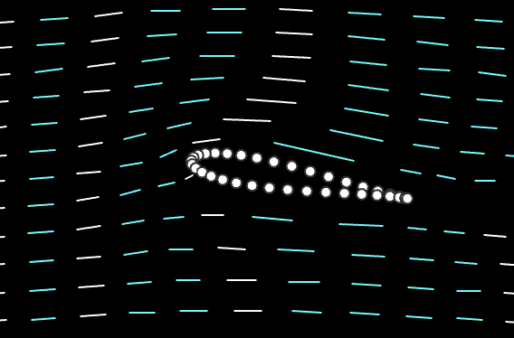
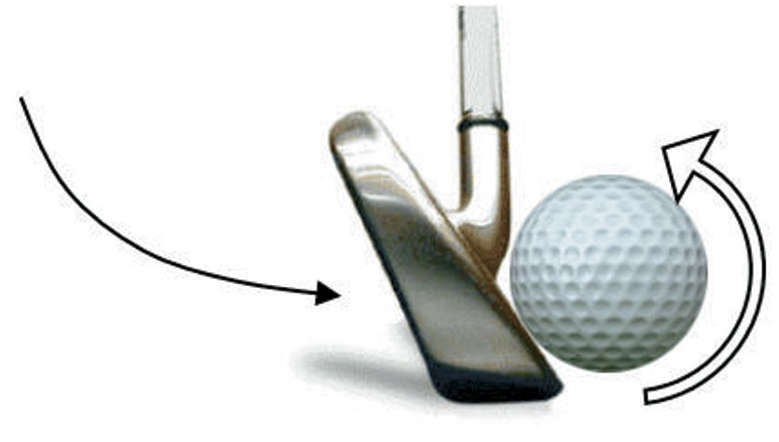
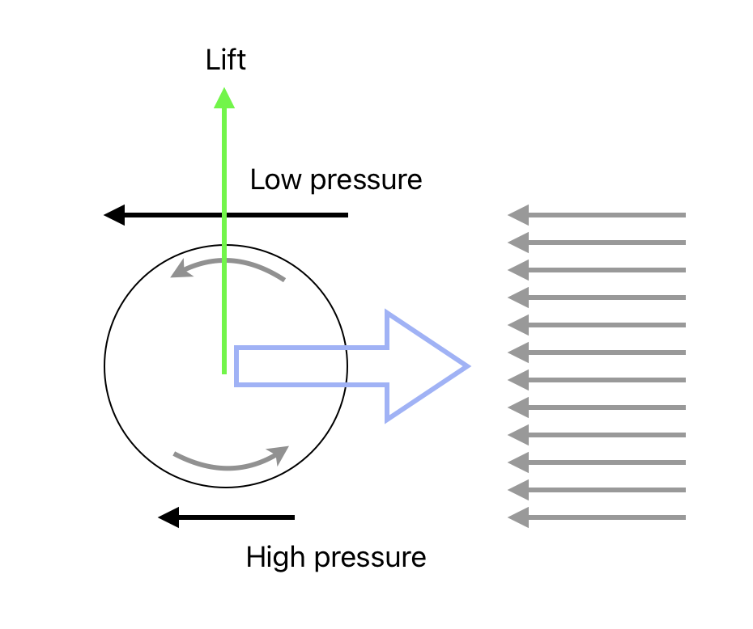

# Circulation

---

Obstacle Effect + Circulation Effect = Natural Airflow

 

---

## Magus Effect

 

https://youtu.be/GAqLyyg2AHk?feature=shared&t=58

<!--
Magus effect
  - golf ball

Demonstration:
  - Flip a business card backward and forward.

-->
