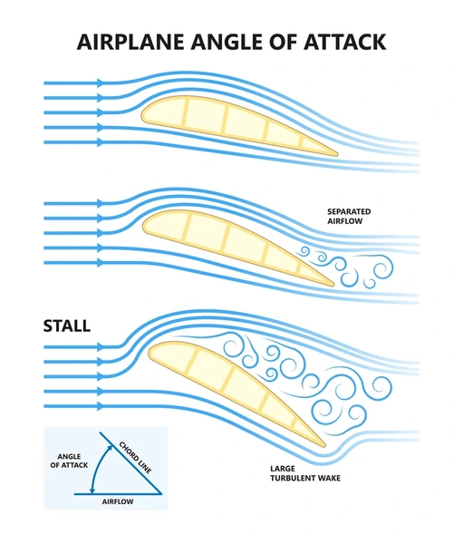
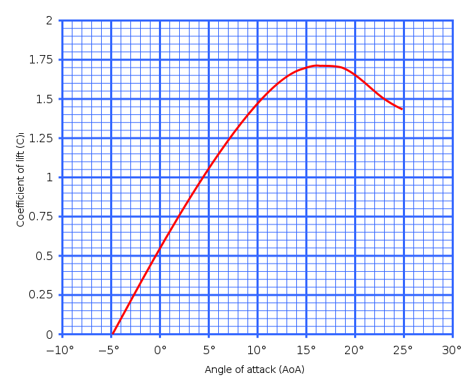

# Stall

---

## Stall Demonstration

[Airfoil Simulation](https://www1.grc.nasa.gov/beginners-guide-to-aeronautics/foilsimstudent/)

- What happens if angle of attack keeps increasing?

<!--
Stall demonstration:
  - In high CFM wind tunnel, continue to increase angle of attack. Observe weight on scale.
  - In smokey wind tunnel, continue to increase angle of attack. Observe air stream separation at trailing edge.

Learning: the magic of angle of attack has an limit!
Drawing: second half of lift <> angle of attack chart
Explanation: this is why paper airplane starts to drop.
-->

---

## Air Separation

---

## Air Separation Demo

---

## Stall

<!--

How to recover?
- pitch down to reduce angle of attack
- add power

-->

---

<!--
Asiana 214 @ SFO
-->