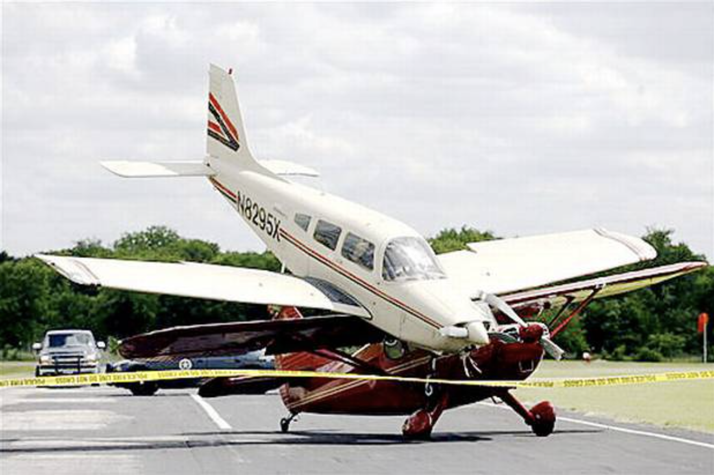
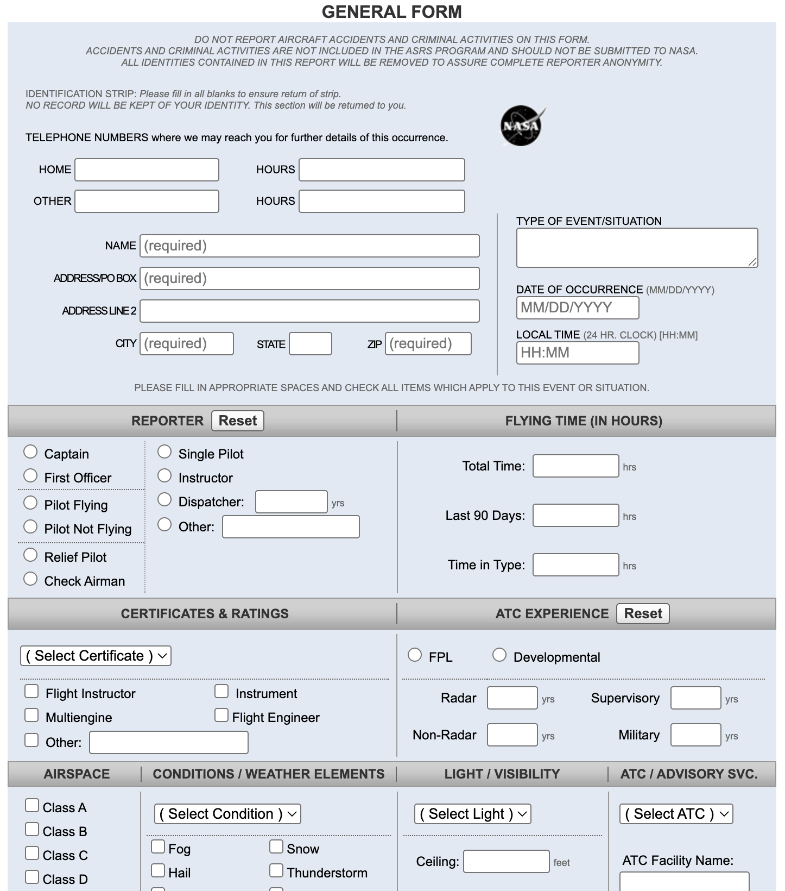

# Accidents & Incidents

---

## Accident - Definition

- death, serious injury
  - hospitalization>48h
  - fractures
  - nerve/muscle/... damage
  - internal organ
  - 2nd/3rd degree burn...

- significant aircraft damage

<reference>

[49 CFR Part 830.2][1]

[1]: https://www.ecfr.gov/current/title-49/subtitle-B/chapter-VIII/part-830/subpart-A/section-830.2

</reference>

---

## Accident - Definition (Cont.)

- Flight control system malfunction or failure
- Inability of a flight crew to perform duties due to illness or injury
- Inflight fire
- Mid-air collision
- Damage to property > $25,000

<reference>

[49 CFR Part 830.2][1]

[1]: https://www.ecfr.gov/current/title-49/subtitle-B/chapter-VIII/part-830/subpart-A/section-830.2

</reference>

---

## Accident - Report

- File within 10 days for accident
- File within 7 days for missing aircraft

<reference>

[49 CFR Part 830.5][1]

[1]: https://www.ecfr.gov/current/title-49/subtitle-B/chapter-VIII/part-830/subpart-B/section-830.5

</reference>

---

## Incident

**Definition**
- Affects or could affect safety
- Is not an accident

**Report**
- File upon request

---

## [Aviation Safety Reporting System][2]

...neither a civil penalty nor certificate suspension will be imposed, if:
- the violation did not involve a criminal offense, accident…
- the person has no violation 5 years prior
- submit report within 10 days after the violation

<reference>

[AC 00-46E][1]

</reference>

[1]: https://www.faa.gov/documentLibrary/media/Advisory_Circular/AC%2000-46E.pdf
[2]: https://asrs.arc.nasa.gov/index.html