# Airworthiness

---

## Aircraft Documents (ARROW)

- **A**irworthiness Certificate
- **R**egistration Certificate
- ~~**R**adio Station License~~
- **O**perating Limitations
- **W**eight Balance Data

---

## Airworthiness Certificate

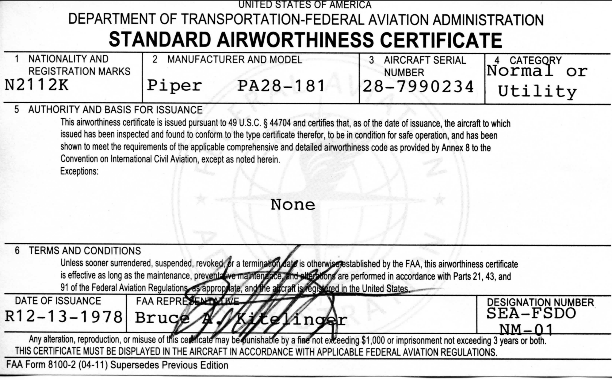

---

## Registration Certificate

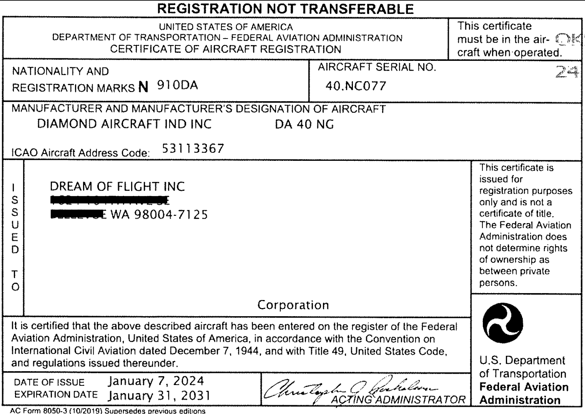

---

## Operating Limits

From Operating Manual

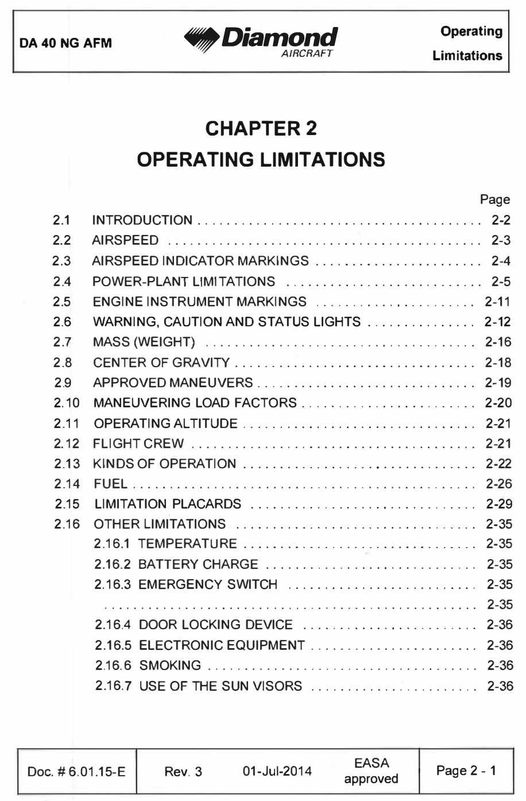

---

## Operating Manual

- Pilot Operating Handbook (POH) <non-key>(<1979, specific to model)</non-key>
- Aircraft Flight Manual (AFM) <non-key>(specific to aircraft)</non-key>
- Airplane Information Manual <non-key>(not FAA approved)</non-key>

<right>

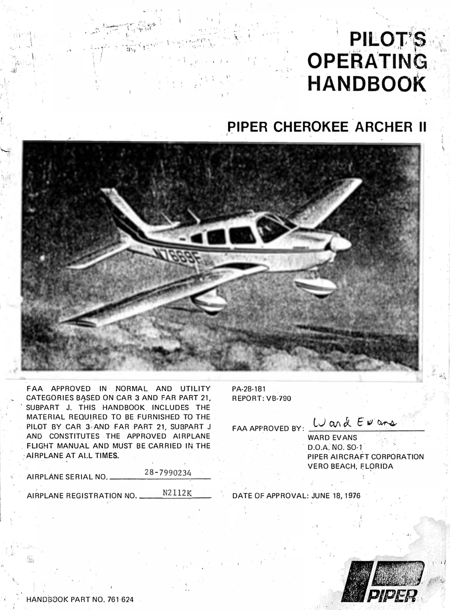 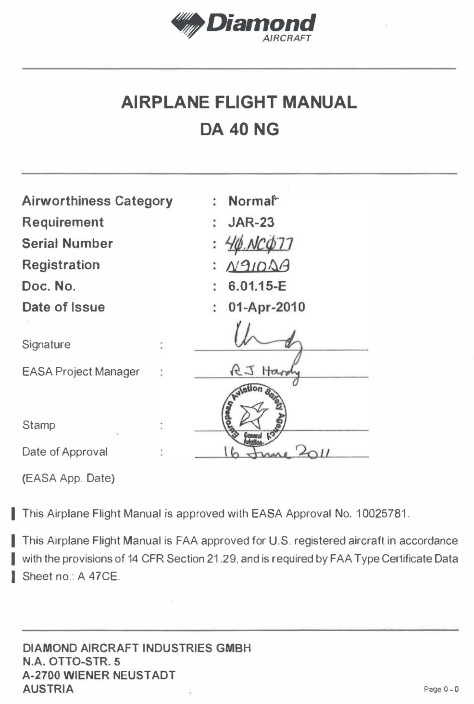 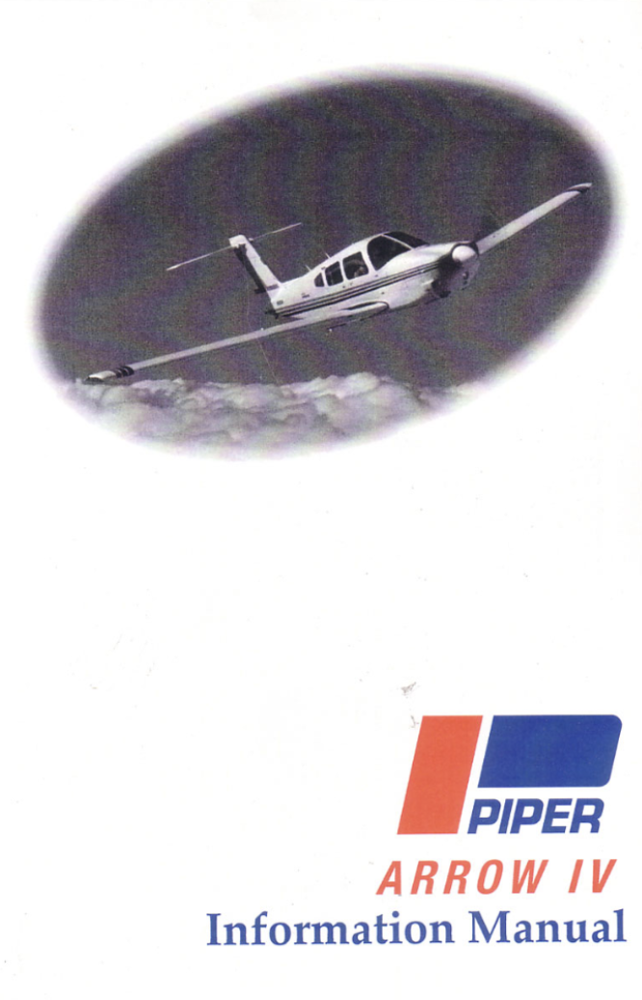

</right>

---

## Weight Balance Data

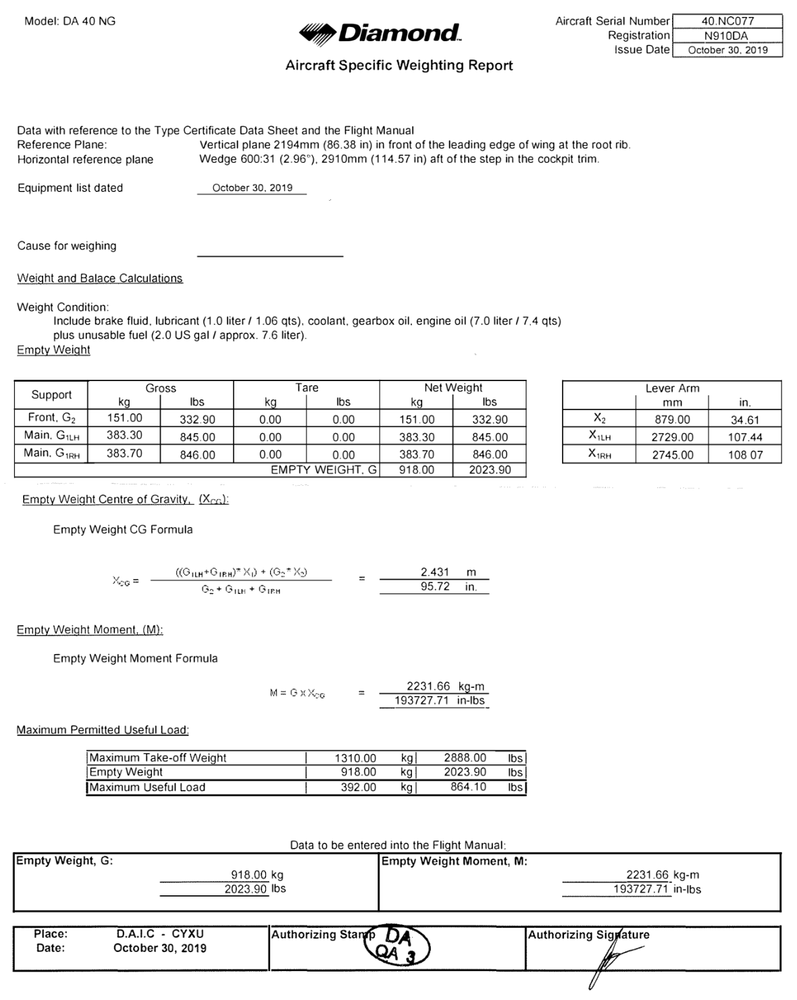

---

## Aircraft Maintenance

<left>

||in the last...|
|--|--:|
|Annual Inspection|12 calendar months|
|100h Inspection*|100h|
|Transponder Inspection|24 calendar months|
|Pitot-static Inspection|24 calendar months|
|Emergency Locator Transmitter|12 calendar months|
|VOR Check|30 days|
|Engine Oil Change|(100h)|

</left>
<right>

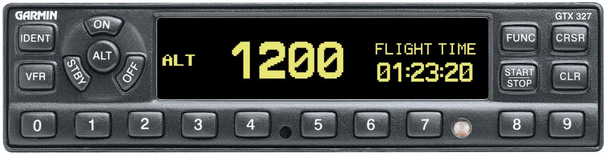
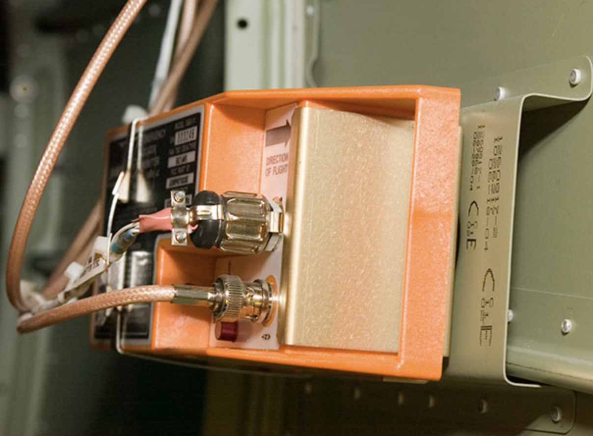

</right>

---

## Airworthiness Directives (ADs)

<non-key>
means used to notify aircraft owners and other interested persons of unsafe conditions and to specify the conditions under which the product may continue to be operated.
</non-key>
  

**Categories**
- Immediate compliance
- Compliance within specified time

**Compliance responsibility**: Owner

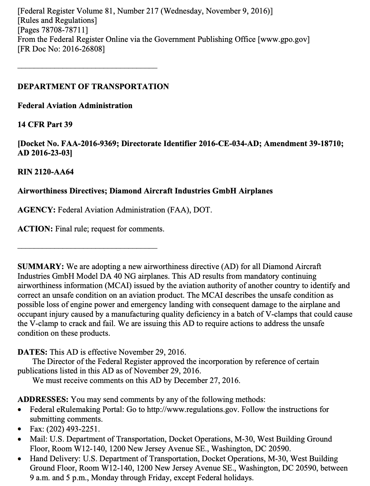

---

## Advisory Circular (ACs)

<non-key>
Explain regulation or provide additional useful information to aid in compliance
</non-key>

  

Not regulatory 

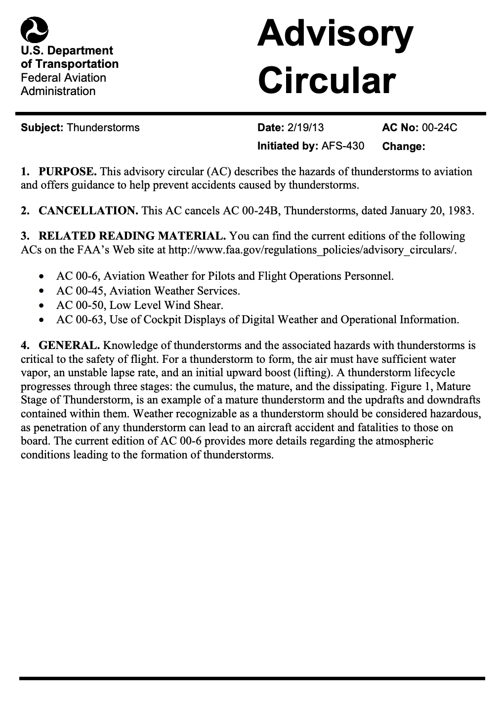

---

## Preventive Maintenance

- By pilot
- Change tire, oil, etc
- Replace bulb, safety belt, battery, etc 

<reference>

[14 CFR Part 43][1]

[1]: https://www.ecfr.gov/current/title-14/chapter-I/subchapter-C/part-43?toc=1

</reference>

---

## Inoperative Equipment

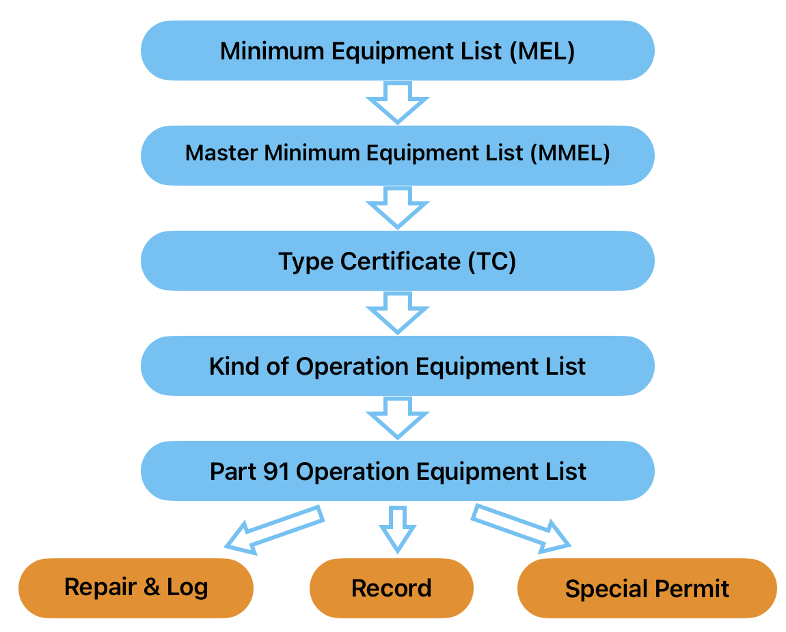

---

## Minimum Equipment List (MEL)

- Created by aircraft operator
- For specific aircraft
- Approved by FAA

     

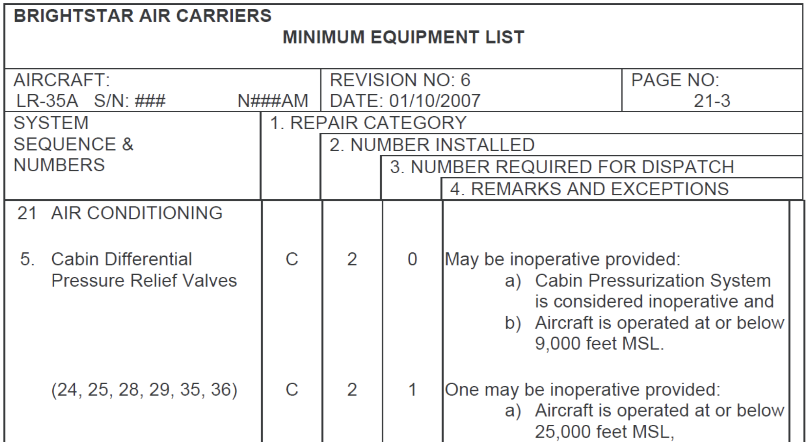

---

## Master Minimum Equipment List (MMEL)

- Co-developed by FAA & Manufacturer
- For aircraft make & model

      

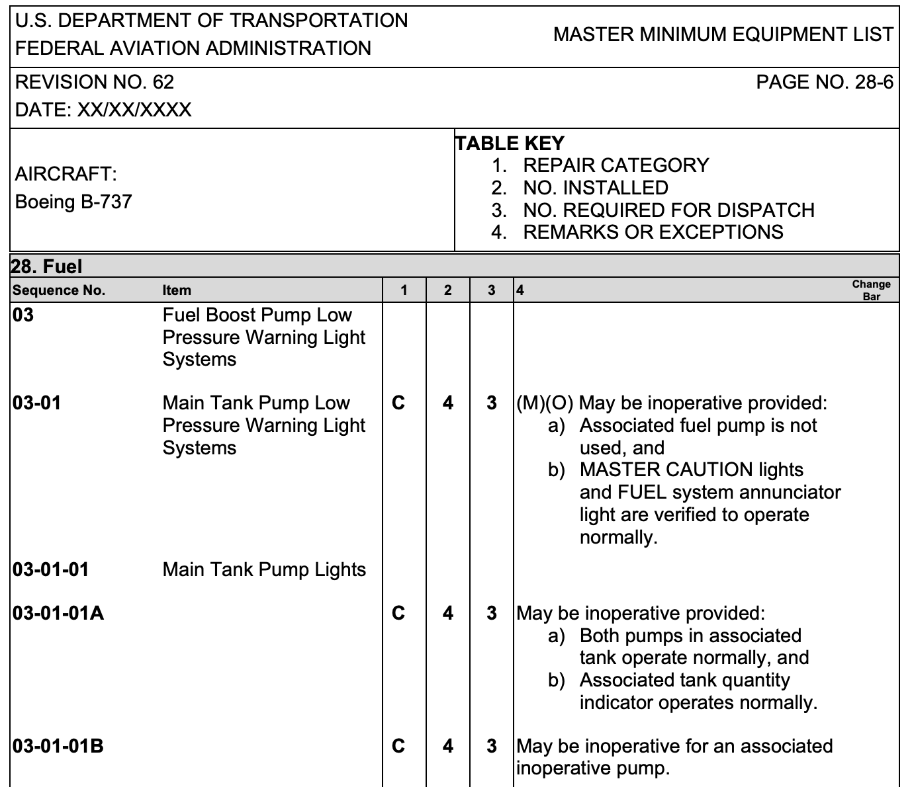

<reference>

[FAA Master Minimum Equipment List][1]

[1]: https://drs.faa.gov/browse/MMEL/doctypeDetails

</reference>

---

<left>

## Type Certificate (TC)

- Design approval by FAA
- To aircraft make & model

</left>
<right>

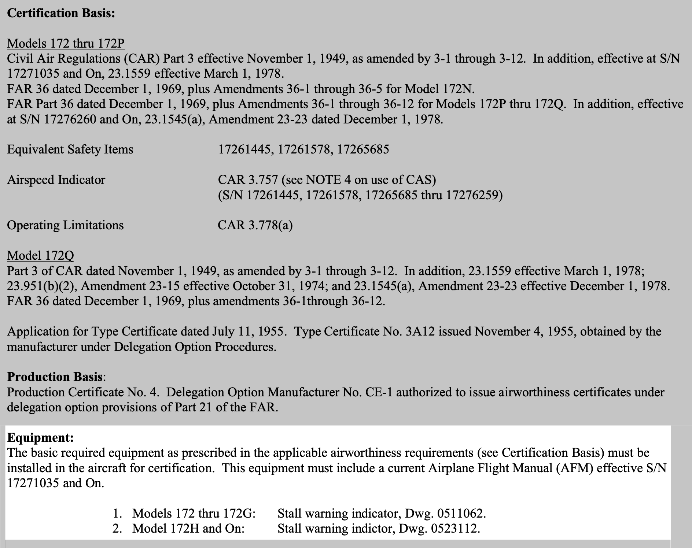

</right>

<reference>

[FAA Type Certificate Data Sheets][1]

[1]: https://drs.faa.gov/browse/TCDSMODEL/doctypeDetails

</reference>

<!--
DA40NG: https://drs.faa.gov/browse/excelExternalWindow/C67CC63755875EAE86258713004984D0.0001
-->

---

## Kind Of Operation Equipment List

- in POH / AFM

---

## Part 91 VFR Equipment Requirements (Day)

<col-2>

- **T**achometer
- **O**il Pressure
- **M**anifold Pressure
- **A**irspeed
- **T**emperature (liquid-cooled engine)
- **O**il Temperature

</col-2>
<col-2>

- **F**uel Quantity
- **L**anding Gear Indicator
- **A**ltimeter
- **M**agnetic Compass
- **E**LT
- **S**afety Belt

</col-2>
<reference>

[14 CFR Part 91.205][1]

[1]: https://www.ecfr.gov/current/title-14/chapter-I/subchapter-F/part-91/subpart-C/section-91.205

</reference>

---

## Part 91 VFR Equipment Requirement (Day) – Cont.

- Anticollision Light (after 3/11/1996)
- Floatation gear & pyrotechnic signaling device
(when beyond power-off glide range)
- Shoulder harness:
  - for front seats (after 7/18/1978)
  - for all seats (after 12/12/1985)

---

## Part 91 VFR Equipment Requirement (Night)

- **F**use <non-key>(3 for each kind, accessible to pilot in flight)</non-key>
- **L**anding light (for hire)
- **A**nti-collision light
- **P**osition light
- **S**ource of electricity

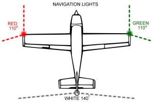

---

## Emergency Locator Transmitter (ELT)

<col-2>

**Temporary Removal**
- Record
- Placard
- No flight after 90 days

**Exceptions**
- (no other person aboard)
- Ferry to install ELT
- Ferry to repair ELT

</col-2>
<col-2>

**Not applicable to**
- Scheduled flights
- Training <50nm
- Aircraft delivery, testing
- Agricultural operation, research, crew training, - exhibition, air racing, market survey
- 1 person airplane
- Max payload >18,000lbs for air transportation

</col-2>
<reference>

[14 CFR Part 91.207][1]

[1]: https://www.ecfr.gov/current/title-14/chapter-I/subchapter-F/part-91/subpart-C/section-91.207

</reference>

---

## Maintenance / Record

- Removed or deactivated
- Placarded
- Recorded (if maintenance is required)

---

## Special Flight Permit

From local Flight Standards District Offices (FSDO)
- Fly for repairs, alterations, maintenance, storage
- Delivering/exporting
- Flight testing
- Evacuation
- Customer demonstration flights in new production aircraft
- Over-weight takeoff (fuel)

<reference>

[14 CFR Part 21.197][1]

[1]: https://www.ecfr.gov/current/title-14/chapter-I/subchapter-C/part-21/subpart-H/section-21.197

</reference>