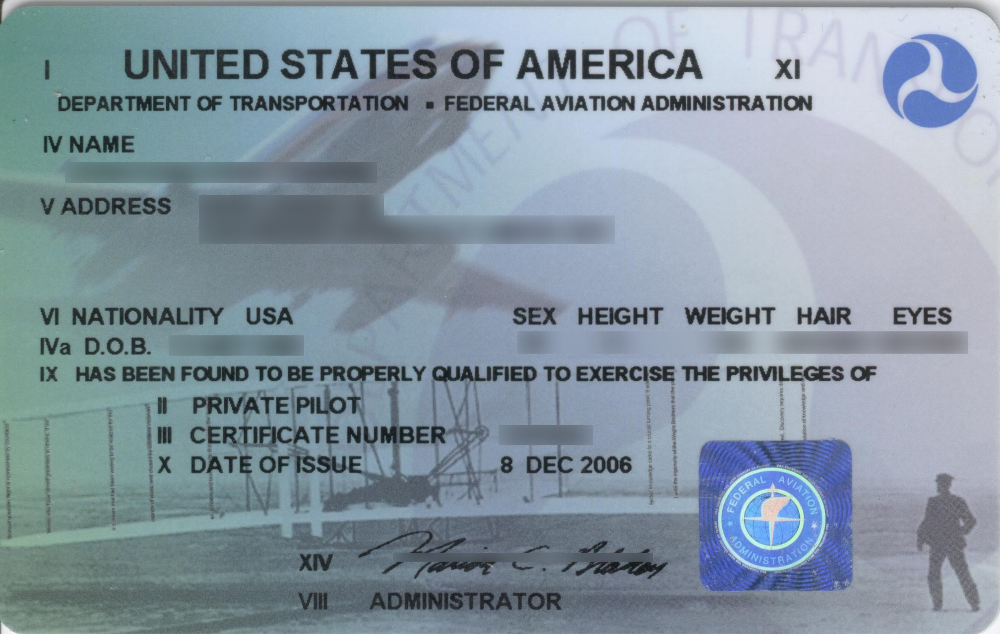
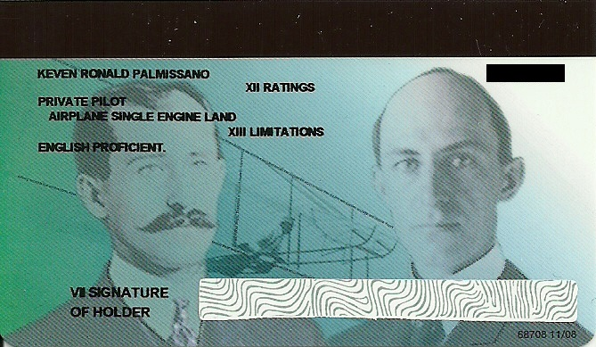
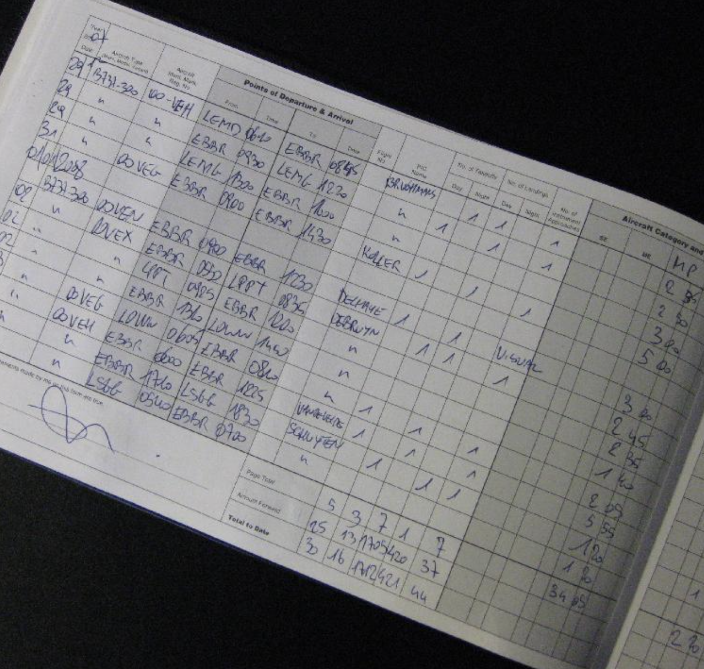
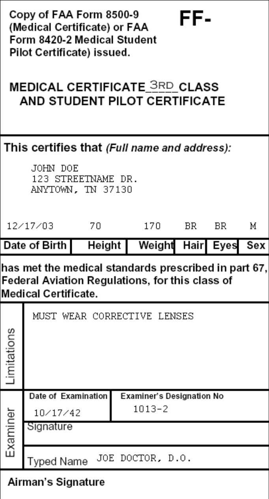

# Certificates

---

## Pilot License

- "Private Pilot"
- "Airplane Single Engine Land"

 

---

## Kind of Aircraft

|Category|Class|Type|
|:--:|:--:|:--:|
|Airplane|Single-engine land, Multi-engine land Single-engine sea, Multi-engine sea|B-737 ...|
|Rotorcraft|Helicopter, Gyroplane|S-61 ...|
|Lighter-than-air|Airship, Free balloon||
|Glider|||
|Powered-lift||

---

## Pilot License

<col-2>

**Certificate**
- Sport Pilot
- Recreational Pilot
- Private Pilot (PPL)
- Commercial Pilot (CPL)
- Certified Flight Instructor (CFI)
- Airline Transportation Pilot (ATP)

</col-2>
<col-2>

**Rating**
- Instrument
- Multi-engine

**Endorsement**
- Tailwheel
- Complex
- High Performance
- High Altitude

</col-2>

<!--
- Sport pilot: light-sport aircraft (LSA), day VFR, <10,000MSL, no passenger
- Recreational pilot: <180hp, day VFR, <50nm, class E/G, 1 passenger.
-->

---

## Private Pilot Privileges

- Fly day or night
- Carry passengers/cargo
- Fly charity/non-profit/community event flight
- Tow glider (14 CFR Part 61.69)
- Demonstrate aircraft to buyer (>200h)

<reference>

[14 CFR PART 61.113][1]

[1]: https://www.ecfr.gov/current/title-14/chapter-I/subchapter-D/part-61#61.113
</reference>

---

## Private Pilot Limitations

<red>
May NOT fly for compensation or hire
</red>
  

- Pilot and passenger must share "common purpose"
- No "holding out"

<!--
Common Purpose
- Pilot must have their own reason for travelling to destination
- Passenger must also have a reason to travel to the same destination
- Pilot chooses destination

No Holding Out
- No advertisement
- Limited audience (with existing relationship)
- Private communication
-->

---

## Private Pilot Limitations

<red>
May NOT pay less than pro-rata share with passengers.
</red>
  

Direct operating expense only:
- Fuel
- Oil
- Airport expenditures (landing fees, facility fees, etc)
- Aircraft rental fees

<reference>

[14 CFR PART 61.113][1]

[1]: https://www.ecfr.gov/current/title-14/chapter-I/subchapter-D/part-61#61.113
</reference>

---

## Certificate Expiration

- Student Pilot Certificate: 24 calendar months
- Private Pilot Certificate: N/A

---

## Recent Flight Experience Requirements

To act as Pilot-in-Command (PIC):
- **flight review** within last **24 calendar months**

To carry passengers: 
- **3 take-off/landings** within last **90 days**, same category/class

To carry passenger at night:
- **3 night takeoff/full stop landings** within last **90 days**, same category/class

<reference>

[14 CFR PART 61.57][1]

[1]: https://www.ecfr.gov/current/title-14/chapter-I/subchapter-D/part-61/subpart-A/section-61.57

</reference>

---

## Logbook

Not required to log each flight, except:
- To substantiate experience requirements for new certificate/rating
- To prove currency

 
<red>
NEVER LOSE!
</red>

---

## Medical Certificate

  
|||Age<40|Age>=40|
|--|--|--|--|
|1st Class|ATP|12 months|6 months|
|2nd Class|Commercial|12 months|12 months|
|3rd Class|Private|60 months|24 months|

 
"Medical certificate is not valid if for any reason one could not pass a physical exam on a given day"

---

## BasicMed

<left>

**Process**
- U.S. driver license
- have held a medical after 7/14/2016
- Take physical exam (every 48 months)
  - physician to complete CMEC
- Complete medical education course
(every 24 months)
  
<non-key>
CMEC: Comprehensive Medical Examination Checklist
</non-key>

</left>
<right>

**Requirements**
- <= 7 occupants
- <= 12,500 lbs
- <= 18,000 MSL
- <= 250kts
- not for compensation / hire

</right>

<reference>

[FAA BasicMed][1]

[1]: https://www.faa.gov/licenses_certificates/airmen_certification/basic_med

</reference>

---

## Pilot Documents

- Private Pilot Certificate
- Medical Certificate
- ID
