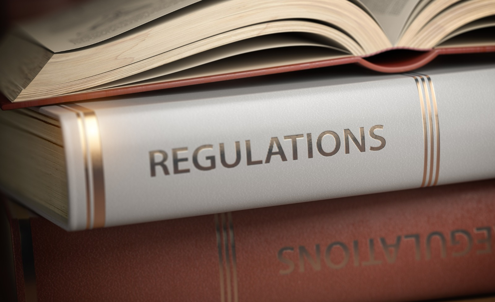

# Regulations

---

## Objectives

Be an professional airman, know the limitations,
as well as your privileges. 

---

## Prep

- Read "Pilot's Handbook of Aeronautical Knowledge":
  - [Chapter 9: Flight Manuals and Other Documents][1]
- Be familiar with Code of Federal Regulations:
  - [Title 14 Part 91][2]

[1]: https://www.faa.gov/sites/faa.gov/files/11_phak_ch9.pdf
[2]: https://www.ecfr.gov/current/title-14/chapter-I/subchapter-F/part-91

<!--
Instructor prep:
-->

---

## Code of Federal Regulations (CFR)
### Title 14: Aeronautics and Space

- 14 CFR Part 1: Definitions
- 14 CFR Part 43: Maintenance
- 14 CFR Part 61: Certification
- <highlighted>14 CFR Part 91: General Operation & Flight Rules</highlighted>
- 49 CFR Part 830: Aircraft Incidents & Accidents
- ...

---

1. [Certificates](certificates.md)
1. [Airworthiness](airworthiness.md)
1. [Operations](operations.md)
1. [Accidents](accidents.md)