# Operations

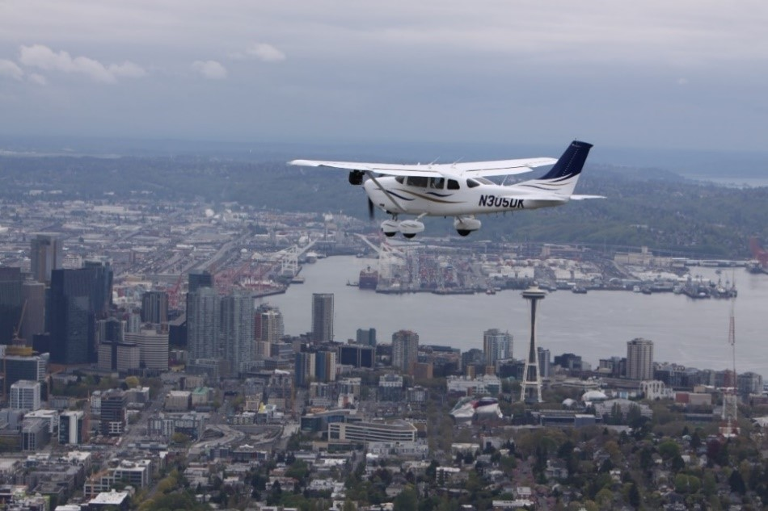

---

## Night

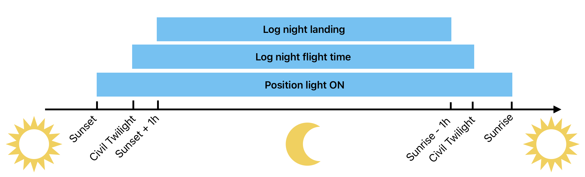

---

## Pilot-In-Command

PIC of an aircraft is **directly responsible for**, and is the **final authority** as to, the operation of that aircraft.

PIC **may deviate** from 14 CFR Part 91 to the extent necessary in the interest of safety. Upon request, send written report to FAA.

<reference>

[14 CFR Part 91.3][1]

[1]: https://www.ecfr.gov/current/title-14/chapter-I/subchapter-F/part-91/subpart-A/section-91.3

</reference>

---

## ATC Compliance

no PIC may deviate from ATC clearance/instructions, unless:
- Emergency
- Traffic alert/collision avoidance system resolution advisory

...notify ATC of deviation as soon as possible
...submit report **within 48 hours, if requested by ATC**.

<reference>

[14 CFR Part 91.123][1]

[1]: https://www.ecfr.gov/current/title-14/chapter-I/subchapter-F/part-91/subpart-B/subject-group-ECFRe4c59b5f5506932/section-91.123

</reference>

---

## Safety Belt

PIC is responsible for:
- briefing passengers how to use safety belt, shoulder harness.
- notifying passengers to fasten safety belt, shoulder harness.

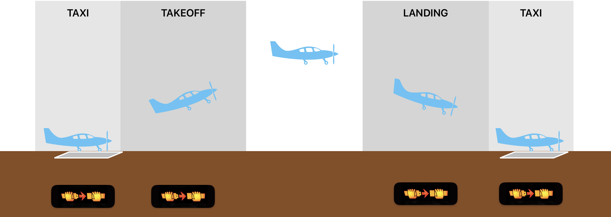

<reference>

[14 CFR Part 91.107][1]

[1]: https://www.ecfr.gov/current/title-14/chapter-I/subchapter-F/part-91/subpart-B/subject-group-ECFRe4c59b5f5506932/section-91.107

</reference>

---

---

## Object Dropping

- No if it creates hazard to persons or property
- Not prohibit if precautions are taken to avoid injury or damage to persons or property

---

## Formation Flight

No formation flight, except:
- by prior arrangement with PIC of each aircraft.

 
No formation flight when carrying passenger for hire.

<reference>

[14 CFR Part 91.111][1]

[1]: https://www.ecfr.gov/current/title-14/chapter-I/subchapter-F/part-91/subpart-B/subject-group-ECFRe4c59b5f5506932/section-91.111

</reference>

---

<left>

## __Right__-of-Way

1. Aircraft in distress
1. Balloon
1. Glider
1. Airship
1. Airplane/Rotorcraft

</left>
<right>

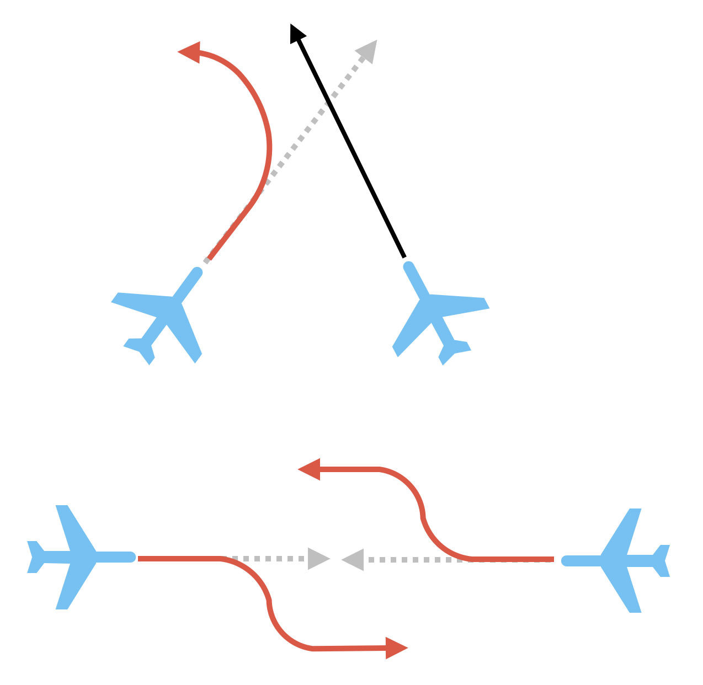

</right>

<reference>

[14 CFR Part 91.113][1]

[1]: https://www.ecfr.gov/current/title-14/chapter-I/subchapter-F/part-91/subpart-B/subject-group-ECFRe4c59b5f5506932/section-91.113

</reference>

---

## Minimum Safe Altitude

Altitude that allow emergency landing without undue hazard to person/property on surface.

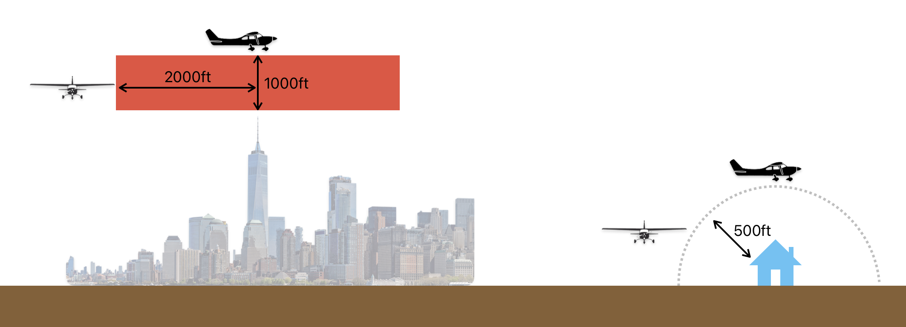

<reference>

[14 CFR Part 91.119][1]

[1]: https://www.ecfr.gov/current/title-14/chapter-I/subchapter-F/part-91/subpart-B/subject-group-ECFRe4c59b5f5506932/section-91.119

</reference>

---

## VFR Fuel Requirements

- Day: +30min
- Night: +45min

<reference>

[14 CFR Part 91.151][1]

[1]: https://www.ecfr.gov/current/title-14/chapter-I/subchapter-F/part-91/subpart-B/subject-group-ECFR4d5279ba676bedc/section-91.151

</reference>

---

<left>

## Aircraft Lights

- Taxi Light
- Landing Light
<non-key>takeoff/landing below 10,000ft<non-key>
- Position Light
<non-key>sunset to sunrise</non-key>
- Rotating Beacon / Anti-collision Light
<non-key>when engine is operating</non-key>

</left>
<right>

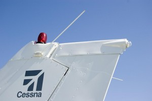
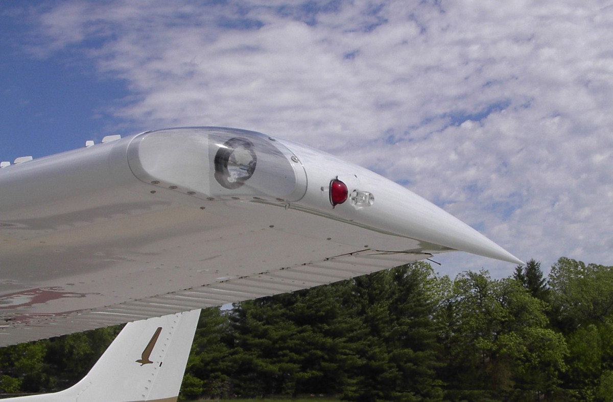

</right>

<reference>

[14 CFR Part 91.209][1]

[1]: https://www.ecfr.gov/current/title-14/chapter-I/subchapter-F/part-91/subpart-C/section-91.209

</reference>

---

## Change of Address

Notify FAA within 30 days

---

## Speed Limit

<left>

**< 250kts if:**
- <10,000MSL
- in Class B

**< 200kts if:**
- Under class B
- in VFR corridor
- in class C <2500AGL
- in class D

</left>
<right>

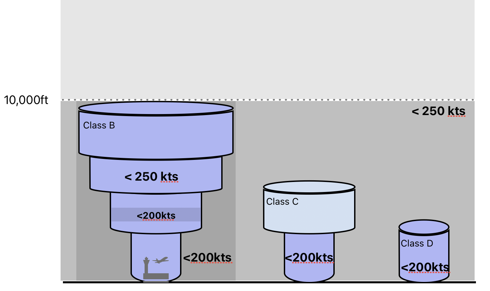

</right>

<reference>

[14 CFR Part 91.117][1]

[1]: https://www.ecfr.gov/current/title-14/chapter-I/subchapter-F/part-91/subpart-B/subject-group-ECFRe4c59b5f5506932/section-91.117

</reference>

---

<left>

## Special VFR

**Weather Minimum**

- Cloud: clear
- Visibility: >=1sm

**At night**
- Pilot: instrument rated
- Aircraft: IFR equipped

</left>
<right>

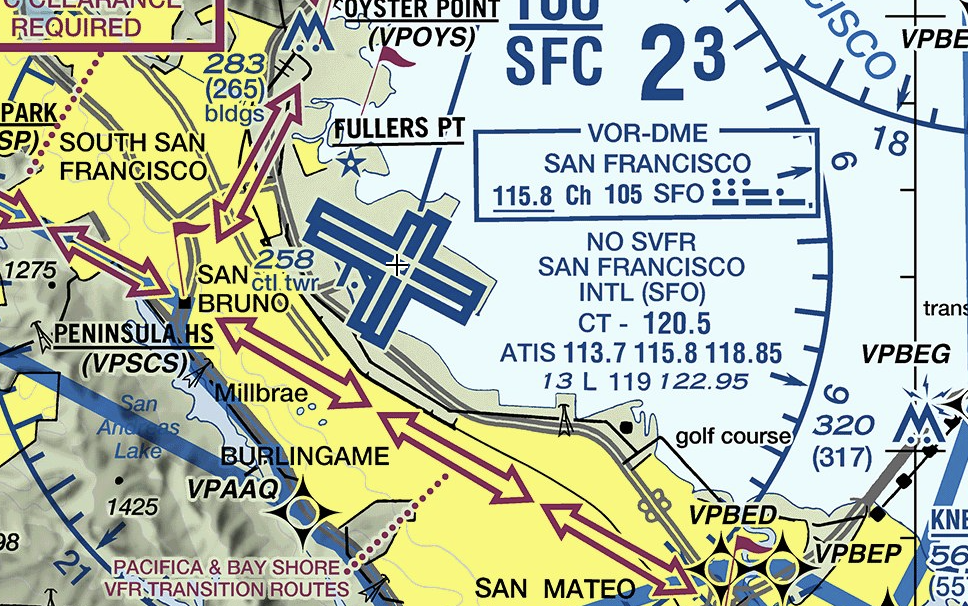

</right>
<reference>

[14 CFR Part 91.157][1]

[1]: https://www.ecfr.gov/current/title-14/chapter-I/subchapter-F/part-91/subpart-B/subject-group-ECFR4d5279ba676bedc/section-91.157

</reference>

---

<left>

## VFR Cruising Altitude

Between 3000AGL - 18000MSL:
- Westbound: Even 1000's + 500ft
- Eastbound: Odd 1000's + 500ft

</left>
<right>

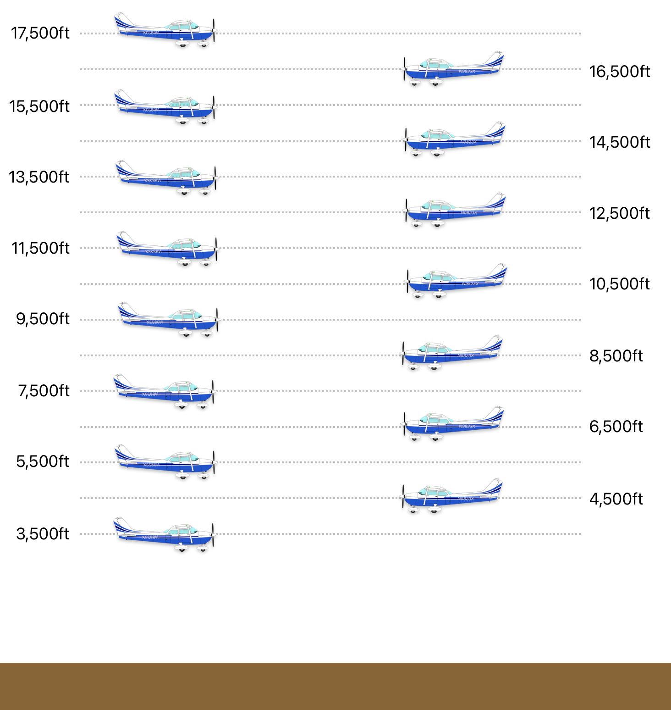

</right>

<reference>

[14 CFR Part 91.159][1]

[1]: https://www.ecfr.gov/current/title-14/chapter-I/subchapter-F/part-91/subpart-B/subject-group-ECFR4d5279ba676bedc/section-91.159

</reference>

---

## Transponder

- Within class A
- Within & above class B
- Within 30nm of class B primary airport
- Within & above class C
- \>10,000ft
<non-key>(except <2500AGL)</non-key>

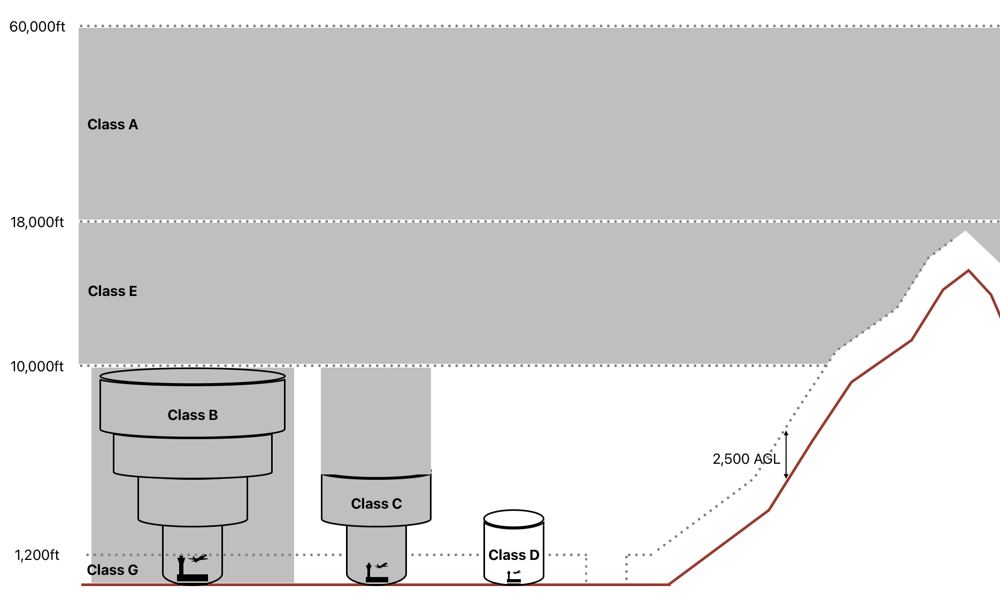

<reference>

[14 CFR Part 91.215][1]

[1]: https://www.ecfr.gov/current/title-14/chapter-I/subchapter-F/part-91/subpart-C/section-91.215

</reference>

---

## Aerobatic Flight

abrupt change in an aircraft's attitude, an abnormal attitude, or abnormal acceleration, not necessary for normal flight.

**Prohibited when**
- visibility < 3sm
- altitude < 1500AGL
- within lateral boundaries of class B/C/D/E of an airport
- within 4nm of federal airway centerline
- over congested area / open-air assembly of people

<reference>

[14 CFR Part 91.303][1]

[1]: https://www.ecfr.gov/current/title-14/chapter-I/subchapter-F/part-91/subpart-D/section-91.303

</reference>

---

## Parachute

Must wear approved parachute when performing:
- \>60° bank
- \>30° pitch
