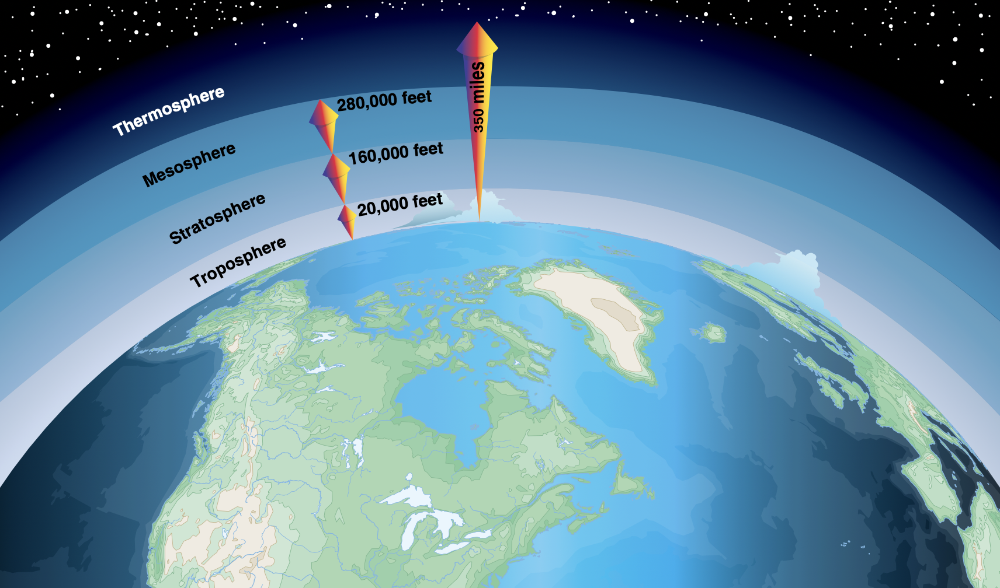
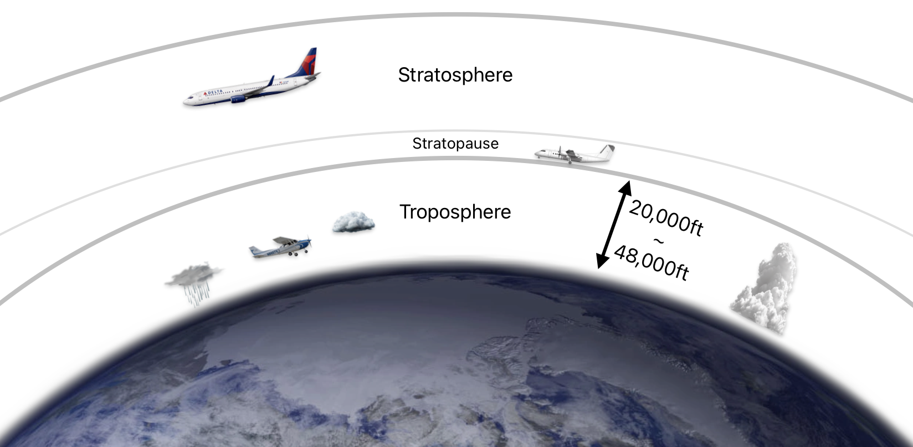
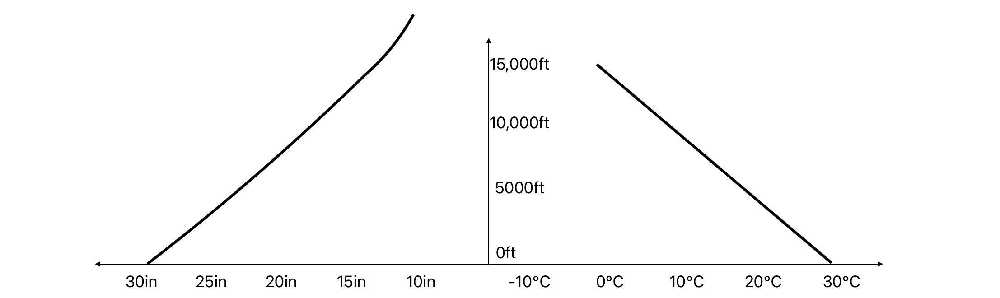

# Atmosphere

---

## Composition of Atmosphere

- 78% Nitrogen
- 21% Oxygen

---

<!--
Troposphere: tropo => turning, convection, heat up by convection & conduction
Tropopause: 10km
stratosphere: strato => layer
stratopause: 50km, O3, absorb near UV
Mesosphere:
Mesopause: 90km
Thermosphere: hot, various between day/night, absorb x-rays, far UV
-->

---

<!--
Mt. McKinley: 20000ft
Mt. Everest: 29000ft
Single engine propeller: 10,000-12,000ft
Turbo prop: 20,000-25,000ft
Jet: 30,000-40,000ft
-->

---

## Temperature & Pressure

<left>

Pressure
Avg Lapse Rate: -1in / 1000ft

</left>

<right>

Temperature
Avg Lapse Rate: -2C / 1000ft

</right>

