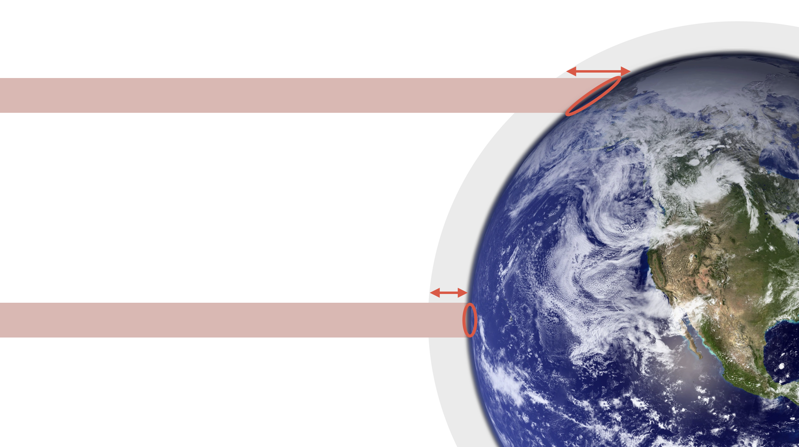
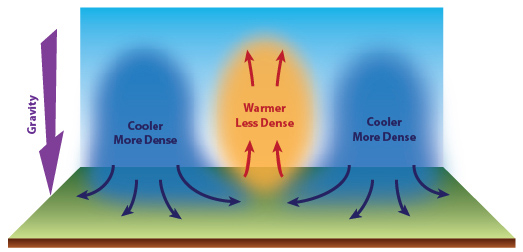

# Atmosphere

---

## Composition of Atmosphere

- 78% Nitrogen
- 21% Oxygen

<timer>01:00</timer>

---

<timer>02:00</timer>

<!--
Troposphere: tropo => turning, convection, heat up by convection & conduction
Tropopause: 10km
stratosphere: strato => layer
stratopause: 50km, O3, absorb near UV
Mesosphere:
Mesopause: 90km
Thermosphere: hot, various between day/night, absorb x-rays, far UV

Mt. McKinley: 20000ft
Mt. Everest: 29000ft
Single engine propeller: 10,000-12,000ft
Turbo prop: 20,000-25,000ft
Jet: 30,000-40,000ft
-->

---

## Uneven Heating

- Angle: equator v.s. north/south pole
- Obscuration: cloud, smoke
- Surface type: water/forest v.s. land/desert

Primary source of all weather phenomenons.

 

<timer>03:00</timer>

---

## Warm Air Raises

 

<timer>05:00</timer>