# Clouds & Fogs

---

## Saturation

Amount of water a given volume of air can hold at given temperature.

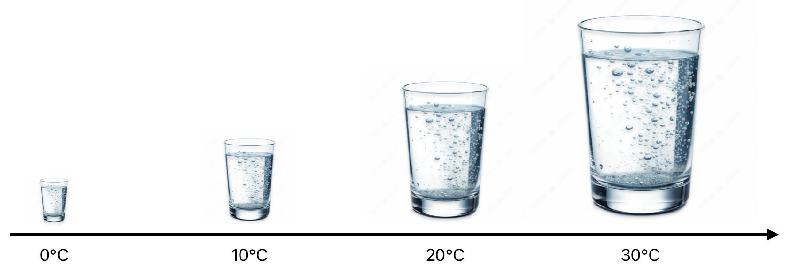 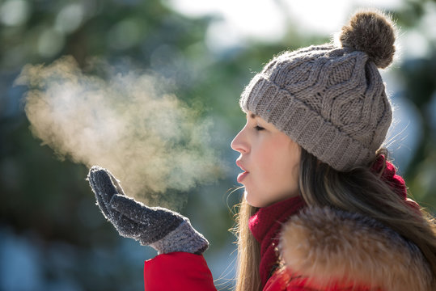

Every 20°F (11°C) doubles air’s capacity to hold moisture.

---

## Dew Point

Temperature at which air becomes saturated.

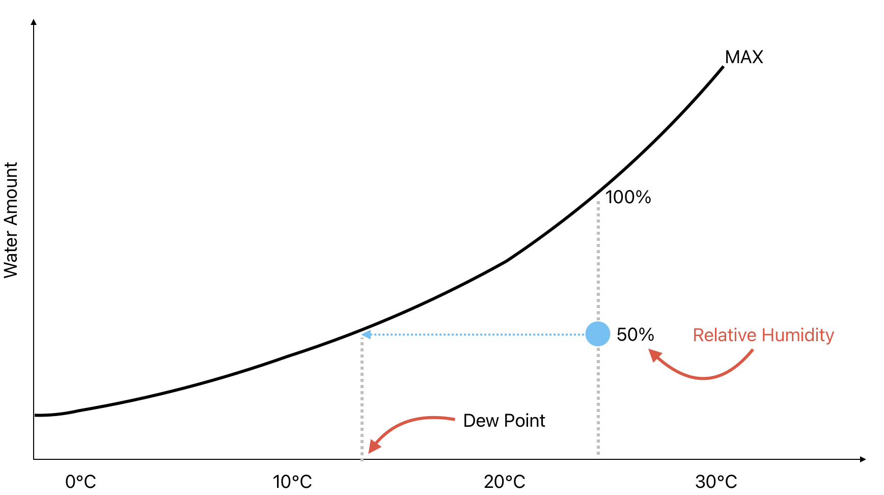

---

## Demo

Amontons's law: $P \times V = n \times R \times T$

<!--
https://www.youtube.com/watch?v=WeXuKd0vMRk
1. Add some rubbing alcohol into an empty water bottle
2. Twist water bottle to compress
3. Release
4. Open cap
-->

---

## Clouds & Fogs

- Water droplets / ice crystals
- Clouds: convection
- Fogs: advection / static

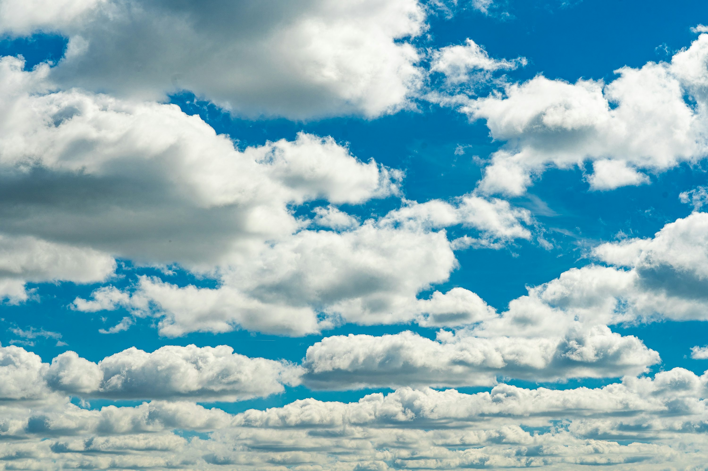 

---

## Advection Fog

        

<!--
morning,
moist air over warm water,
moves to cold land.
-->

</right>

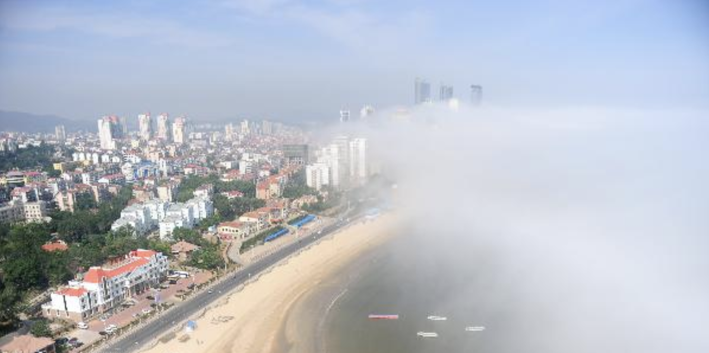

---

## Radiation Fog

        

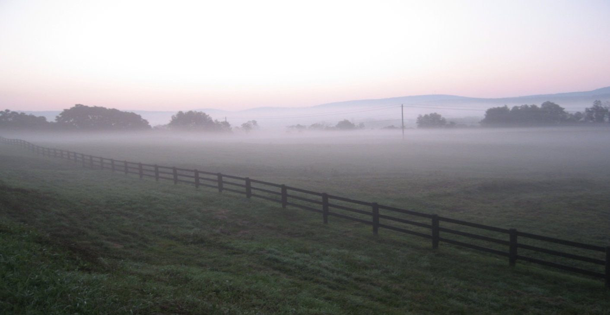

<!--
clear sky, calm wind
-->

---

<invert>

## Upslope Fog

        

</invert>

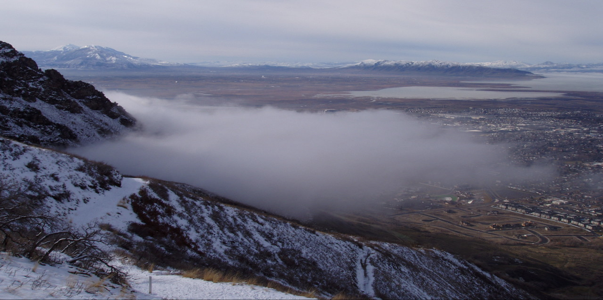

<!--
moist air + updraft
-->

---

<invert>

## Precipitation-induced Fog

</invert>

        

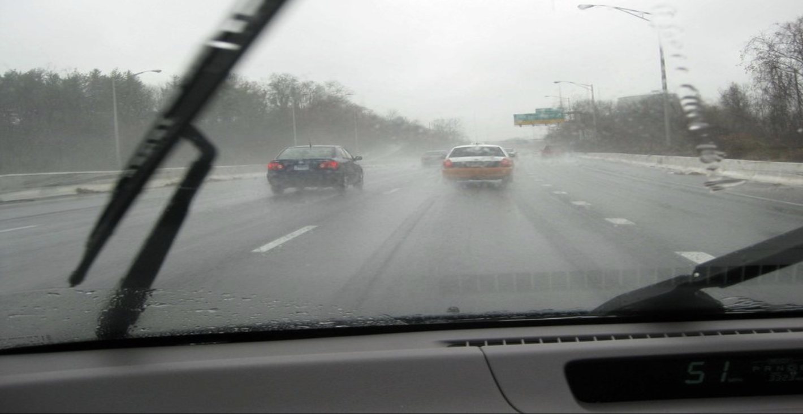

<!--
water vaporize => cool down => dew point
-->

---

## Cirrus Clouds

    

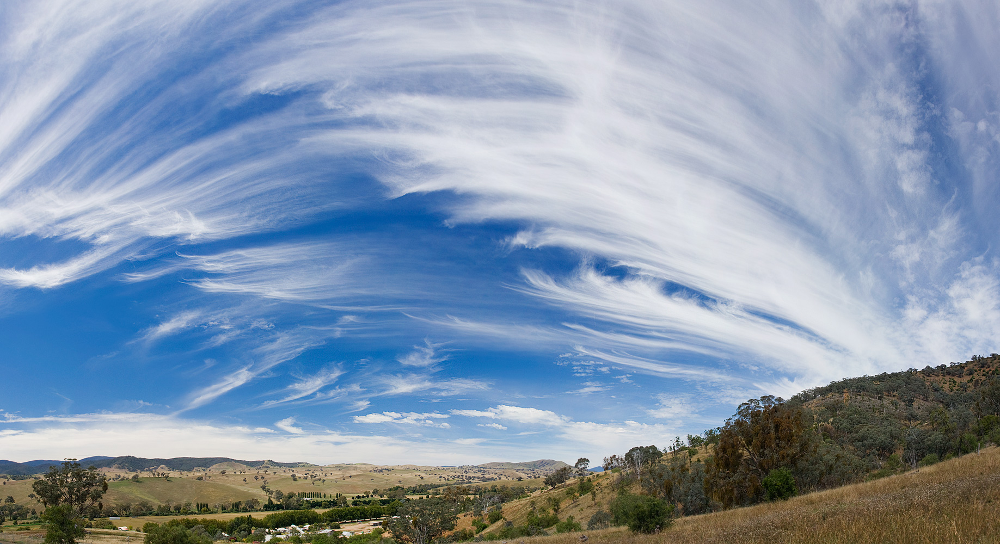

---

## Stratus Clouds

      

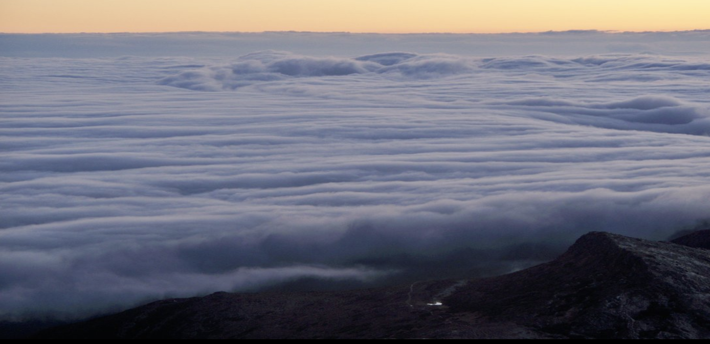

---

## Cumulus Clouds

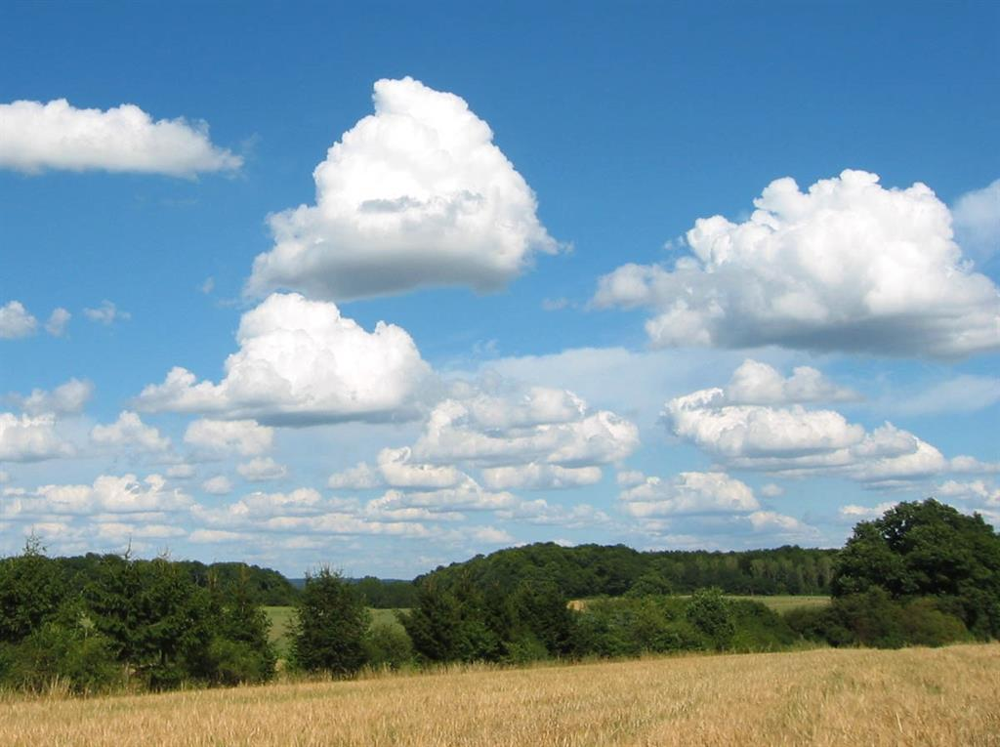

---

## Atmospheric Stability

<right>

- Dry Adiabatic Lapse Rate: -3°C / 1000ft
- Wet Adiabatic Lapse Rate: -1.7°C / 1000ft

</right>

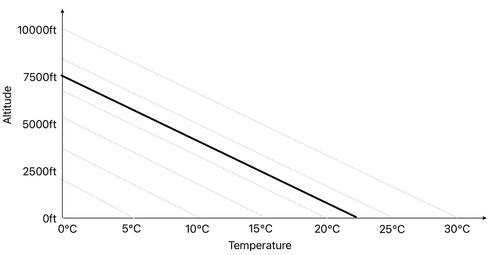

---

## Stable Air

<right>

Lapse Rate >= Dry Adiabatic Lapse Rate (DALR)

</right>

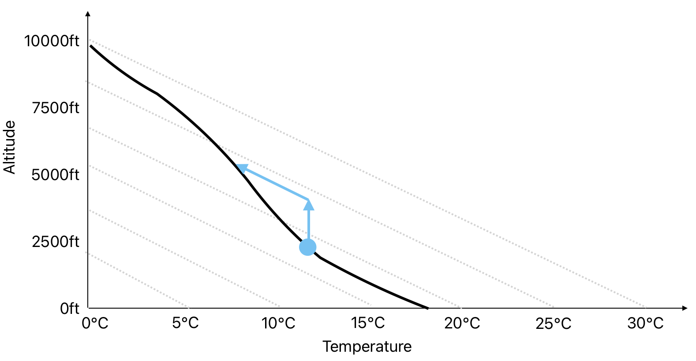

---

## Unstable Air

<right>

Lapse Rate < Dry Adiabatic Lapse Rate (DALR)

</right>

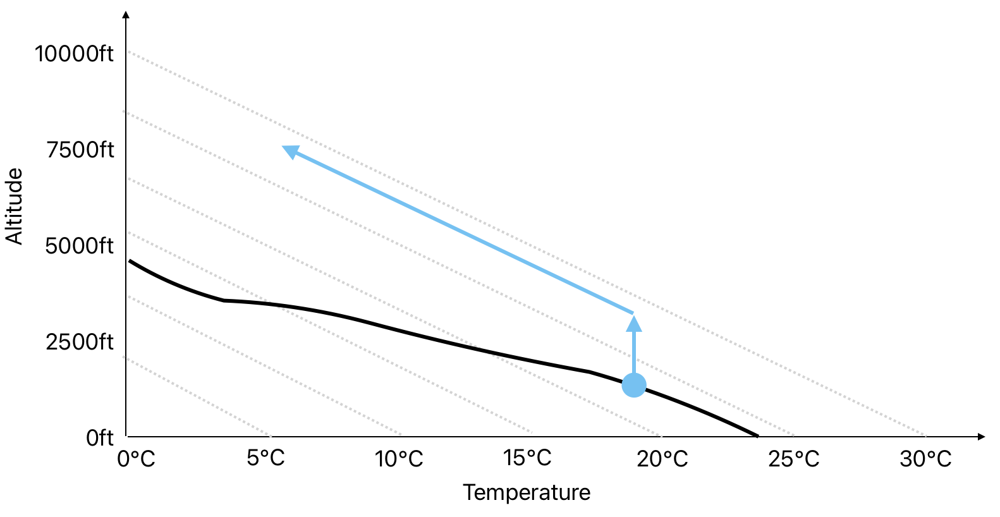

---

 

## Cumulonimbus Clouds

