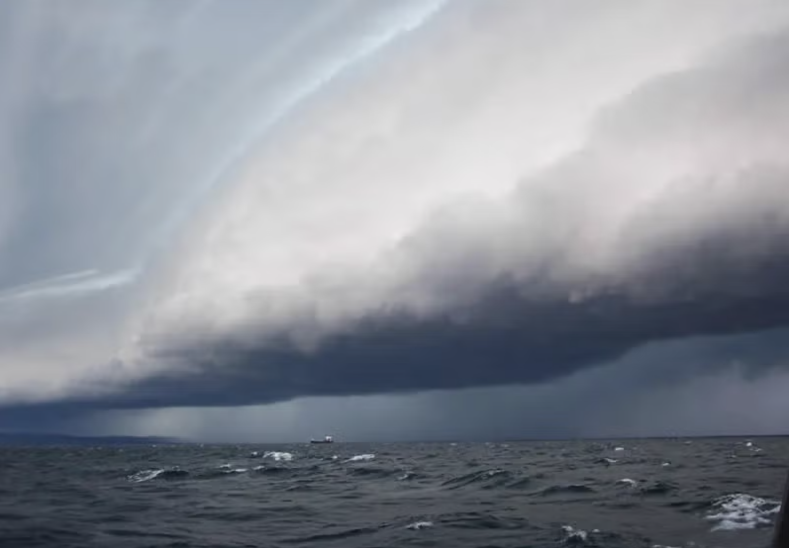
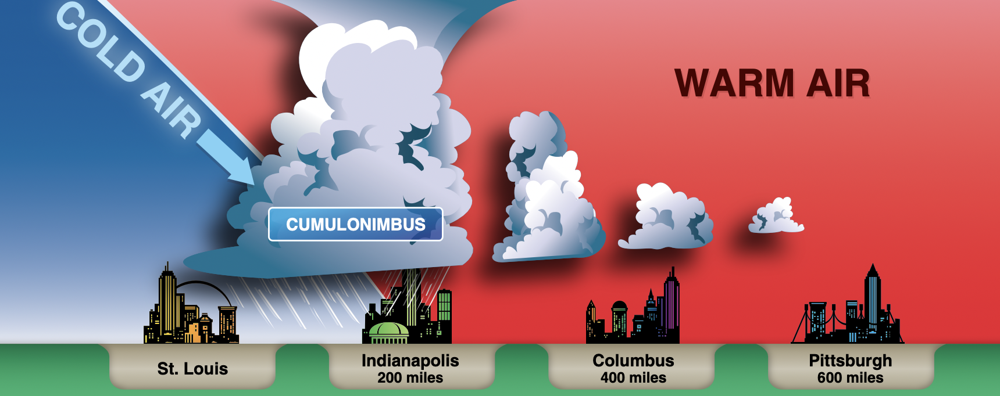
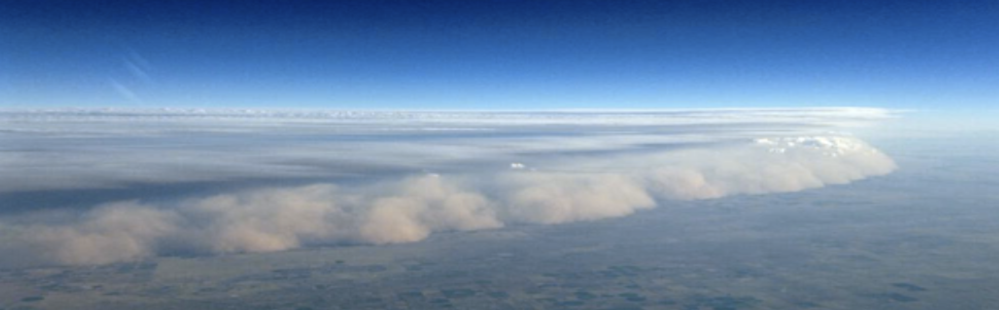
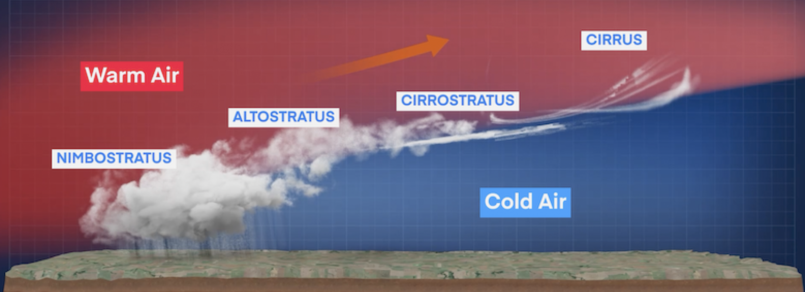
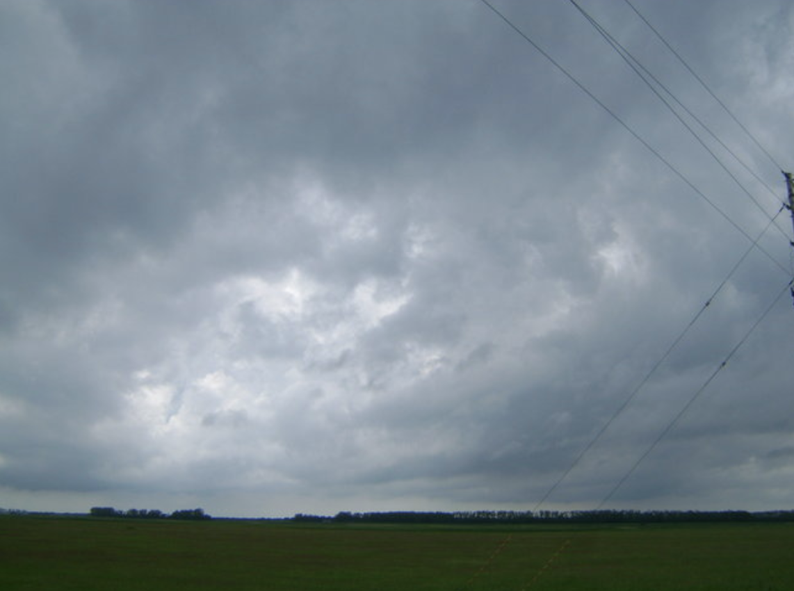
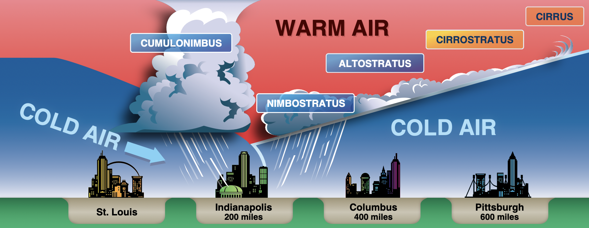

# Fronts

A boundary between two air masses.

---

## Fronts

where air masses with different properties meet.
- Cold air: denser => stays near surface
- Warm air: thinner => stays aloft

---

<left>

    

## Cold Fronts

- Narrow band
- Good visibility
- Bumpy
- Rain showers
- Cumulus clouds
- Clear ice

</left>
<right>

</right>

---

<left>

## Warm Fronts

- Spread over 600 miles
- Poor visibility
- Smooth
- Continuous rain/drizzle
- Stratus clouds
- Rime ice

</left>
<right>

</right>

---

## Occluded Front

Cold front overtakes warm front.

