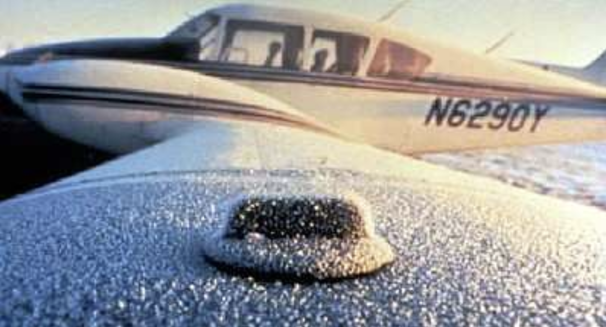
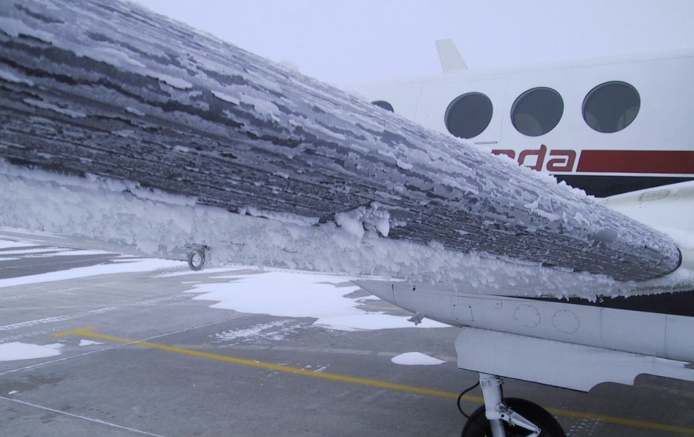
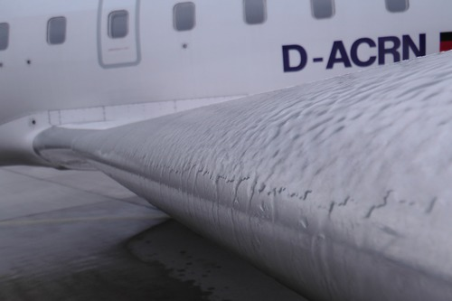
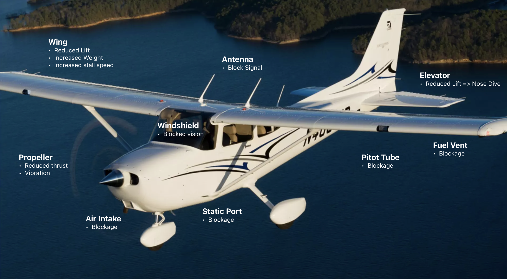

# Icing

---

## Icing

Prerequisites:
- Moisture
- < 0°C
- Condensation nuclei

---

<right>
     

## On Ground - Frost

</right>

<!--
AC 20-117: sandpaper => -30% lift, +40% drag.
+parasite drag (small)
air disturbance & early separation => -lift => +AoA => +induced drag
-->

---

    

## Inflight

- In cloud when temp < 0℃
- Through freezing rain

---

## Types of Icing

- Clear Ice
- Rime Ice
- Mixed

 

---

---

<!--
on February 12, 2009, Colgan Air Flight 3407 (a Bombardier Q400) approaching Buffalo, entered an aerodynamic stall from which it did not recover and crashed.

https://www.youtube.com/watch?v=33NUAy3eomg
-->

---

## Takeaway

- < 0°C + moisture (cloud / rain) == NO FLYING
- Take action (climb, descent, turn back)
- Fly faster, shallow bank