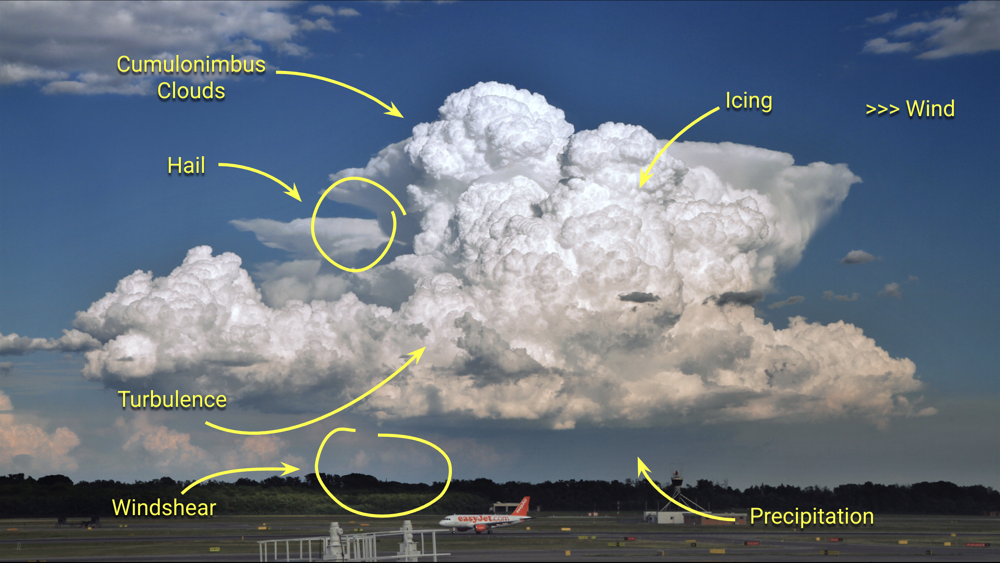

# Weather Theory

---

## Before this lesson...

<!--
Question: what do you see?
Question: can you fly today?
-->

---

## After this lesson...

---

## Objective

Look at sky, you can understand:
- what is happening
- why it is happening
- what will happen next
- how will it impact to the airplane

---

## Review: Units

- Distance: feet, statute mile (sm), nautical mile (nm)
- Height: feet, <non-key>meter</non-key>
- Speed: <non-key>mph</non-key>, knots
- Temperature: <non-key>°F</non-key>, °C
- Pressure: <non-key>Pa, hPa, millibar</non-key>, inch of mercury (in)

---

- [Atmosphere](atmosphere.md)
- [Wind](wind.md)
- [Clouds & Fogs](clouds-fogs.md)
- [Thunderstorm](thunderstorm.md)
- [Fronts](fronts.md)
- [Windshear](windshear.md)
- [Icing](icing.md)

---

> "It’s better being on the ground wishing you were in the air
than being in the air and wishing you were on the ground.”
