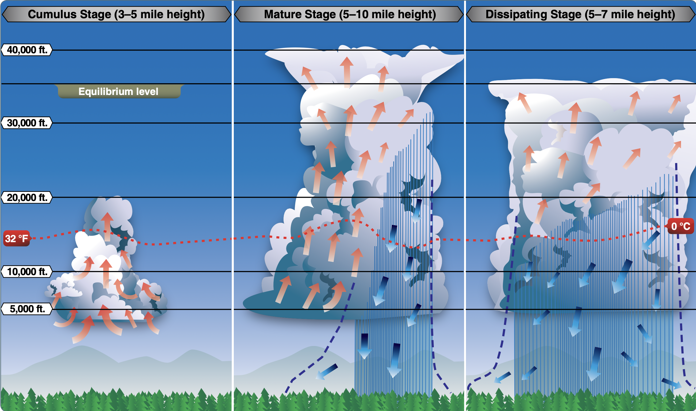
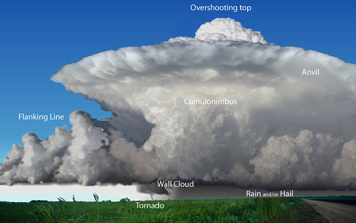
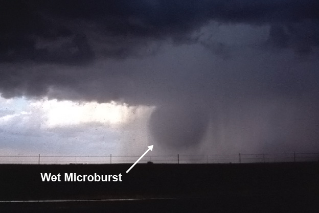
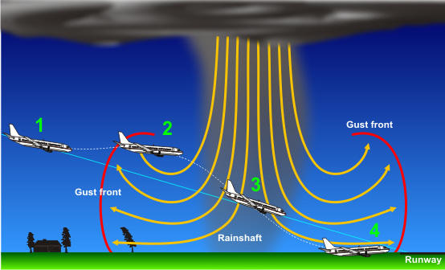

# Thunderstorm

---

---

## Thunderstorm

<left>

Prerequisites:
- Moist Air
- Unstable Air
- Warm Air

</left>
<right-section>

 Trigger: Updraft
- Mountain
- Heat
- Front

</right-section>

---

## Stages

<!--
Cumulus: updraft
Mature: precipitation, downdraft + updraft
Dissipating: heavy rain, downdraft
-->

---

<invert>

## Supercell Thunderstorm

</invert>

           

<!--
https://www.weather.gov/ama/supercell
It contains a deep and persistent rotating updraft called a mesocyclone.
It can last for several hours.
-->

---

<right>
<invert>

## Microburst

- <1 mile
- < 1000ft
- < 15 min
- ~6000 fpm

        

</invert>
</right>

---

---

<!--
Aug 2nd 1985, Delta 191, a Lockheed L-1011 crashed after it flew into a microburst while on approach to land on Runway 17C at Dallas/Fort Worth (DFW).
-->

---

---

## Takeaway

- Stay away from thunderstorms