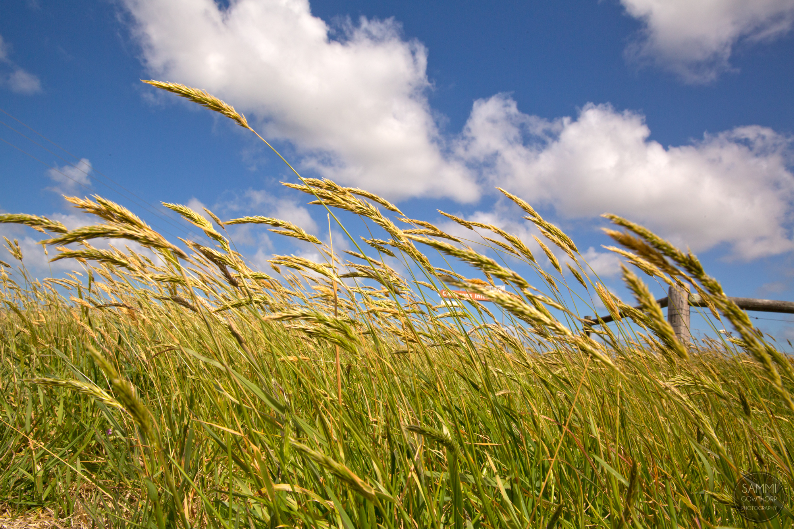
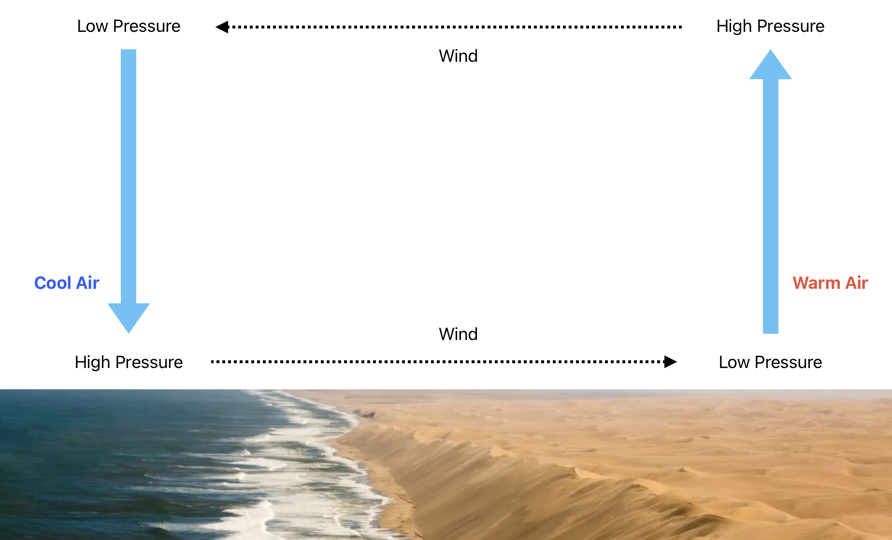
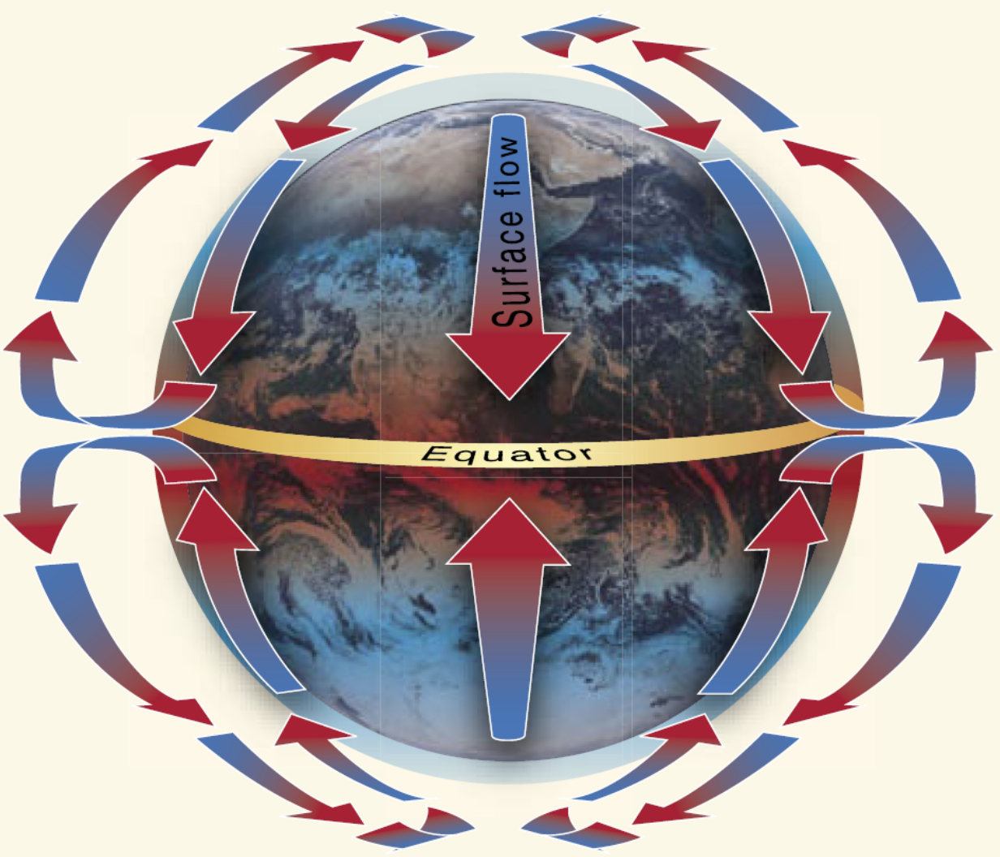
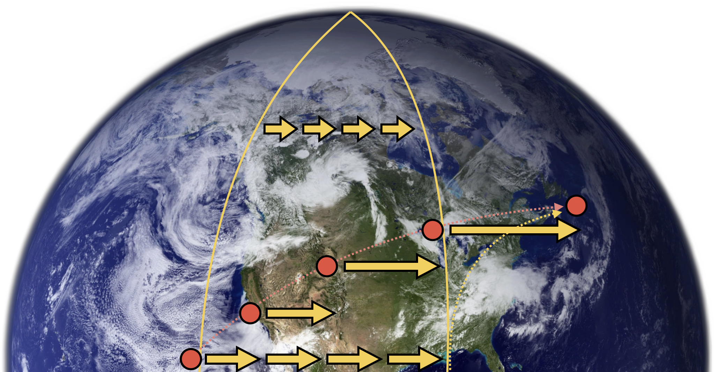
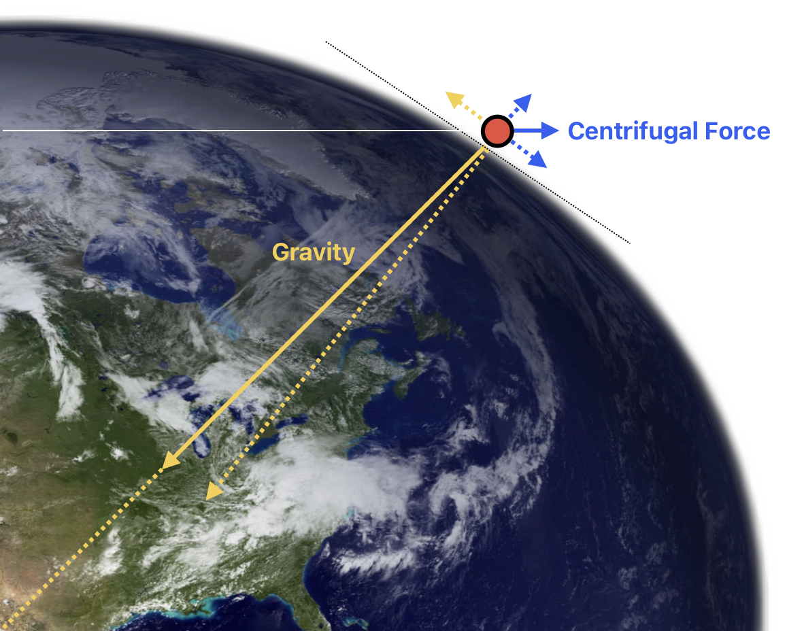
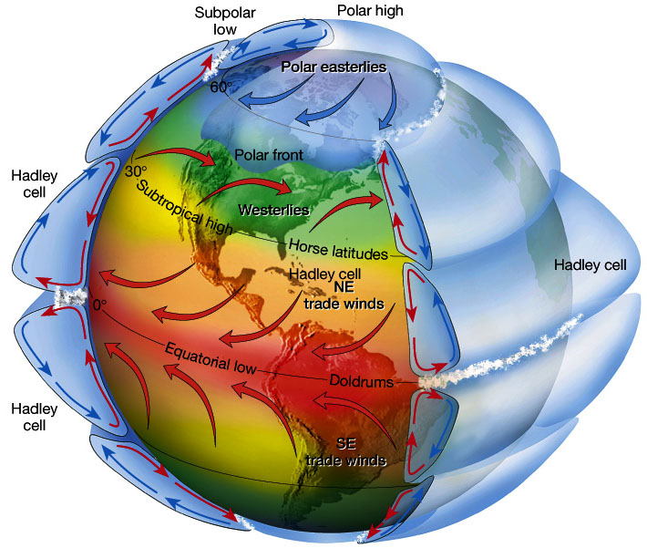
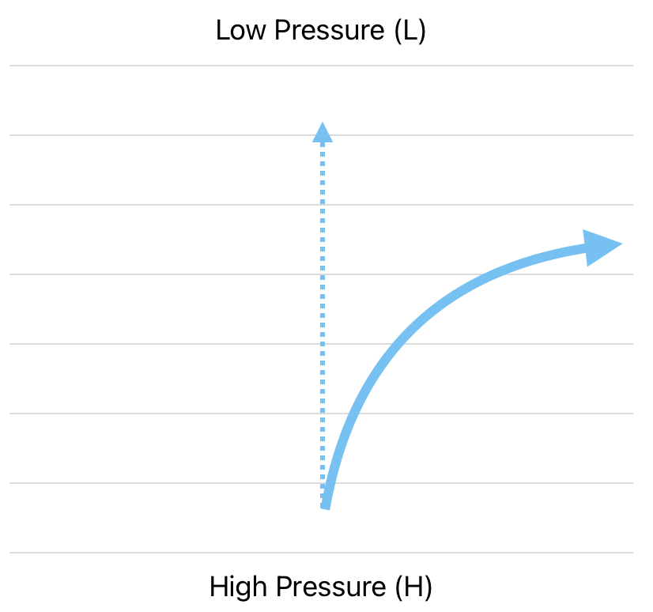
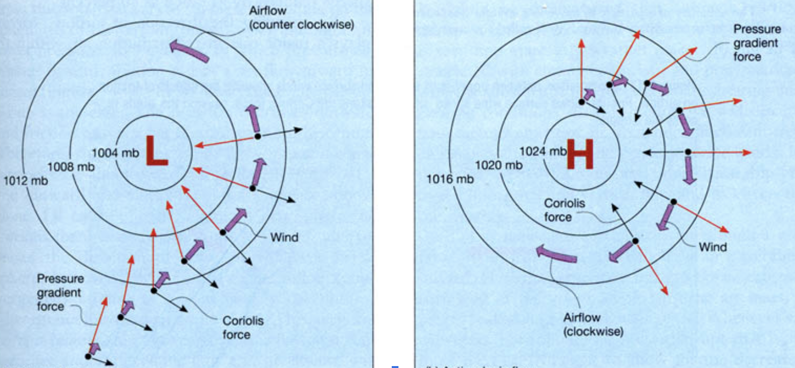
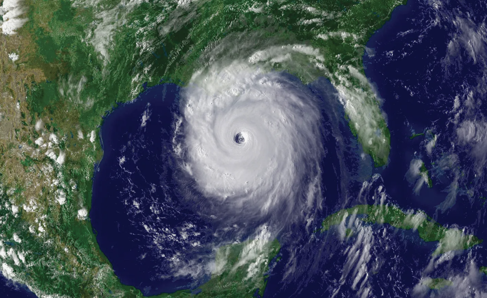

# Wind

How does it form?

---

## Circulation

---

## Circulation Pattern: 1-Cell Model

---

## Law of Conservation of Angular Momentum

> the total angular momentum of a closed system remains constant if no external torque is applied.

---

## Coriolis Effect - North/South Movement

Air turns to the right.

---

## Coriolis Effect - East/West Movement

<left>

Air turns to the right.

</left>

<right>

</right>

<!--
Earth is not a perfect sphere; 
It is an oblate spheroid.
-->

---

## Real Circulation Pattern: 3-Cell Model

 

<!--
reference: https://www.reddit.com/r/explainlikeimfive/comments/7lmjun/eli5_why_are_there_3_atmospheric_circulation/
-->

---

## Cyclone & Anticyclone

- Cyclone (Low Pressure Center): Counterclockwise
- Anticyclone (High Pressure Center): Clockwise

 

---

---

## Surface Wind

- < 2000 AGL
- Influenced by frictions, mountain ranges, passes, valleys

---

## Review

- Uneven heat => H/L Pressure => Wind
- Continental U.S.: generally westernly wind near surface
- Wind starts from H to L, then follows isobar
  - L pressure: wind flows counter-clockwise
  - H pressure: wind flows clockwise
- Surface winds depends on terrains