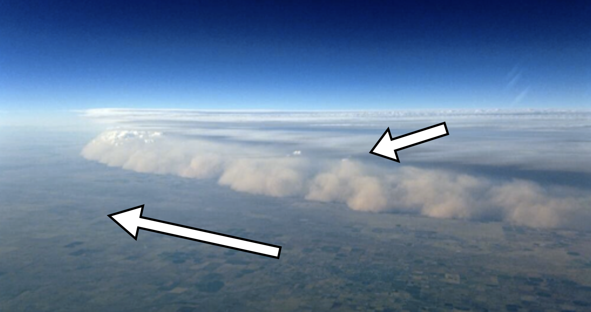
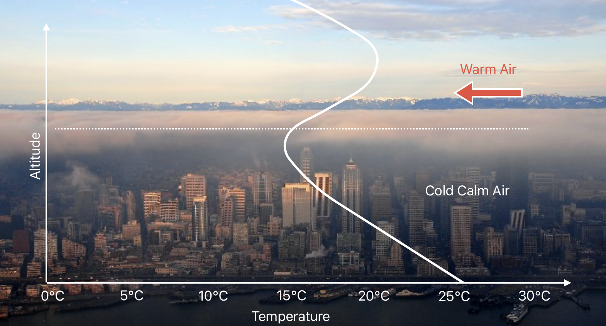
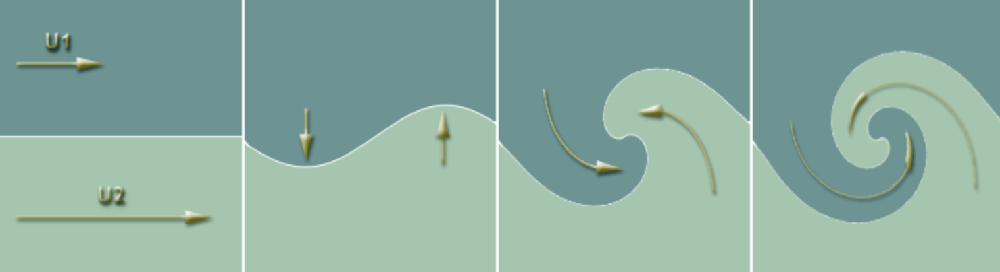
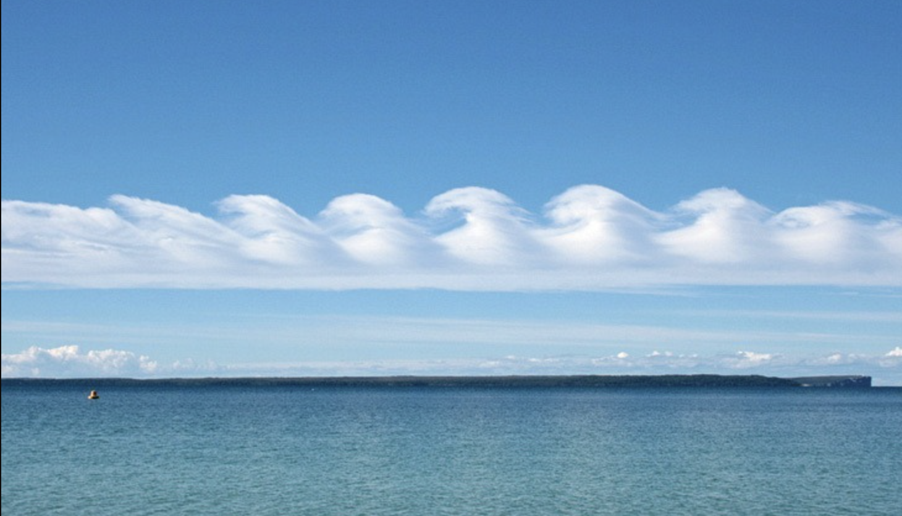
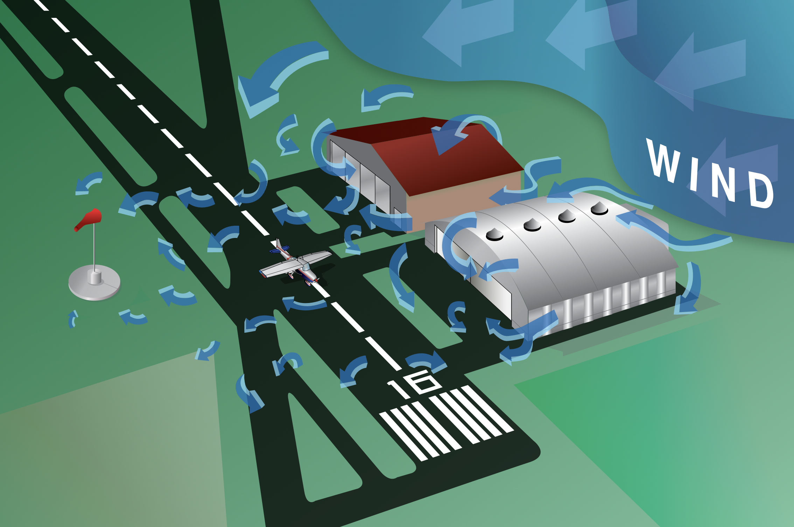
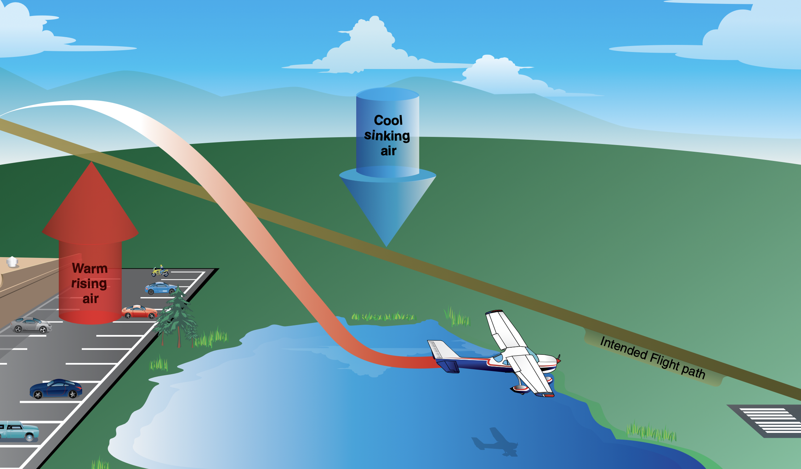
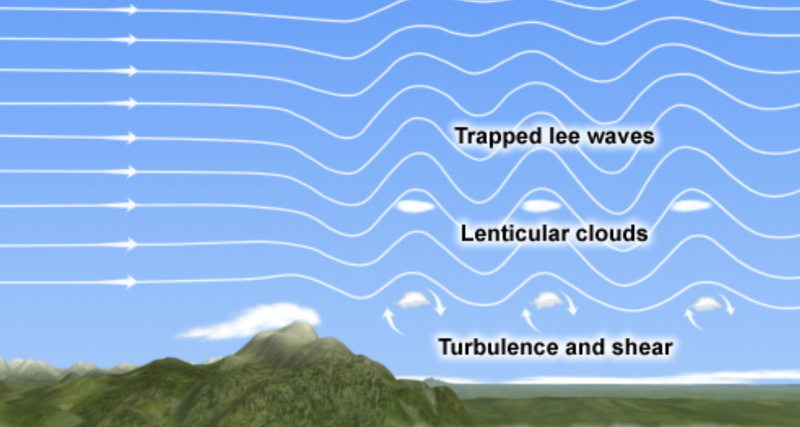

# Windshear

---

## Windshear

- Significant change in wind direction and/or speed,
- within short horizontal or vertical distance.

---

<invert>

## Front

</invert>

         

---

## Temperature Inversion

         

---

 

## Kelvin Helmholtz Cloud

     

---

## Obstruction & Surface

 

---

<invert>

## Mountain Wave

</invert>

       

---

## Mountain Wave

