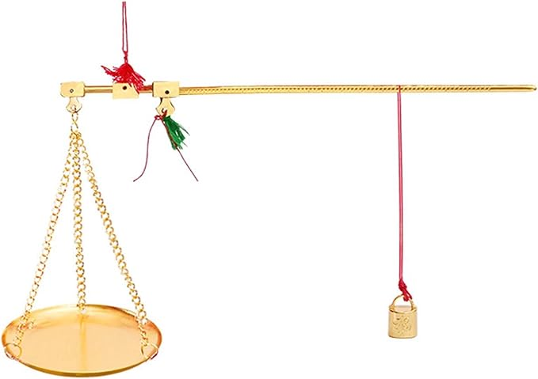
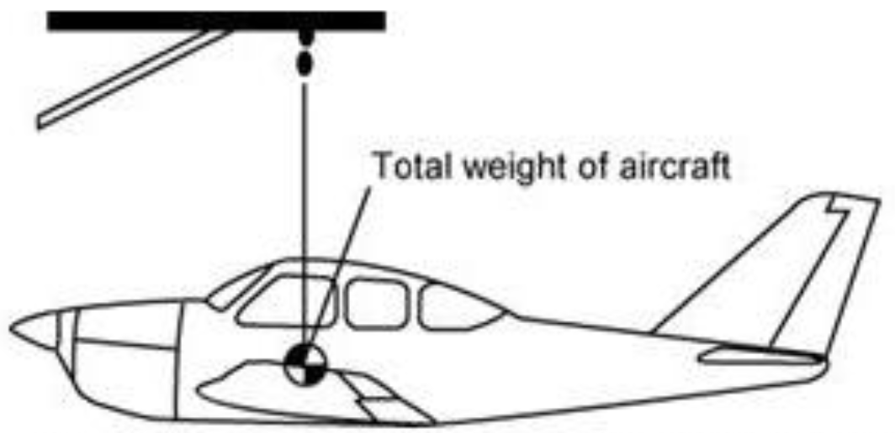
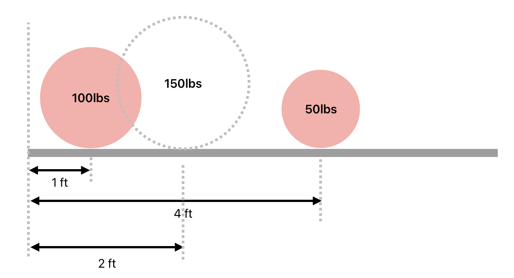
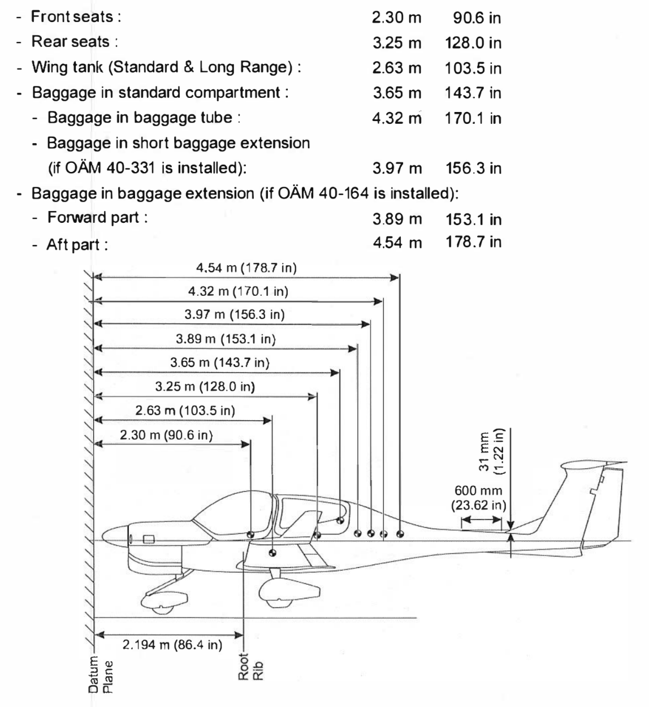
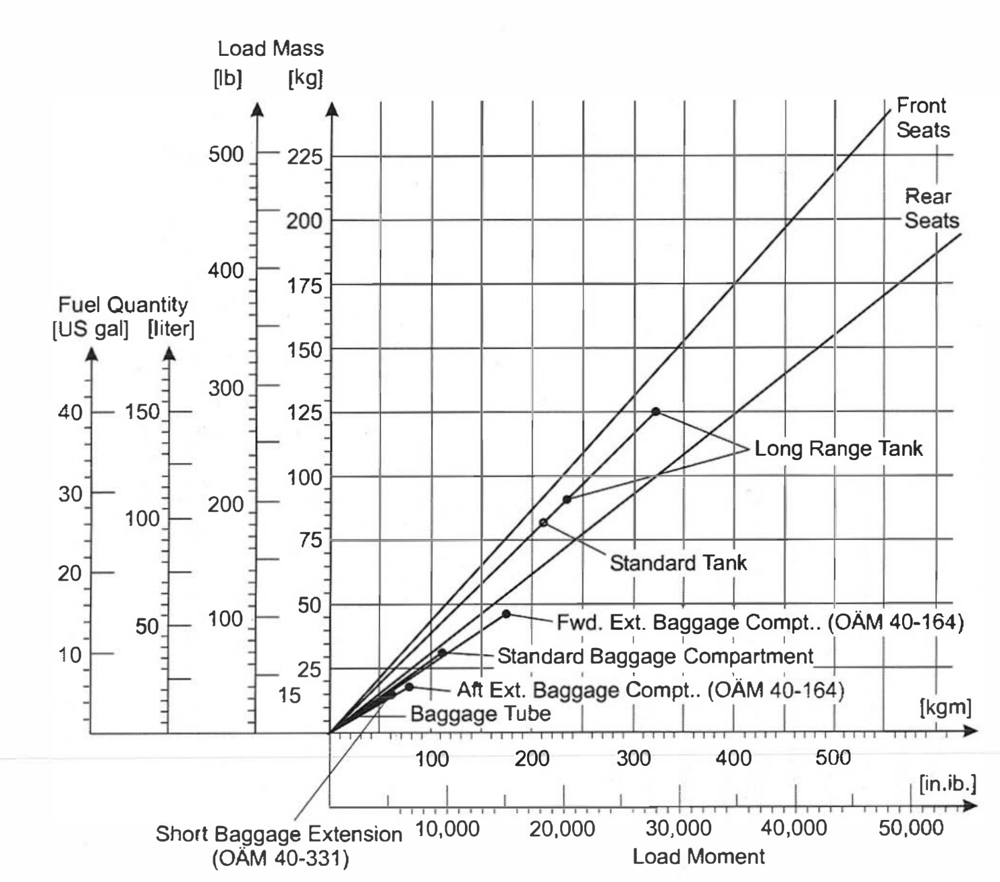
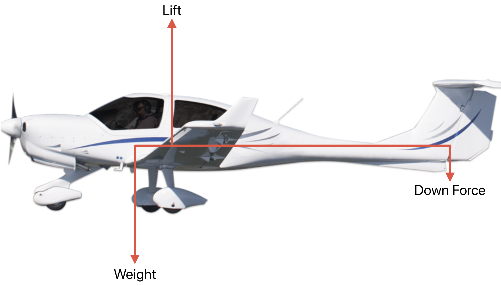
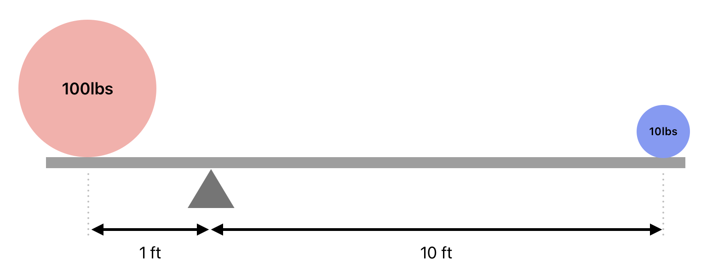
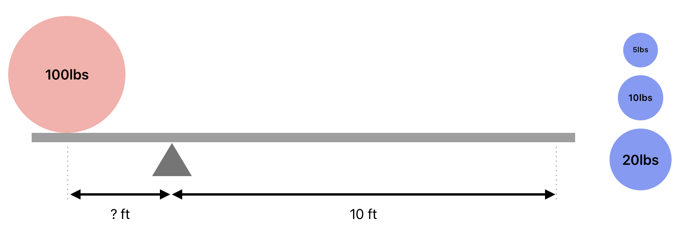
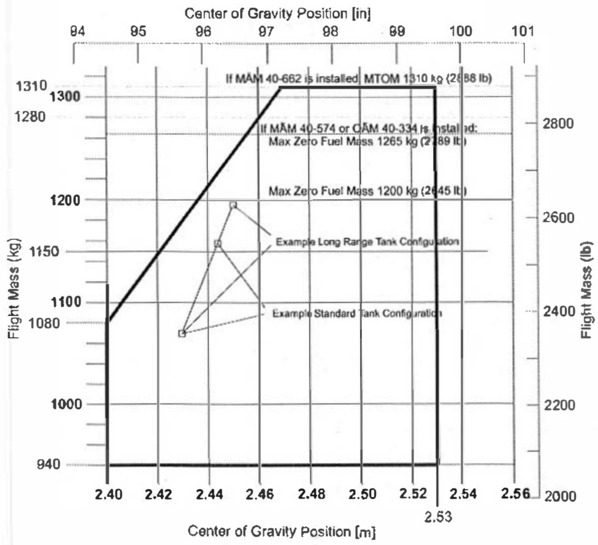
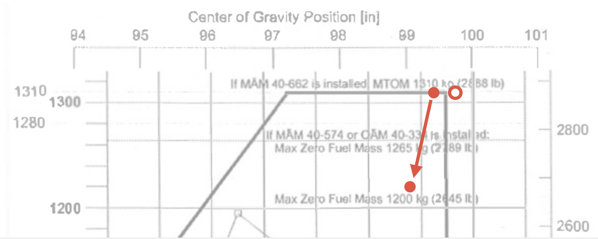

# Balance

---

## Center of Gravity

The point where an object would balance if suspended or supported.
 

---

## CG Calculation

$$ 100lbs \times 1ft + 50lbs \times 4ft = 150lbs \times 2ft$$

---

<left>

## CG Calculation

|Item|Weight|Moment|
|--|--:|--:|
|**Empty Weight**|2023lbs|?|
|**Pilot**|150lbs|?|
|**Passenger 1**|150lbs|?|
|**Passenger 2**|180lbs|?|
|**Passenger 3**|180lbs|?|
|**Fuel** - 30gal|204lbs|?|
||||
|**Take-off Weight**|2887lbs|?|

</left>
<right>

Empty Weight CG: 95.72in

</right>

---

## CG Calculation

<left>

|Item|Weight|Arm|Moment|
|--|--:|--:|--:|
|**Empty Weight**|2023lbs|95.72in|193641.56|
|**Pilot**|150lbs|90.6in|13590|
|**Passenger 1**|150lbs|90.6in|13590|
|**Passenger 2**|180lbs|128.0in|23040|
|**Passenger 3**|180lbs|128.0in|23040|
|**Fuel** - 30gal|204lbs|103.5in|21114|
|||
|**Take-off Weight**|2887lbs|99.76in|288015.56|

</left>
<right>

</right>

---

## Balance

---

## Balance

$$Moment = Weight \times Arm$$

$$100lbs \times 1ft = 10lbs \times 10ft$$
---

## Balance

$$Moment = Weight \times Arm$$

$$100lbs \times 2ft = 20lbs \times 10ft = 200 ft \cdot lbs$$
$$50lbs \times 1ft = 5lbs \times 10ft = 50 ft \cdot lbs$$

---

## CG Limit

- Longitudinal
  - Forward CG Limit
  - Aft CG Limit
- Lateral

---

## Permissible CG Range

<left>

|Item|Weight|Arm|
|--|--:|--:|
|**Empty Weight**|2023lbs|95.72in|
|**Pilot**|150lbs|90.6in|
|**Passenger 1**|150lbs|90.6in|
|**Passenger 2**|180lbs|128.0in|
|**Passenger 3**|180lbs|128.0in|
|**Fuel** - 30gal|204lbs|103.5in|
|||
|**Take-off Weight**|2887lbs|99.76in|

</left>
<right>

</right>

<!--
Question: what can we do about it?
-->

---

## Permissible CG Range

<left>

|Item|Weight|Arm|
|--|--:|--:|
|**Empty Weight**|2023lbs|95.72in|
|**Pilot**|150lbs|90.6in|
|**Passenger 1**|180lbs|90.6in|
|**Passenger 2**|150lbs|128.0in|
|**Passenger 3**|180lbs|128.0in|
|**Fuel** - 30gal|204lbs|103.5in|
|||
|**Take-off Weight**|2887lbs|99.37in|
|**Landing Weight**|2683lbs|99.06in|

</left>
<right>

</right>

<!--
Question: can you take-off?
Question: what can you expect with close to CG limit?
-->

---

## CG Implications

 

||Forward CG|Aft CG|
|--|--|--|
|Longitudinal Stability|More stable|Less stable|
|Stall Recovery|Easier|Harder|
|Drag|Increase|Decrease|
|Stall Speed|Increase|Decrease|

---

## Takeaway

- Always calculate balance
- Anticipate aircraft performance changes