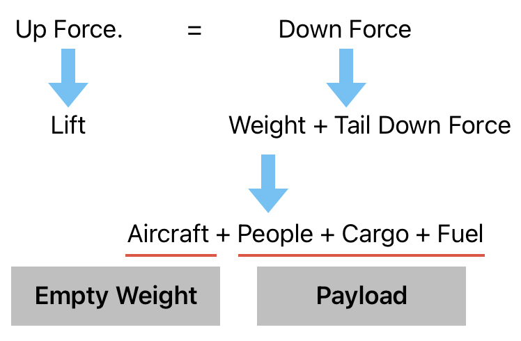
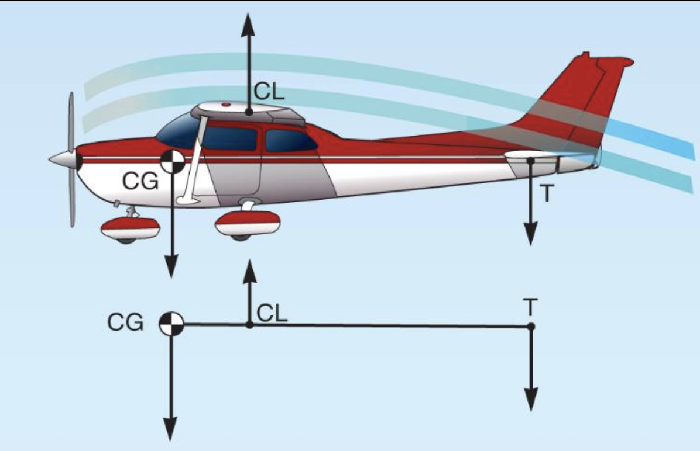
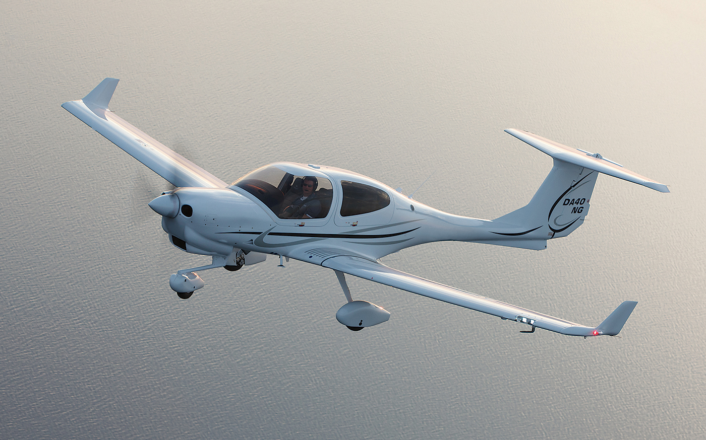
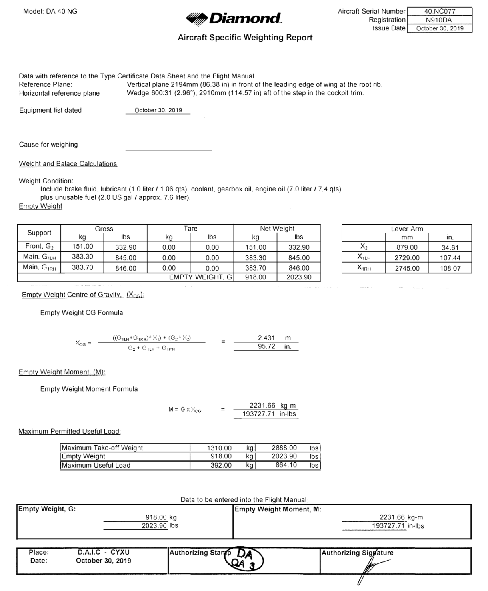
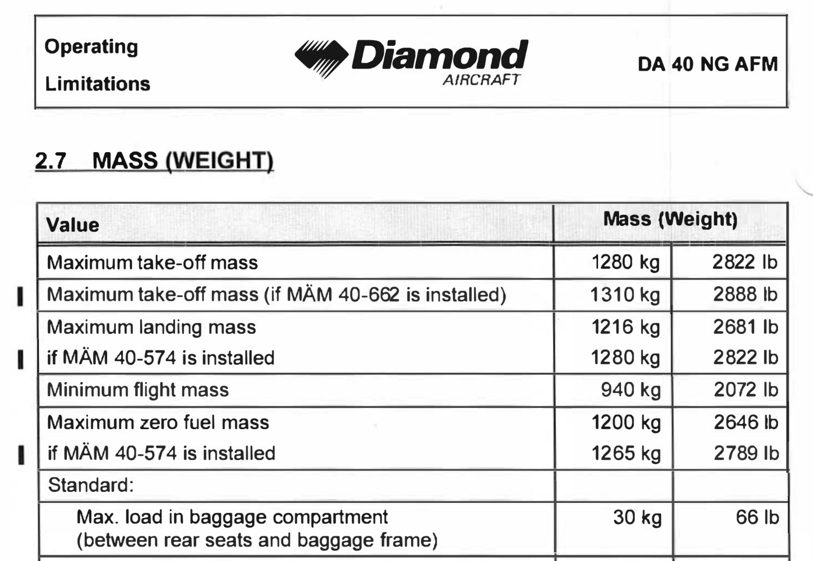

# Weight

---

---

## Max Weight

<left>

</left>
<right>

    

$Lift = \frac{1}{2} \times \rho \times V^2 \times C_L \times S$

</right>

---

## Max Weight

|||
|--|--:|
|**Max Take-off Weight**|2888lbs|
|**Empty Weight**|2023lbs|
|**Max Useful Load**|864lbs|

---

## Max Weight

- Max Take-off Weight
- <highlight>Max Landing Weight</highlight>
- Max Zero-Fuel Weight
- Max Load in Baggage Compartment

<!--
Max landing weight
- can be lower than max take-off weight
- may require abnormal operating procedure
-->
---

## Weight Calculation

<left>

|Item|Weight|
|--|--:|
|**Empty Weight**|2023lbs|
|**Pilot**|150lbs|
|**Passenger 1 + Baggage**|150lbs|
|**Passenger 2 + Baggage**|180lbs + 20lbs|
|**Passenger 3 + Baggage**|180lbs + 20lbs|
|**Fuel** - 39gal|265lbs|
|||
|**Take-off Weight**|?|
|**Max Take-off Weight**|2888lbs|

</left>
<right>

- 100LL: 6lbs/gal
- Jet-A: 6.8lbs/gal

</right>

<!--
Total: 2988lbs

Question: can you takeoff?
-->

---

## Weight Calculation

<left>

|Item|Weight|
|--|--:|
|**Empty Weight**|2023lbs|
|**Pilot**|150lbs|
|**Passenger 1 + Baggage**|150lbs|
|**Passenger 2 + Baggage**|180lbs <del>+ 20lbs</del>|
|**Passenger 3 + Baggage**|180lbs <del>+ 20lbs</del>|
|**Fuel** - <del>39gal</del> 30gal|<del>265lbs</del> 204lbs|
|||
|**Take-off Weight**|2887lbs|
|**Max Take-off Weight**|2888lbs|

</left>
<right>

- 100LL: 6lbs/gal
- Jet-A: 6.8lbs/gal

</right>

<!--
Total: 2988lbs

Question: can you takeoff?
Question: what can you expect at max-weight?
-->

---

## Max Weight Implications

- Longer take-off distance
- Lower climb rate
- Higher stall speed
- Lower cruise speed / range / endurance
- Lower glide ratio
- Longer landing distance / less brake effectiveness

---

## Takeaway

- Always calculate weight
- Never exceed max takeoff weight
- Anticipate aircraft performance changes